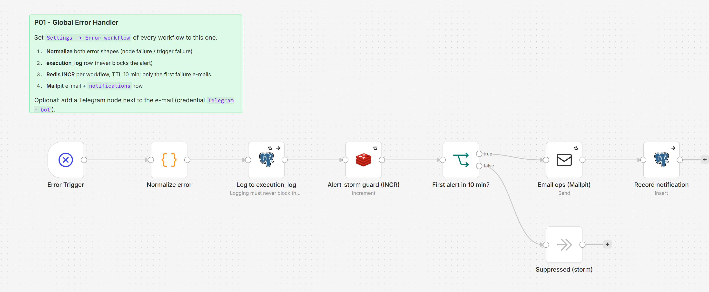

# P01 - Global Error Handler

**Category:** Patterns · **Difficulty:** Intermediate · **Tested on:** n8n 2.37.10

## Problem

A workflow fails at 03:12 because the mock API refused a connection. Nobody notices until a customer asks why the
order never arrived, and by then the execution list has 400 red rows from the same cause. Two things went wrong:
failures were invisible, and when they were finally visible they were noise. Every tutorial workflow stops at "it
works"; a production one has to answer "who finds out when it does not, and how fast?".

## Pattern

One handler workflow, wired to every other workflow through **Settings → Error workflow**. It receives the error
context that n8n emits (workflow, execution id, failing node, message, stack), normalises it, writes a structured row
to `execution_log`, and alerts a human **once per workflow per 10 minutes**. Repeats within that window are still
logged, never e-mailed. Apply it to every workflow that runs unattended (schedules, webhooks, pollers). It is not a
substitute for node-level retries (P02) - those handle transient errors before they become failures; P01 handles
what remains.

## Implementation in n8n

`workflow.json` (`P01 - Global Error Handler`, id `ALP01ErrorHandle`):

1. **Error Trigger** - receives one item for each failed execution or failed trigger start.
2. **Normalize error** (Code) - flattens both shapes (`execution.*` and `trigger.*`) into
   `execution_id, workflow_id, workflow_name, error_node, error_message, error_stack, severity, subject`.
   Messages mentioning `ECONNREFUSED / ETIMEDOUT / 429 / 503 / timeout` become `warning`, everything else `error`.
3. **Log to execution_log** (Postgres insert, retries x3, *continue on error*) - logging must never block the alert.
4. **Alert-storm guard** (Redis `INCR p01:alerts:<workflow_id>`, TTL 600 s) - counts failures per workflow.
5. **First alert in 10 min?** (If) - `INCR` returned 1 → e-mail path; otherwise **Suppressed (storm)**.
6. **Email ops (Mailpit)** - HTML summary to `ops@lab.local` with a link to the execution.
7. **Record notification** (Postgres insert into `notifications`) - what was sent, to whom, at which severity.

How a workflow adopts it: in the authoring script, `Workflow(..., error_workflow=catalog_id("P01"))`, which sets
`settings.errorWorkflow` in the exported JSON. P01 must be **published** (active) for n8n to call it; `scripts/setup.sh`
does that because of `autopublish: true` above.



## Trade-offs

- The storm guard keys on workflow id only: two different bugs in one workflow inside 10 minutes produce one e-mail.
  The `execution_log` rows keep every failure, so nothing is lost, only the second alert.
- If Redis is down the handler itself fails; n8n does not chain error workflows, so that failure only shows in the
  execution list. In production point the guard at a second Redis or drop the guard and accept the noise.
- **Manual and CLI executions do not trigger error workflows** (n8n behaviour). The test fixture therefore uses a
  webhook trigger.
- Telegram is a documented optional branch (credential `Telegram - bot`), not part of the core path.

## Try it

```bash
bash scripts/import-workflows.sh patterns/P01-error-handler --publish
# import + activate the failing test workflow, then fire it three times
docker compose cp patterns/P01-error-handler/test/failing-caller.json n8n:/tmp/failing-caller.json
docker compose exec -T n8n n8n import:workflow --input=/tmp/failing-caller.json
python scripts/dev/publish.py ALP01FailingCall
for i in 1 2 3; do curl -s -X POST localhost:5678/webhook/p01-fail -d '{}'; sleep 3; done
python scripts/dev/executions.py --last 6           # 3 x error (caller) + 3 x success (P01)
docker compose exec -T postgres psql -U n8n -d demo -c "select workflow_name, error_node, logged_at from execution_log"
```

Expected: three `execution_log` rows, **one** e-mail in Mailpit (http://localhost:8025) titled
`[Automation Lab] ERROR in P01 - Failing caller (P01 test) at node "Always fails"`, one `notifications` row, and
`docker compose exec -T redis redis-cli get p01:alerts:ALP01FailingCall` returning `3`.

## Used by

Every workflow in the catalog (`settings.errorWorkflow`). Direct references in front-matter:

- `T01 - Webhook to Database`
- `T02 - Scheduled Daily Digest`
- `T03 - Polling an API Without Webhooks`
- `D01 - CSV/XLSX Import with Row-level Validation`
- `D02 - Web Scrape to Structured JSON`
- `D04 - Incremental Sync with Upsert and Dedupe`
- `M02 - GitHub Events to Chat Notification`
- `M05 - Price / Exchange-rate Watcher`
