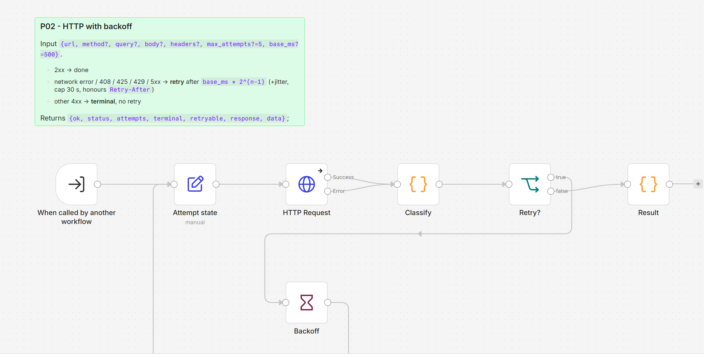

# P02 - Retry with Exponential Backoff

**Category:** Patterns · **Difficulty:** Intermediate · **Tested on:** n8n 2.37.10

## Problem

The mock API answers `503` on every other call to `/flaky` and `429 Retry-After: 3` when a client sends more than
five requests in ten seconds. A workflow that treats every non-2xx as fatal fails half the time and pages someone
at night for something that would have worked one second later. A workflow that retries *everything* hammers a
server that is telling it to slow down, and retries a `404` or `401` forever even though no amount of waiting
will change the answer.

## Pattern

Classify before retrying. **Retryable**: connection errors, timeouts, `408`, `425`, `429`, and every `5xx`.
**Terminal**: every other `4xx` (bad request, auth, not found) - give up immediately and report. Wait
`base * 2^(attempt-1)` between retries (plus up to 25 % jitter so a fleet of workers does not retry in lock-step),
cap the wait at 30 s, honour `Retry-After` when the server sends one, and stop after `max_attempts`. Never retry a
non-idempotent request without an idempotency key (P03) - a retried "charge card" is a double charge.

| Response | Action |
|---|---|
| 2xx | done |
| ECONNREFUSED / timeout / 408 / 425 / 429 / 5xx | retry with backoff, up to `max_attempts` |
| 400 / 401 / 403 / 404 / 422 ... | terminal, return immediately |
| retryable but `max_attempts` reached | terminal (`retryable: true`, `terminal: true`) |

The node-level "Retry On Fail" setting is the cheap version of this (fixed wait, retries everything, no
classification); it is fine for Postgres/Redis calls inside the lab and is used that way. For HTTP calls to
anything you do not control, use this sub-workflow.

## Implementation in n8n

`workflow.json` (`P02 - HTTP with backoff`, id `ALP02RetryBackof`, sub-workflow). Input one item
`{url, method?, query?, body?, headers?, max_attempts?=5, base_ms?=500, timeout_ms?=10000}`.

1. **Attempt state** (Set) - increments `attempt`, fills defaults. Both the trigger and the loop feed this node.
2. **HTTP Request** (v4.2, *full response*, *never error*, 10 s timeout) - 4xx/5xx come out as data with
   `statusCode`; only connection-level failures go to the node's **error output** (continue on error output).
3. **Classify** (Code) - reads both outputs, computes `ok`, `retryable`, `terminal`, `retry`, `delay_ms`
   (backoff + jitter + `Retry-After`), keeps the state.
4. **Retry?** (If) → yes → **Backoff** (Wait `delay_ms` seconds) → back to **Attempt state**.
5. **Result** (Code) - `{ok, status, attempts, terminal, retryable, response, data, url}`. Never throws; the
   caller decides what a terminal failure means (T03 raises a Stop and Error so P01 alerts).

Calling it (see T03's authoring script):

```python
poll_in = set_fields(wf, "Poll request", {"url": "http://mock-api:8080/events",
                     "query": ("={{ { id_gte: 1, _limit: 50 } }}", "object"), "max_attempts": 5, "base_ms": 500})
fetch = execute_workflow(wf, "HTTP with backoff (P02)", catalog_id("P02"))
ok = if_(wf, "Fetched OK?", [cond_bool("={{ $json.ok }}")])
```



## Trade-offs

- Each retry is a synchronous Wait inside the execution: five attempts with `base_ms=500` can hold an execution
  for ~15 s (30 s cap per wait). For long outages prefer failing fast and letting the schedule retry next run.
- The backoff loop is a cycle on the canvas (`Backoff → Attempt state`); n8n allows it, but every node in the
  loop must use `$('Attempt state').last()` (latest run) rather than `.first()` when reading state.
- `data` carries the parsed body (array or object) - it is returned from a Code node on purpose, a typed Set field
  would reject arrays.
- Known limit: the HTTP node autodetects the response, so a `text/html` body becomes a file and `data` comes
  back `null` (found by D02). Scrapers use a direct HTTP Request node until P02 grows a `response_format` input.
- Not covered: circuit breaking (stop calling a dead service for a while) - see P04 for the rate-limit side.

## Try it

```bash
bash scripts/import-workflows.sh patterns/P02-retry-backoff --publish
docker compose cp patterns/P02-retry-backoff/test/harness.json n8n:/tmp/p02-harness.json
docker compose exec -T n8n n8n import:workflow --input=/tmp/p02-harness.json
python scripts/dev/run-workflow.py ALP02Harness0000
python scripts/dev/executions.py --workflow ALP02Harness0000 --last 1
```

The harness calls P02 for four cases; the last node's output (open the execution in the UI, or fetch it with the
public API `GET /api/v1/executions/<id>?includeData=true`) reads:

| case | ok | status | attempts | terminal |
|---|---|---|---|---|
| `/flaky` (503 then 200) | true | 200 | 1-2 | false |
| `/health/down` (always 503) | false | 503 | 3 | true |
| `/no-such-route` (404) | false | 404 | 1 | true |
| `http://mock-api:1` (ECONNREFUSED) | false | 0 | 2 | true |

## Used by

- `T03 - Polling an API Without Webhooks`
- `D03 - Multi-source API Aggregation`
- `D04 - Incremental Sync with Upsert and Dedupe`
- `M05 - Price / Exchange-rate Watcher`
- `B01 - Lead Capture, Enrich, CRM Row and Follow-up Sequence`
