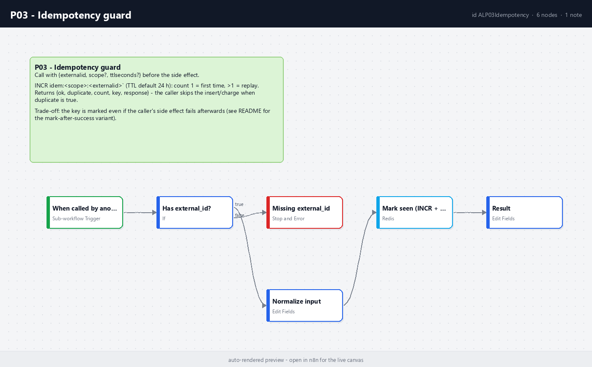

# P03 - Idempotency

**Category:** Patterns · **Difficulty:** Intermediate · **Tested on:** n8n 2.37.10

## Problem

Webhook senders retry. A payment provider that does not get a 2xx within a few seconds sends the same event again,
and again, sometimes hours later. A poller that crashed halfway re-reads the same page. Without a guard every retry
becomes a second order row, a second confirmation e-mail, a second charge. "It only happened once in testing" is
the whole problem: replays show up under load, not on the demo.

## Pattern

Every inbound event carries (or is given) an **external id**. Before the side effect, the workflow asks a shared
store "have I seen `<scope>:<external_id>`?" in one atomic operation. First time → proceed; seen before → answer
success without doing the work again (the sender only wants a 2xx). The store is Redis `INCR` with a TTL: atomic,
one round trip, self-cleaning. Apply it to every webhook, poller, and queue consumer that writes or spends money.
Skip it for read-only workflows and for naturally idempotent writes (upsert on a unique key already is one).

| Situation | Guard? |
|---|---|
| Webhook that inserts / sends / charges | yes, before the side effect |
| Poller with a cursor (T03) | cursor prevents re-reads; still guard the insert with a unique key |
| Upsert on a natural key (D04) | the upsert is the guard; no Redis needed |
| Read-only report (T02) | no |

## Implementation in n8n

`workflow.json` (`P03 - Idempotency guard`, id `ALP03Idempotency`, sub-workflow):

1. **When called by another workflow** - Execute Workflow Trigger, passthrough input.
2. **Has external_id?** (If) → otherwise **Missing external_id** (Stop and Error) so the caller's P01 sees a clear message.
3. **Normalize input** (Set) - `external_id` trimmed, `scope` (default `default`), `ttl_seconds` (default 86400).
4. **Mark seen (INCR + TTL)** (Redis `incr idem:<scope>:<external_id>`, `expire` with the TTL, 3 retries).
5. **Result** (Set) - `{ok: true, duplicate: count > 1, count, key, external_id, scope, ttl_seconds, response}`.

Calling it from a workflow (see T01's authoring script):

```python
guard_in = set_fields(wf, "Guard input", {"external_id": "={{ $json.external_id }}", "scope": "t01-orders", "ttl_seconds": 86400})
guard = execute_workflow(wf, "Idempotency guard (P03)", catalog_id("P03"))
dup = if_(wf, "Duplicate?", [cond_bool("={{ $json.duplicate }}")])   # true -> respond 200, false -> do the work
```



## Trade-offs

- **Mark-before-work**: the key is set even if the insert afterwards fails. The retry from the sender is then
  answered as a duplicate and the row is never written. For money-moving flows use the variant *mark after
  success* (call P03 after the insert, and rely on a unique DB constraint for the race window) or delete the key on
  failure (`redis(wf, "Unmark", "delete", key)` on the error output).
- The TTL bounds memory, not correctness: a replay after 24 h is treated as new. Pick the TTL from the sender's
  retry policy, or persist to Postgres (`webhook_events.external_id UNIQUE`) as the second line of defence - T01 does both.
- One Redis is a single point of failure for every guarded workflow; the sub-workflow retries 3 times then fails
  loudly (P01) rather than letting a duplicate through.

## Used by

- `T01 - Webhook to Database`
- `M02 - GitHub Events to Chat Notification`
- `B01 - Lead Capture, Enrich, CRM Row and Follow-up Sequence`
- `D04 - Incremental Sync with Upsert and Dedupe`
