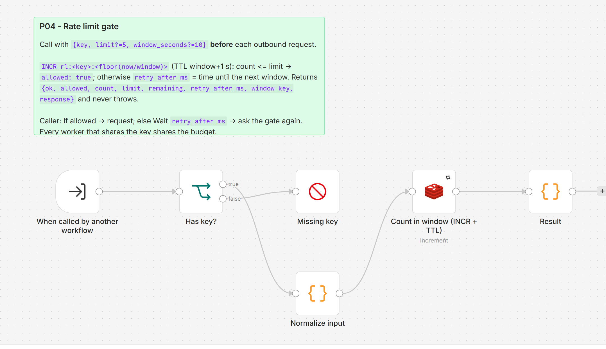

# P04 - Rate Limiting and Batching

**Category:** Patterns · **Difficulty:** Intermediate · **Tested on:** n8n 2.37.10

## Problem

The mock API allows five requests per ten seconds per client on `/ratelimited`; real APIs (GitHub, Shopify,
Google, most SaaS) have the same kind of quota, and some ban a key after repeated violations. A workflow that
fans out one HTTP call per item sends the whole page at once, gets a wall of `429`s, and the naive fix - retry
each one - only spreads the same burst over the next few seconds. Three workflows scheduled at the same minute
sharing one API key multiply the problem, and every `429` that reaches P01 is an alert nobody needs.

## Pattern

Spend the quota deliberately instead of discovering it. Three levers, from cheapest to most general:

1. **HTTP node `batching`** (`http(..., batching=(5, 10000))`): the node sends 5 items, waits 10 s, sends the next 5.
   Zero extra nodes; only throttles *this* node in *this* execution.
2. **Loop Over Items + Wait** (`loop(batch_size)` -> work -> `wait(...)` -> back to the loop): pacing across
   several nodes per item (e.g. fetch, then post, then log); still per execution.
3. **Shared gate** (this sub-workflow): a Redis counter keyed by the API/tenant that *every* workflow and every
   concurrent execution asks before calling. This is the only lever that enforces a quota across workers.

| Situation | Lever |
|---|---|
| One node, N items, one execution at a time | HTTP `batching` |
| Several nodes per item must be paced together | Loop Over Items + Wait |
| Several workflows / parallel executions share one API key | P04 gate (`key` = the API or tenant) |
| Quota is per user / per tenant of *your* system | P04 gate with `key = "<api>:<tenant>"` |
| The server sends `Retry-After` / `X-RateLimit-Reset` | the server's value **wins**: P02 already waits on it - keep P02 as the backstop after the gate |
| Read-only, low-volume, no quota documented | nothing; just `.retry(3, 1000)` |

The gate is a **fixed window**: `INCR rl:<key>:<floor(now/window)>` with a TTL, one atomic round trip. The
caller either proceeds (`allowed: true`) or sleeps `retry_after_ms` and asks again. Combine with P02 for the
calls themselves: the gate prevents *predictable* 429s, P02 handles the ones you could not predict.

## Implementation in n8n

`workflow.json` (`P04 - Rate limit gate`, id `ALP04RateLimitin`, sub-workflow). Input one item
`{key, limit?=5, window_seconds?=10}`.

1. **When called by another workflow** - Execute Workflow Trigger, passthrough input.
2. **Has key?** (If) -> otherwise **Missing key** (Stop and Error) so the caller's P01 sees a clear message.
3. **Normalize input** (Code, per item) - trims `key`, defaults, computes `window_index = floor(now / window)`,
   `window_key = rl:<key>:<index>`, `window_end_ms`, `ttl_seconds = window + 1`.
4. **Count in window (INCR + TTL)** (Redis `incr` on `window_key`, expire after `ttl_seconds`, 3 retries).
5. **Result** (Code) - `{ok: true, allowed: count <= limit, count, limit, remaining, retry_after_ms (0 when
   allowed, otherwise ms until the window ends), window_key, window_seconds, key, response}`. Never throws.

Calling it (see D03's authoring script - the same shape is used in the harness):

```python
gate_in = set_fields(wf, "Gate input", {"key": "d03-catalog", "limit": 5, "window_seconds": 10})
gate = execute_workflow(wf, "Rate limit gate (P04)", catalog_id("P04"))
allowed = if_(wf, "Allowed?", [cond_bool("={{ $json.allowed }}")])
hold = wait(wf, "Wait for next window", amount="={{ ($json.retry_after_ms + 250) / 1000 }}", unit="seconds")
wf.chain(gate_in, gate, allowed)
wf.connect(allowed, request, out=0)   # true: make the call
wf.connect(allowed, hold, out=1)      # false: sleep, then ask again
wf.connect(hold, gate)                # the gate echoes key/limit/window_seconds, so its output can be re-fed
```

Ask again after the wait rather than calling straight away: the request after the wait must be counted in the
new window, otherwise a long queue sends `limit + 1` per window. Inside a Loop Over Items use batch size 1 so
each item asks the gate on its own.



## Trade-offs

- **Fixed window bursts at the boundary.** Five calls at the end of one window plus five at the start of the
  next are ten calls in a second, which a server with a *sliding* window (like the mock API) still rejects. Either
  configure the gate at half the server's quota when the server slides, or accept that P02 catches the
  occasional boundary `429`. A sliding log or token bucket needs Lua / sorted sets, which the Redis node does not
  expose; a fixed window is one `INCR` and good enough for quotas of "N per minute/hour".
- **Redis is a dependency.** The gate retries three times and then fails loudly (P01) instead of letting
  the burst through; if you prefer "fail open" wrap the Execute Workflow node with `continueRegularOutput` and
  treat a missing `allowed` as true.
- **Waiting holds the execution.** `retry_after_ms` is at most one window; for quotas of "1000 per hour" a
  throttled worker can sleep up to an hour. Use `executionTimeout`, or fail fast and let the schedule pick the
  work up next run (T03 style).
- Not covered: per-endpoint costs (some APIs weight calls), concurrency limits (max N in flight, not per window),
  and circuit breaking for a dead service.

## Try it

```bash
bash scripts/import-workflows.sh patterns/P04-rate-limiting --publish
docker compose cp patterns/P04-rate-limiting/test/harness.json n8n:/tmp/p04-harness.json
docker compose exec -T n8n n8n import:workflow --input=/tmp/p04-harness.json
python scripts/dev/run-workflow.py ALP04Harness0000          # ~30-45 s: it waits for the rate-limit windows
python scripts/dev/executions.py --workflow ALP04Harness0000 --last 1
docker compose exec -T redis redis-cli --scan --pattern 'rl:harness:*'
```

The harness fires 8 parallel requests at `/ratelimited` without the gate, lets the server's window drain (11 s),
then sends 8 through the gate one at a time at **2 per 10 s** (every third request is throttled, sleeps until the
next window, asks again). The last node's output reads:

```json
{ "ungated": { "requests": 8, "ok": 5, "status_429": 3 },
  "gated":   { "requests": 8, "ok": 8, "status_429": 0, "throttled_by_gate": 3 },
  "pass": true,
  "response": "without gate: 3/8 got 429; with gate: 0/8 got 429" }
```

Why the harness uses 2 per 10 s against a server that allows 5: the server's window *slides* from its first
stored request while the gate's window is *fixed* to the clock, so five gated calls late in one window plus five
early in the next would be ten in a few seconds. Two fixed windows overlap any sliding one, so `limit = floor(5/2)`
is the largest setting that can never trip the server. Set `limit: 5` in `8 gated requests` to watch the
boundary burst produce 429s - the case P02 is there to backstop.

## Used by

- `D03 - Multi-source API Aggregation`
- `D02 - Web Scrape to Structured JSON` (shares the `d03-catalog` key with D03: one budget per site)
- `R02 - Bulk Certificates` (planned: pace docgen renders)
- `A06 - Article to Social Posts` (planned)
