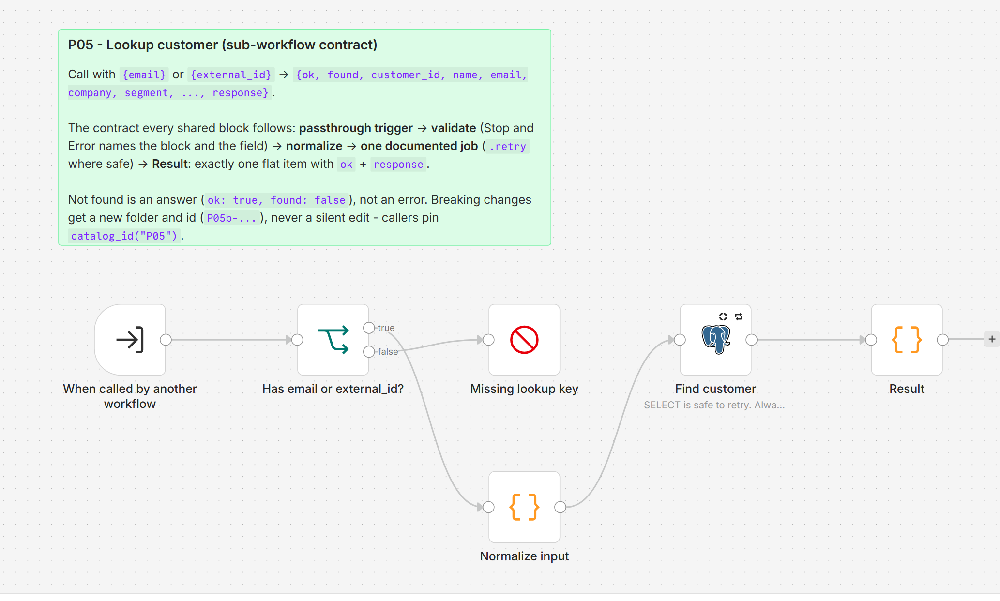

# P05 - Sub-workflow modularity

**Category:** Patterns · **Difficulty:** Intermediate · **Tested on:** n8n 2.37.10

## Problem

"Look up the customer by e-mail" starts as three nodes in one workflow, gets copy-pasted into the next five, and
then drifts: one copy lower-cases the address, one does not, one treats *no row* as a failure and pages someone at
03:00 because a prospect is not a customer yet. The e-mail-casing bug is fixed in three canvases; the fourth is
found two months later in a support ticket.

Extracting the block without a contract trades that for a quieter problem. A shared sub-workflow that returns two
items for one caller and none for another, sometimes an array under `data`, sometimes an exception on "not found",
forces every caller to grow a defensive Code node - and after the third caller nobody dares touch the block,
because n8n declares nothing: there is no schema on an Execute Workflow node, so callers discover the shape at run
time, in production. The AI case makes it sharp: an agent tool (A05) needs one flat item with a text field per
call; a block that answers with two items or throws hands the model garbage.

## Pattern

**A shared block is a function with a signature: one item in, exactly one flat item out, always carrying `ok` and
`response`; the only thing that throws is bad input; a breaking change gets a new id, never a silent edit.**

Every shared block in this repo is built from the same five steps - P02, P03, P04, P07 and P08 all follow them, and
`workflow.json` here is the reference implementation:

| # | Step | Node | Why it is in the contract |
|---|---|---|---|
| 1 | Receive | Execute Workflow Trigger v1.1, `inputSource: passthrough` | the caller's item arrives unchanged: no field mapping to keep in sync in two places |
| 2 | Validate | If → **Stop and Error** whose message names the block *and* the field | the caller (or P01's e-mail) reads `P05 lookup customer: input item needs email or external_id` and knows where to look |
| 3 | Normalize | one Code/Set node: trim, case, defaults | every later node sees one shape; callers may be sloppy |
| 4 | Do the one documented job | the service call, `.retry(3, 1000)` where repeating it is safe | a block does one thing; a `mode` flag is a second block in disguise |
| 5 | Result | Code/Set emitting **one flat item** with `ok` + `response` | callers branch on fields, AI tools read `response`; nothing has to be unwrapped |

Two rules that decide most arguments:

- **"Not found" is an answer, not an error.** A miss returns `ok: true, found: false` with a readable `response`.
  Throwing makes absence indistinguishable from "Postgres is down", fires the error workflow for a normal
  business case, and forces callers to wrap the call in an error lane just to handle an empty result. The caller
  decides what a miss means; the block only reports it.
- **Breaking changes get a new folder and id** (`P05b-lookup-customer`, new `catalog_id`), never an edit in place.
  Callers pin the id (`catalog_id("P05")` → `ALP05SubWorkflow`) inside their Execute Workflow node; changing what
  that id returns breaks every caller at run time, with no import-time error to warn anyone. Additive changes (a
  new output field, a new optional input with a default) are safe and stay in the same id.

When to extract at all:

| Situation | Extract into a block? |
|---|---|
| The same 3+ nodes exist in two workflows and must stay identical (retry classification, idempotency, rate gate) | yes - that is P02 / P03 / P04 |
| The step needs a credential or host allowlist the caller should not see (P07) | yes |
| An AI agent needs it as a tool | yes - a tool must answer as one flat item with a text field |
| Behaviour differs per caller by more than a documented parameter | no - two blocks, or keep it inline |
| A single node with a credential | no - the credential already *is* the shared thing |
| A hot loop over thousands of items | careful: ~650 ms for the first call in an execution, ~150 ms after; batch it (see Trade-offs) |

## Implementation in n8n

`workflow.json` (`P05 - Lookup customer`, id `ALP05SubWorkflow`, sub-workflow). Input: one item
`{email?, external_id?}`, at least one of the two; `external_id` wins when both are set.

1. **When called by another workflow** - Execute Workflow Trigger v1.1, `inputSource: passthrough`.
2. **Has email or external_id?** (If v2.2, combinator `or`, `notEmpty` on `String($json.email ?? '')` and on
   `String($json.external_id ?? '')`) → false lane → **Missing lookup key** (Stop and Error:
   `P05 lookup customer: input item needs email or external_id`). Nothing has run at that point, so a bad call
   costs one node.
3. **Normalize input** (Code, run once for each item) - e-mail trimmed and lower-cased, external id trimmed and
   upper-cased, empty strings become `null`; sets `lookup_by` (`external_id` when present, else `email`) and
   `lookup_value`. This is why the caller may pass `" cust-0001 "` and still hit `CUST-0001`.
4. **Find customer** (Postgres v2.5 `executeQuery`, credential `Postgres - demo`, **3 retries × 1 s**, *Always
   Output Data*) - one parameterised statement with `queryReplacement: {{ [ $json.external_id, $json.email ] }}`:

   ```sql
   select id, external_id, name, email, phone, company, country, city, segment, created_at
     from customers
    where ($1::text is not null and external_id = $1)
       or ($1::text is null and lower(email) = $2)
    order by id
    limit 1
   ```

   A `SELECT` is safe to repeat, so it carries `.retry`. *Always Output Data* turns a miss into one empty item
   instead of an ended branch, which is what lets step 5 run in both cases.
5. **Result** (Code, run once for all items) - drops the empty item (`r.id !== undefined`), then returns exactly
   one flat item and never throws:
   `{ok, found, customer_id, external_id, name, email, phone, company, country, city, segment, lookup_by,
   lookup_value, response}`.

Workflow settings: `callerPolicy: workflowsFromSameOwner` - only workflows owned by the same n8n user may call it
(`settings.callerPolicy`, the builder's default on every workflow in this repo) - and
`errorWorkflow: ALP01ErrorHandle`, so a failure inside the block is still reported by P01 when the caller does not
keep an error lane.

`test/input.json` → `test/expected.json` (abridged; the fixtures carry every field):

```json
{ "email": "selin.berg@lab.local" }
```
```json
{ "ok": true, "found": true, "customer_id": "CUST-0001", "name": "Selin Berg", "company": "Ironwood Furniture",
  "segment": "smb", "lookup_by": "email", "lookup_value": "selin.berg@lab.local",
  "response": "found CUST-0001 Selin Berg (Ironwood Furniture, smb) by email" }
```

A miss is the same shape: `{"ok": true, "found": false, "customer_id": null, "email": "nobody@lab.local",
"response": "no customer with email nobody@lab.local"}`.

**Calling it** (builder DSL; the Execute Workflow node points at `catalog_id("P05")` = `ALP05SubWorkflow`):

```python
lookup_in = set_fields(wf, "Lookup input", {"email": "={{ $json.email }}"})
lookup = execute_workflow(wf, "Lookup customer (P05)", catalog_id("P05"), mode="each",
                          cached_name="P05 - Lookup customer").on_error("continueErrorOutput")
known = if_(wf, "Known customer?", [cond_bool("={{ $json.found }}")])
wf.chain(lookup_in, lookup, known)
wf.connect(lookup, dead_letter, out=1)      # error lane = index 1; trustworthy only one item per call (below)
```

- **mode `each` vs `once`.** P05 answers **once per call**: `Result` reads `$('Normalize input').first()` and the
  first matching row, so a `once` call carrying five items returns one answer for the first item and silently drops
  the rest. Call it with `mode="each"`. `once` is for blocks written to take a batch (P08's logger). And if you
  keep the error lane, send **one item per call** - see the probe table below.
- **`waitForSubWorkflow: true`** (the builder's default, `options.waitForSubWorkflow`). With it off the caller
  does not wait for the answer and the node passes its input on instead; every caller in this repo waits.
- **`cached_name`** only fills the label shown on the canvas; the `value` (the 16-char id) is what n8n resolves.
- The block must be **active** in n8n or the call fails with "Workflow is not active and cannot be executed" -
  hence `autopublish: true` in the front-matter and `--publish` on the import command.

**The error lane is output index 1 on a single-item call - and that is the only shape you can trust.** The builder
wires it where n8n delivers it for that shape (`wf.connect(call, err_lane, out=1)` -> `connections[...].main[1]`),
but *how many items the call carries, and where the failing one sits*, changes both the branch count and the index.
Eleven probes against this block on n8n 2.37.10 (Execute Workflow v1.1 -> `ALP05SubWorkflow`):

| probe | items in the call | mode | error lane | what the node did |
|---|---|---|---|---|
| A | 1 bad | each | yes | out[0] empty, **out[1] = 1 error item** - correct |
| B | 1 good | each | yes | out[0] = 1 full result, out[1] empty - correct |
| C | 1 bad | once | yes | out[1] = 1 error item - correct |
| D | 1 bad | each | no | the caller fails with the Stop and Error message - correct |
| E | 1 good + 1 bad | each | yes | out[0] = 1 result, out[1] **empty**: the failing item is gone, node status *success* |
| F | 2 good | each | yes | out[0] = 2 results - correct |
| G | 2 bad | each | yes | out[1] = **1**: only the first failure arrives |
| H | 3 good + 1 bad | each | yes | node ends in *error* with `TypeError: Cannot read properties of undefined (reading 'entries')` (`assignPairedItems`) and echoes the 4 **raw input** items on out[0] |
| I | 2 good + 1 bad (bad last) | each | yes | **three** branches appear: out[0] = 2 results, out[1] empty, **out[2] = 1 error item** |
| J | 1 bad + 2 good (bad first) | each | yes | out[0] = 2 results, **out[1] = 1 error item** - correct |
| K | 4 good | each | yes | out[0] = 4 results - correct; a large batch is fine when nothing fails |

The block itself was fine in every probe: each call ran as its own integrated execution with the right result or
the right Stop and Error. The defect is on the caller's node. **Silent loss (E, G) is the dangerous one**: node
status "success", nothing on the error lane, no failed execution in the caller - the item is simply gone.

Probe I is why a fixed index is not safe either: the same block, one extra good item, and the error moves to
out[2]. That is the shape `patterns/P07-secrets/test/run.py` sends (3 items, refusal last), which is why its
comment says "index 2" and why it reads *everything after lane 0* rather than a fixed branch - and why an earlier
draft of this folder recorded `error_output_index: 2`. Both were honest observations of a moving target. Comparing
J with E and I shows the position of the failing item matters as much as the count, so there is no formula here
worth memorising: keep the call to one item and the index is 1.

| You need | Call shape |
|---|---|
| per-item error handling (route failures somewhere, keep the rest) | **one item per call**: `mode: each` with a single item, error lane on index 1 (probe A). Over many items, make many one-item calls - a Loop Over Items with batch size 1 in front of the node is probe A repeated |
| throughput, and a failure may fail the whole run | batch call **without** an error lane (probe D/F), or `mode: once` |
| nothing | a multi-item call **with** an error lane: E, G, H and I are silent, crashing or index-shifting |

`test/harness.json` is built on that rule, and asserts it: the three valid cases go through one `each` call with
**no** error lane (*Lookup customers (P05)*), and the bad-input case gets its own single-item call **with** the lane
(*Lookup bad input (P05)*). The Report node reads `$('Lookup bad input (P05)').all(1)` for the error lane and
`.all(0)` for the result lane and checks six things: three results, the two hits, the miss as data, exactly one
item on index 1 with **nothing** on index 0, and a message that names the block.

**Blocks and callers in this repo today** (every `execute_workflow(...)` in
`.claude/skills/n8n-workflow-json/authoring/`):

| Block | Called by |
|---|---|
| `P02 - HTTP with backoff` | T03, D03, D04, M05 |
| `P03 - Idempotency guard` | T01, M02 |
| `P04 - Rate limit gate` | D02, D03 |
| `P08 - Log execution` | M04, O05, D05 (in progress) |
| `P07 - Signed request` | no permanent caller yet: `patterns/P07-secrets/test/run.py` builds a throwaway caller (Execute Workflow + error lane), runs it, deletes it |
| `P05 - Lookup customer` | `test/harness.json` (reference block, see "Used by") |



## Trade-offs

- **Calls are not free.** ~650 ms for the first Execute Workflow call in an execution (cold start), ~150 ms after
  it. `mode: each` over 1 000 items is minutes of overhead; either design the block to take a batch and call it
  `once`, or keep the logic inline. Never put a block call inside a Loop Over Items that runs per row when a single
  SQL statement would do.
- **A batch call with an error lane loses failures.** On Execute Workflow v1.1 in n8n 2.37.10, `mode: each` +
  `onError: continueErrorOutput` is only reliable when the call carries one item: with a mixed batch the failing
  item disappears while the node reports success (probes E and G), with three items the lane moves to out[2]
  (probe I), and with four the node itself crashed (`assignPairedItems`) and echoed its raw input on the result
  lane. Per-item error routing therefore costs one call per item; batching means giving up the lane.
- **A handled error is still an alert.** P05 sets `errorWorkflow: ALP01ErrorHandle`, so a refused call fires P01
  even when the caller catches it on the error lane. In the live harness run the bad-input case produced P05
  execution 861 (status *error*) and P01 execution 862 in `mode: error` in the same second, which wrote
  `execution_log` row `error_message = 'P05 lookup customer: input item needs email or external_id'`,
  `error_node = 'Missing lookup key'` (P01's e-mail is then subject to its own 10-minute alert-storm guard). If a
  caller expects misses or dirty input as normal traffic, validate in the caller and keep the block's Stop and
  Error for genuine contract violations - which is the strongest argument for the "not found is an answer" rule:
  a miss must never reach the error workflow.
- **Debugging spans two executions.** The block runs as its own execution; the caller's canvas only shows that the
  Execute Workflow node failed, and the real message lives in the sub-workflow's execution one click away. That is
  the price of the boundary, and the reason the Stop and Error message starts with the block's name.
- **No type checking anywhere.** n8n does not validate the item a caller sends; the contract is enforced at run
  time by step 2 and on paper by this README. Renaming an output field breaks callers at run time, not at import -
  which is why breaking changes get a new id instead.
- **Versioning costs duplication.** `P05b-...` means two blocks to maintain until every caller has moved; the
  alternative (edit in place) means finding out from production.
- **`ok: true, found: false` moves the decision to the caller.** A caller that forgets to check `found` writes
  nulls into its table happily. Not throwing is deliberate, but it is not free.
- **`callerPolicy: workflowsFromSameOwner`** fits a single-owner lab. On a shared instance the block has to be
  shared with the calling workflows explicitly (`workflowsFromAList`), otherwise calls fail with a permission error.
- **This folder ships one reference block, not a library.** The catalog's other shared blocks are the other
  patterns (P02, P03, P04, P07, P08); P05 is the contract they all obey plus one small, honest example of it.
- Not covered: fan-out inside a block (it answers one item per call by design), binary payloads across the
  boundary (they are copied, not referenced), and call graphs deeper than one level - keep them flat and declare
  them in `depends_on`.

## Try it

```bash
bash scripts/import-workflows.sh patterns/P05-sub-workflows --publish
export MSYS_NO_PATHCONV=1                       # Git Bash only: keeps /tmp/... a container path
docker compose cp patterns/P05-sub-workflows/test/harness.json n8n:/tmp/p05-harness.json
docker compose exec -T n8n n8n import:workflow --input=/tmp/p05-harness.json
python scripts/dev/run-workflow.py ALP05Harness0000
python scripts/dev/executions.py --workflow ALP05Harness0000 --last 1
```

Do not try to activate the harness: it is manual-trigger only, so `scripts/dev/publish.py` (and the UI toggle)
refuses it - `run-workflow.py` executes it through the CLI instead. `P05 - Lookup customer` itself has no manual
trigger on purpose (a shared block is only ever called), so `python scripts/dev/run-workflow.py P05` fails with
"Missing node to start execution"; the harness is how you exercise it.

The **Report** node (open the execution in the UI, or `GET /api/v1/executions/<id>?includeData=true`) of the run
that shipped this folder:

```json
{ "pass": true,
  "checks": { "three_results": true, "hit_by_email": true, "hit_by_external_id": true,
              "miss_is_data": true, "one_error_on_index_1": true, "error_names_the_block": true },
  "result_items": 3,
  "error_items": 1,
  "response": "4 cases passed: 3 results from one 'each' call + 1 error item on output index 1 from the single-item call" }
```

with these four rows in `cases`:

| case | lane | ok | found | customer_id | response / message |
|---|---|---|---|---|---|
| hit by email (`selin.berg@lab.local`) | result (index 0) | true | true | CUST-0001 | `found CUST-0001 Selin Berg (Ironwood Furniture, smb) by email` |
| hit by external_id (` cust-0002 `) | result (index 0) | true | true | CUST-0002 | `found CUST-0002 Karim Weber (Skyline Realty, smb) by external_id` |
| miss (`nobody@lab.local`) | result (index 0) | true | false | null | `no customer with email nobody@lab.local` |
| bad input (neither key) | error (index 1) | - | - | - | `P05 lookup customer: input item needs email or external_id` |

Four integrated executions back that up - three `success` and one `error` - which you can see next to the harness
run, together with the P01 execution the failed one triggers:

```bash
python scripts/dev/executions.py --last 8
docker compose exec -T postgres psql -U n8n -d demo -tAc   "select execution_id, workflow_name, status, error_node from execution_log
    where workflow_name = 'P05 - Lookup customer' order by id desc limit 3"
docker compose exec -T postgres psql -U n8n -d demo -tAc   "select external_id, name, company, segment from customers where external_id in ('CUST-0001','CUST-0002')"
```

## Used by

The five shipped blocks that follow this contract node for node - passthrough trigger, validate → Stop and Error,
normalize, one job with `.retry`, one flat `{ok, ..., response}` item:

- `P02 - Retry with Exponential Backoff` (`P02 - HTTP with backoff`) - adds retryable/terminal classification to
  step 4 and answers `{ok, status, attempts, terminal, response}`
- `P03 - Idempotency` (`P03 - Idempotency guard`) - one atomic Redis round trip, `{ok, duplicate, count, key,
  response}`
- `P04 - Rate Limiting and Batching` (`P04 - Rate limit gate`) - `{ok, allowed, retry_after_ms, response}`, and it
  never throws, so the caller can wait and ask again
- `P07 - Secrets in a Public Repo` (`P07 - Signed request`) - same five steps, with the Stop and Error firing
  *before* the request when the target host is not allowlisted
- `P08 - Observability` (`P08 - Log execution`) - the batch variant: its *Normalize* and *Result* nodes run once
  per item, so it is called with `mode: once` and one call logs N rows, each answering `{ok, ..., response}`

And the folders that depend on the contract without being blocks themselves:

- `P01 - Global Error Handler` - the other side of the contract: when a caller keeps no error lane, the block's
  Stop and Error message is what P01 e-mails and writes to `execution_log`, which is why step 2's message names the
  block and the field.
- `A05 - Agent with Tools Calling Sub-workflows` (planned) - the block becomes an agent tool; the flat item with a
  text `response` is written for exactly this.
- `B04 - Support Inbox Triage, Assign and SLA Timer` (planned) - resolves the sender to a customer with
  `P05 - Lookup customer` before triaging.

The workflows that already call one of those blocks are listed in the caller table under "Implementation in n8n"
(ten of them today). They are deliberately not repeated here: their `patterns:` front-matter names the concrete
block they invoke, so the coverage matrix attributes them to that pattern instead of double-counting them under
P05.
