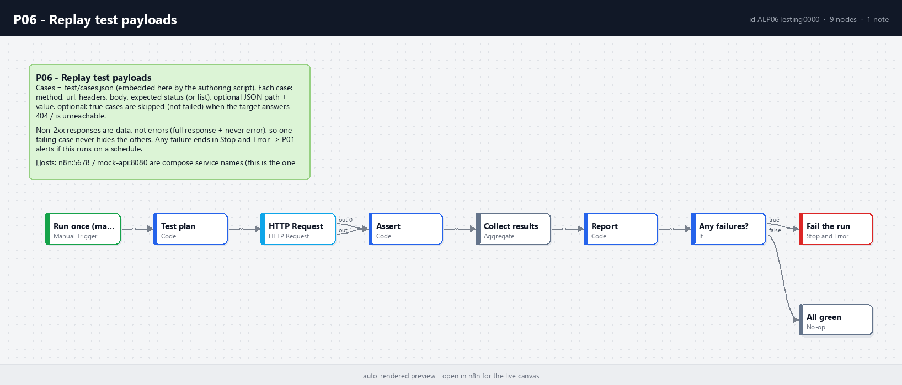

# P06 - Testing and Mock Payloads

**Category:** Patterns · **Difficulty:** Intermediate · **Tested on:** n8n 2.37.10

## Problem

A workflow is "tested" by clicking *Execute* once with whatever payload was on the clipboard. Six weeks later a
node is upgraded, a validation rule changes, an upstream sender renames a field - and the first person to notice
is the customer whose order came back `400`. There is no way to state "this webhook accepts *this* body and
answers *this*" in a form that can be re-run. While building this lab the harness caught a real one: the HTTP
Request node silently sent no body when `Send Body` was an expression, so T01 answered 400 from inside n8n while
curl from the host got 201.

## Pattern

Every folder ships `test/`: sample inputs and expected outputs, synthetic, checked into git. A **replay harness**
sends those samples at the real endpoints and asserts the status code and a JSON path, listing every case (never
stopping at the first failure), skipping cases whose target is not deployed, and failing the run when anything
is red - so the same harness can run on a schedule and alert through P01. Two runners share one plan
(`test/cases.json`): the n8n workflow (runs inside the network, proves the stack from the inside) and
`test/replay.py` (runs from the host or CI, no n8n needed). `pinData` stays `{}` by contract: pinned data hides
regressions because it replaces the trigger instead of exercising it.

| Level | What | Where |
|---|---|---|
| unit | validator Code nodes given `test/*.json` | manually in the editor, or via the harness through the webhook |
| contract | webhook status + body for valid / invalid / unauthenticated input | `cases.json` (this pattern) |
| stack | services answer (`/health`, outage simulation) | `cases.json`, `scripts/dev/smoke.py` |
| repo | folder contract, JSON structure, secrets | `scripts/validate.py` (CI) |

## Implementation in n8n

`workflow.json` (`P06 - Replay test payloads`, id `ALP06Testing0000`):

1. **Run once (manual / CLI)** → **Test plan** (Code) - the cases, embedded from `test/cases.json` by the authoring
   script. Case shape: `{name, method, url, headers?, body?, expect_status | [..], expect_path?, expect_value?, optional?}`.
2. **HTTP Request** (v4.2, *full response*, *never error*, 15 s timeout, error output for connection failures) -
   non-2xx is data; the headers/body come from the case (`specifyHeaders: json`, `specifyBody: json`).
3. **Assert** (Code, per item) - pairs each response with its case, compares status and JSON path, marks
   `optional` cases as *skipped* on 404 / unreachable.
4. **Collect results** → **Report** (Code) - `{total, passed, failed, skipped, failed_names, report}`.
5. **Any failures?** → **Fail the run** (Stop and Error with the report) or **All green**.

Adding a workflow's own tests: append a case to `CASES` in the authoring script (or to `cases.json` for the host
runner), pointing at `http://n8n:5678/webhook/<path>` with the folder's `test/payload.json` as body. Targets are
compose service names (`n8n`, `mock-api`); `replay.py` maps them to `localhost` ports.



## Trade-offs

- Side effects are real: a T01 case really inserts a row (the plan uses a fixed `external_id`, so it is one row
  ever, then `200 duplicate`). Run `bash scripts/reseed.sh` when a clean database matters.
- Sequential, one request at a time; fine for tens of cases, not a load test.
- No time control - schedule-driven workflows are exercised through their manual trigger, not by faking the clock.
- The harness targets n8n's own webhooks from inside n8n (`http://n8n:5678`). That is deliberate and is the one
  place the lab points a workflow at n8n itself.

## Try it

```bash
bash scripts/import-workflows.sh patterns/P06-testing
python scripts/dev/run-workflow.py P06                    # inside n8n; execution ends at "All green"
python scripts/dev/executions.py --workflow ALP06Testing0000 --last 1
python patterns/P06-testing/test/replay.py                # same plan from the host
```

Expected (both runners): 6 cases, `6 passed, 0 failed, 0 skipped` once P01, P03 and T01 are imported and
active; the three T01 cases show as *skipped* otherwise.

## Used by

- `T01 - Webhook to Database`
- `T05 - Form Trigger to Record and Confirmation Email`
- `M02 - GitHub Events to Chat Notification`
- `B01 - Lead Capture, Enrich, CRM Row and Follow-up Sequence`
