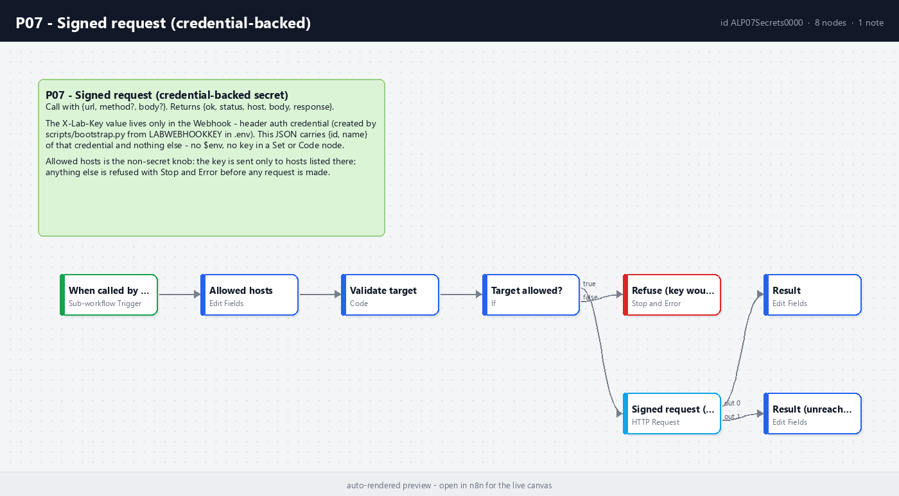

# P07 - Secrets in a Public Repo

**Category:** Patterns · **Difficulty:** Beginner · **Tested on:** n8n 2.37.10

## Problem

A workflow export lands in a public repo with the Postgres password inside its credential block, or with an API
key pasted into an HTTP Request header "just for testing". The key is live in git history for months, every fork
keeps a copy, and rotating it means rewriting history. The second failure is quieter: a workflow reads
`{{ $env.API_KEY }}`, so the export looks clean - but it now runs on one machine only, and the same expression in a
Code node reads `N8N_ENCRYPTION_KEY`. The third is the "reusable HTTP helper" that attaches the company key to
whatever URL the caller passes: one typo (`api.exmaple.com`) sends the key to a stranger and nobody notices,
because the response was a normal 404.

## Pattern

**A secret has exactly one home - the `.env` file on the machine - and reaches a workflow only through an n8n
credential that `scripts/bootstrap.py` creates from it.** Git tracks `.env.example` (dummy values), workflow JSON
with `{id, name}` credential references, and nothing else. The workflow decides *where* a secret may travel (an
allowlist on the canvas); the credential decides *what* the secret is. Where no credential type can carry the
value, the workflow carries a **dummy** that equals `.env.example`, says so in its README, and rotation means editing
that one node.

| Value | Lives in | Reaches the workflow through | Git tracks |
|---|---|---|---|
| Service passwords (Postgres, MinIO, IMAP) | `.env` | credential created by bootstrap (`Postgres - demo`, `S3 - MinIO`, `IMAP - GreenMail`) | `.env.example` dummy + `{id, name}` |
| Shared webhook key `LAB_WEBHOOK_KEY`, inbound | `.env` | Webhook node header auth with `Webhook - header auth` (T01) | dummy + `{id, name}` |
| Same key, outbound | `.env` | HTTP Request node with the same credential - the sub-workflow shipped here | dummy + `{id, name}` |
| n8n public API key | `data/.n8n-api-key` (git-ignored, minted by bootstrap) | `n8n API - local` credential (O04, O05) | never |
| `N8N_ENCRYPTION_KEY`, owner password | `.env` and the n8n volume | n8n itself, never a node | never |
| Third-party signing secret with no credential type (GitHub HMAC) | `.env` for the real value | Set node at the top of the workflow with the dummy (M02 "Config") - the documented exception | dummy only |
| Non-secret knobs (model name, addresses, thresholds, host allowlists) | the canvas | Set node | yes |
| Optional external tokens (Telegram, GitHub) | `.env`, empty by default | credential that bootstrap creates only when the variable is set | `{id, name}` only |

Routes that are closed on purpose: `$env` in any node (`N8N_BLOCK_ENV_ACCESS_IN_NODE=true`, rejected by the
validator, [ADR 0006](../../docs/decisions/0006-env-access-blocked-in-nodes.md)); external secret stores
(Vault, AWS Secrets Manager) are an n8n Enterprise feature and out of scope; `n8n export:credentials --decrypted`
never runs in a script.

**Credential naming.** Id `ALcred` + 10 characters (16 in total, nanoid-shaped, fixed in `CREDS` in
`n8n_builder.py`), display name `<Service> - <instance>` (`Postgres - demo`, `Webhook - header auth`). The builder
only accepts `CREDS` keys, `scripts/bootstrap.py` creates exactly those ids from `.env`, so an imported workflow is
wired without clicking and can never reference a credential that bootstrap will not create. A new secret means: a
variable with a dummy in `.env.example`, a `CREDS` entry, a spec in `credential_specs()` - never an inline value.

**What never gets committed, and what stops it.**

| Never in git | Stopped by |
|---|---|
| `.env`, any `.env.*` except `.env.example` | `.gitignore`; `pre-commit` (this folder); the Claude Code write guard refuses to write real env files |
| `data/` - API key, exports, inbox drops | `.gitignore`; `pre-commit` |
| Credential *values* in `workflow.json` (`data`, `oauthTokenData` ...) | `scripts/export-workflows.sh` strips them; validator rule "credentials by {id, name}"; write hook |
| `pinData` (real payloads captured in the editor) | validator and write hook require `pinData: {}` |
| Key-shaped strings anywhere (AWS, OpenAI, GitHub, Slack, Google, Telegram, Stripe, SendGrid, private-key blocks, JWTs) | `python scripts/validate.py --secrets-only` - blocking in CI (`validate.yml`) and in the Stop hook; `pre-commit` runs it on the staged diff |
| Real e-mail addresses in seed, test or workflow content | validator allows `@lab.local` / `@example.com` only |
| Screenshots of a credential dialog | you - `scripts/render-preview.py` only draws the canvas, and real captures go through `/screenshot` of the canvas |

The threat model behind these controls, and what to rotate before exposing a port, is in
[docs/security.md](../../docs/security.md).

## Implementation in n8n

`workflow.json` (`P07 - Signed request (credential-backed)`, id `ALP07Secrets0000`) is the outbound half of the
rule: call an endpoint that expects the shared key, without the key ever appearing in a node parameter. One item
in, one flat item out.

1. **When called by another workflow** (Execute Workflow Trigger v1.1, passthrough) - input `{url, method?, body?}`.
2. **Allowed hosts** (Set, keeps the other fields) - `allowed_hosts: ["mock-api:8080", "n8n:5678"]`. The one
   non-secret knob, on the canvas by design: the key may only travel to hosts named here.
3. **Validate target** (Code) - trims the URL, upper-cases the method (default `GET`), extracts the host, checks
   it against the allowlist; emits `{url, method, body, host, allowed, reason}`.
4. **Target allowed?** (If) - false → **Refuse (key would leak)** (Stop and Error:
   `P07 signed request: host example.com is not in allowed_hosts ...`). Nothing has been sent at this point; the
   caller's error lane or its P01 error workflow gets the message.
5. **Signed request (header credential)** (HTTP Request v4.2) - `authentication: genericCredentialType`,
   `genericAuthType: httpHeaderAuth`, credential `Webhook - header auth` (`ALcredWebhookHdr`); n8n adds
   `X-Lab-Key: <value>` at run time. Full response, *never error* (a 401 is data, not an exception), 15 s timeout,
   connection failures go to the error lane. No `.retry` inside: the body may not be idempotent, so the caller wraps
   the call with P02 when it wants retries.
6. **Result** (Set) - `{ok, status, host, method, url, credential, body, response}`;
   **Result (unreachable)** - same shape with `ok: false, status: 0`.

The diff that matters: `grep -n ALcredWebhookHdr patterns/P07-secrets/workflow.json` shows
`{"id": "ALcredWebhookHdr", "name": "Webhook - header auth"}` and nothing else about the key;
`grep -c lab-demo-key patterns/P07-secrets/workflow.json` prints `0`. The test target `mock-api:8080/secure/ping`
answers 200 only with the right header and never echoes it, so execution data stays clean too (`test/run.py` checks
that).

**Caller wiring** (builder DSL; the Execute Workflow node points at `catalog_id("P07")` = `ALP07Secrets0000`):

```python
req = set_fields(wf, "Build request", {"url": "http://mock-api:8080/secure/ping", "method": "POST",
                                        "body": {"event": "order.created", "id": "={{ $json.id }}"}})
sign = execute_workflow(wf, "Signed request (P07)", catalog_id("P07"), mode="each").on_error("continueErrorOutput")
gate = if_(wf, "Delivered?", [cond_bool("={{ $json.ok }}")])
wf.chain(req, sign, gate)
```

Mode *each* (one item per call), *Wait for sub-workflow* on. Success lane: the result item; error lane: `{error:
"P07 signed request: ..."}` for a refused host or a missing url. To point it at a real API: add the host to
**Allowed hosts**, put the real key in `LAB_WEBHOOK_KEY` in `.env` (never `.env.example`) and run
`python scripts/bootstrap.py --only-credentials`. A different header name or a second key is a new `CREDS` entry
plus a `credential_specs()` line, with its variable documented in `.env.example`.

**Inbound side.** The Webhook node's header auth uses the same credential: T01 answers 403 without `X-Lab-Key`,
and the value is nowhere in `workflows/T01-webhook-to-database/workflow.json`. HMAC-signed payloads (GitHub) have
no credential type that feeds the Crypto node, so M02 carries the dummy in its `Config` Set node and says so - the
one accepted exception in the table above.

**Local guard.** `pre-commit` in this folder refuses env files, anything under `data/`, and key-shaped strings in
the staged diff (same regexes CI uses). Install once per clone:
`cp patterns/P07-secrets/pre-commit .git/hooks/pre-commit && chmod +x .git/hooks/pre-commit`.



## Trade-offs

- A credential is opaque to the workflow: it cannot be logged, compared or handed to the Crypto node. That is the
  point, and the reason HMAC verification of third-party signatures (M02) has to carry a dummy on the canvas.
- Redirects are not followed (`followRedirects: false`, no credentials on cross-origin redirects). An allowed
  host answering `302 Location: http://elsewhere/` would otherwise get the key re-sent there; a 3xx comes back
  as `ok: false` with its status instead.
- The allowlist is by host, not by path. A rogue endpoint on an allowed host still receives the key
  (`mock-api:8080/webhooks/sink` echoes request headers - never point P07 at an echo endpoint).
- Response bodies land in execution data as-is. If a target echoes request headers, the key ends up in Postgres;
  choose targets that do not, or set `EXECUTIONS_DATA_SAVE_ON_SUCCESS=none` (docs/security.md).
- The regex scan catches key *shapes*, not every secret: a plain password passes. The real defence is structural -
  no script ever copies `.env` into a tracked file, and the builder cannot emit a credential value.
- One shared key for the whole lab. Production uses one credential per target, rotated independently; n8n CE has no
  secret versioning, so rotation is "edit the credential" (bootstrap does it from `.env`).
- The dummy values are public knowledge (`lab-demo-key`, `minioadmin`). Exposing a port without rotating `.env`
  first (docs/security.md, "Before exposing anything") means effectively no auth.

## Try it

```bash
bash scripts/import-workflows.sh --publish patterns/P07-secrets
python patterns/P07-secrets/test/run.py                                   # 3 passed, 0 failed (+ execution ids)
python scripts/dev/executions.py --workflow ALP07Secrets0000 --last 3     # success, success, error (the refusal)
curl -i localhost:8080/secure/ping                                        # 401 - no key
curl -i -H 'X-Lab-Key: lab-demo-key' localhost:8080/secure/ping           # 200 - value of LAB_WEBHOOK_KEY
grep -c lab-demo-key patterns/P07-secrets/workflow.json                   # 0
python scripts/validate.py --secrets-only                                 # the CI gate, same scan as pre-commit
```

## Used by

- `T01 - Webhook to Database` (inbound: Webhook node header auth with the `Webhook - header auth` credential)
- `M02 - GitHub Events to Chat Notification` (documented exception: HMAC dummy in the Config node, rotation by editing it)
- `B01 - Lead Capture, Enrich, CRM Row and Follow-up Sequence` (planned: CRM call through the sub-workflow)
- `D04 - Incremental Sync` (planned: authenticated source API through the sub-workflow)
- `P06 - Testing and Mock Payloads` (planned: replace the plain-text `X-Lab-Key` in the harness cases with a call through P07)
