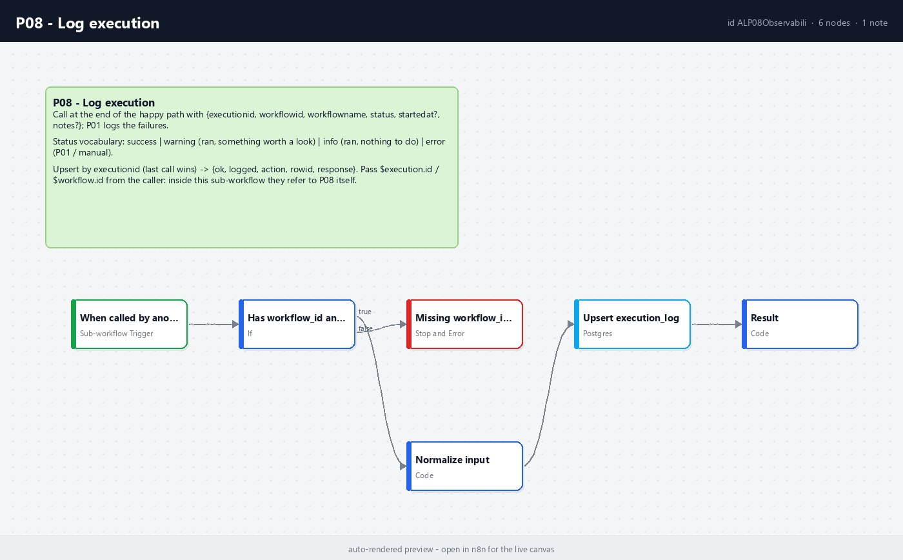

# P08 - Observability

**Category:** Patterns · **Difficulty:** Intermediate · **Tested on:** n8n 2.37.10

## Problem

Two weeks after the fact, somebody asks why a digest did not go out on a Friday. The execution is gone
(`EXECUTIONS_DATA_MAX_AGE` prunes after 7 days), and even while it existed the executions list only answered
"did this one workflow run" - not "what ran last night, how long did it take compared with last month, which
runs finished green but did nothing". Meanwhile the inbox has forty e-mails from one flapping API, so the one
that mattered was archived unread. The executions list is a debugging view, not observability: it has no
history that survives pruning, no cross-workflow picture, and no distinction between "worth a look" and "wake
someone up".

## Pattern

Every unattended run leaves **exactly one structured row** in a table you own (`demo.execution_log`), with the
same fields for every workflow: `execution_id, workflow_id, workflow_name, status, started_at, finished_at,
duration_ms, error_message, error_node, logged_at`. Three writers, one vocabulary:

| Who writes | When | Status |
|---|---|---|
| the workflow itself, via **P08 - Log execution** | at the **end of the happy path** (last node) | `success`, `warning`, `info` |
| **P01 - Global Error Handler** | when a node failed (n8n's error workflow) | `error` |
| **O05** (n8n public API backfill, every 15 min) | for runs that neither of the above logged | whatever n8n reports |

Severity vocabulary - four words, no more:

| Status | Meaning | Alert? |
|---|---|---|
| `success` | ran, did its job | no |
| `info` | ran, nothing to do (empty poll, "all within thresholds") | no |
| `warning` | ran, but something is worth a look (rows skipped, retries exhausted on a side branch, threshold crossed) | only if it is a threshold breach, and then once per window |
| `error` | did not finish; P01 wrote the row | yes, once per workflow per 10 minutes |

**Alert on what needs a human now; dashboard the rest.** Failures, threshold breaches and *silence* (a schedule
that did not run) go to a person. Durations, run counts, warning ratios and alert volume go to a dashboard
(Metabase over `execution_log` and `notifications`, see O05 and `docs/observability.md`). Every alerting path
gets a storm guard: Redis `INCR` on a key with a TTL, alert only when the counter is 1 (P01: per workflow per
10 minutes; M04: per metric per hour). Repeats are still *logged* - suppression is about the e-mail, never
about the row.

When not to bother: a workflow you run by hand from the editor (you are looking at it), and read-only
one-offs. Everything on a schedule or a webhook logs.

## Implementation in n8n

`workflow.json` (`P08 - Log execution`, id `ALP08Observabili`, sub-workflow):

1. **When called by another workflow** - Execute Workflow Trigger, passthrough input, one item per call.
2. **Has workflow_id and status?** (If) - `workflow_id` non-empty and `status` in `success|error|warning|info`,
   otherwise **Missing workflow_id or status** (Stop and Error) so the caller's P01 sees a clear message.
3. **Normalize input** (Code, per item) - every optional becomes `null`; `finished_at` defaults to now (the log
   call *is* the end of the run); `duration_ms` = `finished_at - started_at` when `started_at` was passed;
   `workflow_name` falls back to the id; `notes` are stored in `error_message` when there is no error message
   (the table has no `notes` column; see Trade-offs).
4. **Upsert execution_log** (Postgres, writable-CTE upsert keyed on `execution_id`, 3 retries, *continue on
   error*) - update the row if it exists (last call wins, `logged_at` refreshed), insert otherwise. Needs no
   unique index; O05 adds one later for its bulk backfill.
5. **Result** (Code, per item) - `{ok, logged, action: inserted|updated|failed, row_id, execution_id,
   workflow_id, workflow_name, status, duration_ms, response}`. When Postgres is down the item says
   `logged: false` and the caller carries on: logging never fails the run.

Calling it - in the authoring script, right after the trigger capture the start time, and make the log call the
last node of the happy path:

```python
started = set_fields(wf, "Started", {"started_at": "={{ $now.toISO() }}"})
...
log_in = set_fields(wf, "Log input", {
    "execution_id": "={{ $execution.id }}",          # inside P08, $execution/$workflow would be P08's own
    "workflow_id": "={{ $workflow.id }}",
    "workflow_name": "={{ $workflow.name }}",
    "status": "success",                              # or "warning" / "info"
    "started_at": "={{ $('Started').item.json.started_at }}",
    "notes": "={{ 'synced ' + $json.inserted + ' executions' }}",
})
log = execute_workflow(wf, "Log execution (P08)", catalog_id("P08"), cached_name="P08 - Log execution")
```

`$execution.id` and `$workflow.id` **must be passed by the caller**: inside a sub-workflow they refer to the
sub-workflow's own execution. The Execute Workflow node waits for P08 and returns the result item; most callers
ignore it. P08 must be published (`autopublish: true`) - an inactive sub-workflow cannot be executed.

The test harness (`test/harness.json`, `ALP08Harness0000`) is a manual workflow wired exactly like that, calling
P08 twice: a `success` row and a `warning` row.



## Trade-offs

- **One row per execution** is the contract, so call P08 as the *last* node. If a node after the log call fails,
  P01 writes a second row for the same `execution_id` (or, once O05 has created the unique index, P01's plain
  insert is skipped and only the e-mail goes out). Both are visible; neither is silent.
- `execution_log` has no `notes` column, and the seed schema is generated (not hand-edited), so P08 stores
  `notes` in `error_message` for non-error rows. In production add `notes text` and change one line in
  **Normalize input**.
- Every log call is a sub-workflow execution: it costs a few milliseconds and shows up in the executions list
  (and O05 logs those runs too, as `P08 - Log execution`). Filter `mode = 'integrated'` in O05's Code node if that
  is noise for your dashboard; the lab keeps them because they are honest.
- The upsert is two statements in one CTE, not `ON CONFLICT`; two calls for the same `execution_id` in the same
  millisecond could both insert. Callers log once per run, so this does not happen in practice, and O05's unique
  index closes the door.
- No tracing: a parent and its sub-workflows are separate rows. The caller's `execution_id` is what you correlate
  on; sub-workflow rows carry their own id.

## Try it

```bash
bash scripts/import-workflows.sh patterns/P08-observability --publish
docker compose exec -T n8n n8n import:workflow --input=/repo/patterns/P08-observability/test/harness.json
python scripts/dev/run-workflow.py ALP08Harness0000
docker compose exec -T postgres psql -U n8n -d demo -c "select execution_id, workflow_name, status, duration_ms, error_message as notes, logged_at from execution_log order by id desc limit 2"
python scripts/dev/executions.py --workflow ALP08Observabili --last 2        # two integrated runs, success
```

Expected: the harness prints `both_logged: true`; two new rows, `success` with `harness: 5 of 5 rows processed`
and `warning` with `harness: 2 of 5 rows skipped (simulated partial failure)`, both with a small `duration_ms`.
Run the harness again: two more rows (a new execution id each time). Then start O05 to see the same table
filled from the n8n API and charted in Metabase.

## Used by

- `O05 - Execution Logs to Postgres to Metabase` (logs its own sync runs; backfills everything else)
- `M04 - DB Threshold Alert` (`info` when all within thresholds, `warning` on a breach, alerted or suppressed)
- `D05 - Scheduled DB Dump to MinIO with Rotation` (one `success` row per dump; the run notes carry the tables, rows and rotation counts)
- `A02 - Ticket Classification and Routing` (one row per triage run; `info` on an empty queue, `warning` when any ticket lands on the review lane)
- `A03 - Audio to Transcript, Summary and Task List` (`success` with the task count, `warning` when the transcript fails the quality gate)
- `P01 - Global Error Handler` (writes the `error` rows to the same table directly, same vocabulary)
- `T02 - Scheduled Daily Digest` (planned: log `success` / `info` after *Record notification*)
- `M01 - Uptime Monitor with Escalation` (planned: `warning` on state changes; M01 ships without the call today)
