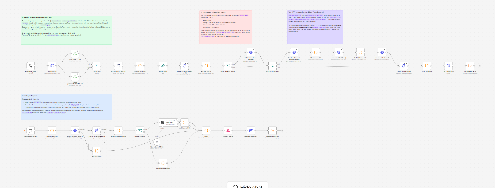

# A01 - RAG Chatbot over the Repo Docs

**Category:** AI · **Difficulty:** Advanced · **Tested on:** n8n 2.37.10
**Patterns used:** P01 (error workflow), P08 (observability: one `execution_log` row per index run and per question)

## Problem

The documentation of this repository is 22 markdown files: a PRD, four topic documents, ten ADRs and eight
pattern READMEs. Nobody reads all of it, and the question people actually have is small and specific - *"what
does the error handler do about repeats?"*, *"why is Execute Command disabled?"*. Full-text search answers those
badly, because the words in the question are rarely the words in the file. A retrieval-augmented chatbot answers
them well - and is also the single easiest thing in automation to fake: point a model at some vectors, get a
confident paragraph, ship the demo, and never notice that a third of the answers are invented. The interesting
part of this workflow is therefore not the embedding, it is the discipline around it: an index you can re-run
without duplicating vectors, a similarity floor that refuses before the model is even called, a prompt with a
refusal token, and an answer that always arrives with the passages it came from and their scores, so a reader
can check it. Everything runs on the machine you are sitting at: Ollama, Qdrant, no API key, no card, ~3 GB of
models.

## How it works

Two paths in one workflow, sharing one Qdrant collection (`lab_docs`). They are deliberately not connected: the
ingest path is an **operator action** that costs a minute of CPU, the query path is **interactive** and must
answer in seconds. Splitting them into two folders would have split one artifact - the collection contract
(payload shape, metadata keys, chunk size) is the same object seen from two sides, and a reader who changes the
chunk size has to see both halves at once.

### Ingest (top row) - `Reindex the docs (manual)`

1. **Index settings** (Set) - every knob in one place: `chunk_size 900`, `chunk_overlap 150`,
   `embed_batch_size 16`, `vector_size 768` (nomic-embed-text), `force_rebuild false`, and `started_at` for the
   log row.
2. **Read docs/\*\*/\*.md** and **Read patterns/\*/README.md** (Read/Write File, glob) -> **Corpus files**
   (Merge, append). That is the corpus: everything under `docs/` (PRD, security, observability, tool comparison,
   ten ADRs) plus the eight pattern READMEs - **22 files, ~115 kB**. Workflow READMEs are *not* included: n8n can
   only read under `/home/node/.n8n-files`, and `workflows/` is mounted at `/repo/workflows` for the CLI
   importer, outside that root (see Notes).
3. **Extract markdown text** (Extract From File, `keepSource: both`) - the text lands in `json.content` while
   `binary.data.directory` + `fileName` survive, which is how each chunk gets a citable path.
4. **Prepare documents** (Code) - one item per file: repo-relative `source`, `title` (front-matter `title:` or
   the first `#` heading), cleaned `text`. YAML front matter is dropped: it is metadata, not prose.
5. **Hash content** (Crypto, SHA-256 of the text) -> **Index manifest (Qdrant scroll)** (HTTP, one call, a 404
   means "no collection yet" and is treated as an empty index) -> **Plan the reindex** (Code): compares the hash
   of every file on disk with the `content_hash` carried by the chunks already in the collection and produces
   `added / changed / unchanged / removed`.
6. **Stale chunks to delete?** -> **Delete stale chunks (Qdrant)** deletes by payload filter
   (`metadata.source in [...]`) for every changed **and** removed file, so a changed file never leaves an older
   copy behind.
7. **Anything to embed?** -> **Create collection if missing** (PUT, a 409 is the normal answer from the second
   run on) -> **Chunk and batch** (Code: recursive character split on paragraph / line / sentence / hard slice,
   packed to 900 characters with 150 carried over, grouped into batches of 16) -> **Embed batch (Ollama)** (HTTP
   `POST /api/embed`, one call per batch) -> **Build Qdrant points** (Code: zips each batch with its vectors;
   the point id is `content_hash + chunk_index`, so an upsert can never duplicate a chunk) -> **Upsert points
   (Qdrant)** (PUT, safe to retry precisely because the ids are deterministic).
8. **Count points (Qdrant)** reads the truth back -> **Index summary** (Code) -> **Log input (index)** ->
   **Log index run (P08)**: one row, `success` when something was written, `info` when nothing had changed.

### Query (bottom row) - `Ask the docs (chat)`

9. **Prepare question** (Code) - normalises the message and carries the three retrieval knobs: `top_k 6`,
   `min_score 0.45`, `max_sources 4`.
10. **Embed question (Ollama)** -> **Search the docs (Qdrant)** (`POST /points/search`, cosine). Both are
    read-only, so both retry; both have an **error lane** into **Retrieval failed**, which turns an unreachable
    index into a normal chat reply instead of a 500.
11. **Build grounded context** (Code) - keeps only hits at or above `min_score`, takes the best four, and builds
    the numbered context block (`[1] docs/PRD.md - PRD ...`) plus the prompt. It also names the situation:
    `ok`, `below_threshold`, `empty_index`, `index_error`, `not_asked`.
12. **Enough context?** (If) - false goes to **No grounded answer** and the model is never called (a refusal
    costs 0.8 s instead of 30). True goes to **Answer from the docs (LLM)** (Basic LLM Chain) with **Ollama
    (llama3.2:3b)**, temperature 0, `numCtx 4096`, `keepAlive 30m`, and a system prompt that says: answer only
    from the numbered passages, cite them as `[n]`, and if they do not contain the answer reply exactly
    `NOT_IN_DOCS`. The node retries once and then routes to **Model unavailable**.
13. **Reply** (Code) - one shape for all four lanes. A real answer gets a `Sources:` block listing only the
    passages the answer actually cited, with their similarity scores; `NOT_IN_DOCS` becomes a plain refusal that
    still shows what was retrieved; every failure lane becomes a sentence a human can act on.
14. **Respond to chat** (Respond to Webhook, the chat trigger runs in `responseNode` mode) -> **Log input
    (question)** -> **Log question (P08)**: `success` grounded, `warning` refused, `error` for a failure the chat
    absorbed. The log call sits *after* the response and continues on error - logging a question must never
    break the conversation.



## Setup

- Services: `core` **and** `ai` profiles -
  `docker compose --profile core --profile ai up -d` (n8n, Postgres, Ollama, Qdrant; ~8 GB RAM).
  First boot pulls `llama3.2:3b` (~2 GB) and `nomic-embed-text` (~275 MB); check with
  `docker compose exec -T ollama ollama list` before running anything.
- Credentials: **`Ollama - local`** (used by the chat-model node) and **`Postgres - demo`** (used by P08), both
  created by `scripts/setup.sh`. Qdrant is reached over plain HTTP on the compose network and needs no
  credential here - the local instance has no API key (see Notes).
- Import: `bash scripts/import-workflows.sh workflows/A01-rag-docs-chatbot --publish`.
  **P08 must be imported and published first** (`depends_on: [P08]`), or the two log nodes fail with
  "Workflow is not active and cannot be executed".
- Activation: `autopublish: true`. Publishing is what exposes the chat endpoint; there is no schedule, so a
  published A01 costs nothing until somebody asks a question or runs the reindex.
- The chat URL is stable because the webhook id is derived from the workflow id:
  `http://localhost:5678/webhook/f5387d42-2ec6-5c40-9ab6-872129623d74/chat` (open it in a browser for the hosted
  chat window, or POST to it).

## Try it

```bash
docker compose exec -T ollama ollama list                     # llama3.2:3b + nomic-embed-text must be there

# 1. build the index (~60 s from empty: 22 files, 115 kB -> 177 chunks)
python scripts/dev/run-workflow.py A01
curl -s localhost:6333/collections/lab_docs | python -m json.tool | grep -E 'points_count|size|distance'

# 2. run it again - nothing changed, so nothing is embedded (~1.5 s)
python scripts/dev/run-workflow.py A01

# 3. ask a question the docs can answer (8-43 s on CPU; see the latency note below)
curl -s -X POST http://localhost:5678/webhook/f5387d42-2ec6-5c40-9ab6-872129623d74/chat \
  -H 'Content-Type: application/json' \
  -d @workflows/A01-rag-docs-chatbot/test/chat-request.json | python -m json.tool

# 4. ask one they cannot
curl -s -X POST http://localhost:5678/webhook/f5387d42-2ec6-5c40-9ab6-872129623d74/chat \
  -H 'Content-Type: application/json' \
  -d '{"action":"sendMessage","sessionId":"demo","chatInput":"Who won the 2018 FIFA World Cup?"}' \
  | python -m json.tool

# 5. what the run left behind
docker compose exec -T postgres psql -U n8n -d demo -c \
  "select execution_id, status, duration_ms, left(error_message, 100) as notes
     from execution_log where workflow_id = 'ALA01RagDocsChat' order by id desc limit 6"
```

Expected, measured on this stack on 2026-09-07 (4 vCPU, 9.6 GB to Docker, no GPU):

| step | result |
|---|---|
| first index (empty collection) | `corpus 22 file(s) / 115497 chars -> 177 chunk(s) in lab_docs; embedded 22 file(s) (22 new, 0 changed) = 177 chunk(s), skipped 0 unchanged; took 59 s` - `execution_log` status `success` |
| second index, nothing changed | same corpus line, `embedded 0 file(s) ... skipped 22 unchanged; took 1 s`, `points_count` still 177 - status `info` |
| one file changed | `embedded 1 file(s) (0 new, 1 changed) = 31 chunk(s), skipped 21 unchanged; dropped the chunks of 1 file(s); took 12 s`, `points_count` unchanged |
| grounded question (step 3) | `grounded: true`, `reason: ok`, an answer citing `patterns/P03-idempotency/README.md` at similarity **0.695**, in **8-43 s** |
| off-topic question (step 4) | `grounded: false`, `reason: below_threshold`, in **0.8 s** - best score 0.42 is under the 0.45 floor, so the model was never called |

The real answer to step 3, captured on 2026-09-07:

```
Every inbound event carries an external id. Before the side effect, the workflow asks a shared store
"have I seen <scope>:<external_id>?" in one atomic operation. First time -> proceed; seen before ->
answer success without doing the work again [2].

Sources:
[2] patterns/P03-idempotency/README.md - Idempotency  (similarity 0.695)
```

`workflows/A01-rag-docs-chatbot/test/questions.json` holds the small evaluation set (three answerable, two
unanswerable, one empty, one known-wrong) with the answers observed on that date;
`test/README.md` shows how to walk it and how to force every failure lane on purpose.

## Notes & trade-offs

- **The Qdrant Vector Store node does not work on this stack, so the vector store is built from HTTP + Code
  nodes.** `@n8n/n8n-nodes-langchain.vectorStoreQdrant` bundles `@qdrant/js-client-rest@1.16.2`, which builds an
  **undici 6** `Agent` and hands it to Node 26's built-in `fetch` (undici 7 handler API). Every call dies with
  `TypeError: fetch failed`, and the container log shows the real cause,
  `InvalidArgumentError: invalid onError method`. Reproduced in both the main process and the `n8n execute` CLI,
  before a single vector was written. The HTTP Request node (axios) talks to the same Qdrant happily, so the
  five Qdrant operations this workflow needs - scroll, delete-by-filter, create collection, upsert, search - are
  plain REST calls, and chunking is a Code node instead of the Recursive Character Text Splitter sub-node. The
  payload written is exactly the shape the LangChain node writes (`{content, metadata:{...}}`), so when the
  client is fixed upstream the node drops straight back in over the same collection. What is lost: the
  `ai_embedding` / `ai_document` / `ai_textSplitter` lanes on the canvas, and the splitter's exact
  implementation - the Code node reproduces its idea (recurse paragraph -> line -> sentence -> hard slice, then
  pack to `chunk_size` with `chunk_overlap` carried over), not its source. The chat model still hangs off the
  Basic LLM Chain on `ai_languageModel`, which works fine.
- **Retrieval quality with a 3B model, honestly.** On questions whose answer is a *paragraph* the setup is good:
  P01's alert policy, P03's idempotency key, P05's single-item rule all come back correctly cited, with top
  scores of 0.69-0.79. On questions whose answer is a **table row** it fails, and it fails confidently. Asked
  *"which port does Mailpit listen on for SMTP"*, the right answer (`| mailpit | core | 8025 / 1025 |` in
  `docs/PRD.md`) never enters the top 10 - dense embeddings represent a markdown table row poorly - and
  `llama3.2:3b` answered "8025", a number that was in *neither* retrieved passage, while dutifully citing one of
  them. Asked which services run in the `ai` profile it listed Redis, which is `core`. Both are in
  `test/questions.json` as expected weaknesses, not swept away. The fixes are known and out of scope here:
  hybrid retrieval (BM25 alongside the vectors, which Qdrant supports as sparse vectors), table-aware chunking
  that repeats the header row with each row, a re-ranker, and a 7-8B model. Treat this bot as a way to *find the
  file*, not as a source of numbers - which is why every answer prints its sources.
- **`nomic-embed-text` is used without its task prefixes.** The model was trained with `search_document:` /
  `search_query:` prefixes. Prefixing correctly is not possible here: the query side is easy, but on the
  document side the prefix would have to be attached to every chunk, and the chunker would have to be
  prefix-aware. Asymmetric prefixing is worse than none, so neither side gets one. Scores are therefore
  compressed (relevant ~0.7, irrelevant ~0.4 instead of a wider spread) and the 0.45 floor was calibrated
  against that. Re-calibrate it if you change the embedding model - it is the single most load-bearing number in
  the workflow.
- **Re-index freshness is manual, on purpose.** Nothing watches `docs/`; the index is as old as the last run of
  the ingest path. A Schedule trigger would make it fresh and would also mean an unattended laptop embedding
  documents at 3 a.m.; a Local File Trigger on `/home/node/.n8n-files/docs` would fire per file save. Both are
  three minutes of work on top of what is here (the plan step already makes a re-run cheap: 1.4 s when nothing
  changed), and both were left out because "the index is stale" is a *visible* problem in a demo while "the
  laptop is hot" is not. In production this is a `schedule` + the same plan step.
- **Deleting before inserting leaves a window.** A changed file's chunks are deleted and re-embedded a few
  seconds later; a question asked in between retrieves nothing for that file. Zero-downtime re-indexing means
  building into a second collection and swapping a Qdrant alias, which needs a dynamic collection name in five
  places. At this corpus size (12 s for a file) the window is not worth the machinery, and the query path
  already answers "not in the docs" honestly during it.
- **The collection name `lab_docs` is a literal in five nodes** (three Qdrant REST URLs on the ingest path, one
  on the query path, plus `Index settings` for documentation). It is a constant, not a setting: making it one
  would need the same expression in five places, which is not less error-prone, only less visible.
- **Chat executions do not page anyone.** A retrieval or model failure is caught, answered politely, and logged
  as `error` through P08 - so it shows up in `execution_log` and on the Metabase dashboard (O05), but it does
  **not** trigger P01, because from n8n's point of view nothing failed. That is the deliberate trade: a chat
  request must always answer. If you want to be paged for a dead Ollama, watch `execution_log` for
  `status = 'error'` on this workflow (M04 is the shape of that alert), or drop the error lanes and let P01 do
  its job at the price of a 500 in the chat window.
- **No memory, no follow-up questions.** Every message is retrieved and answered on its own; "and what about the
  second one?" will not work. A Window Buffer Memory sub-node on an Agent would fix the conversation but would
  also let the model answer from the conversation instead of the passages, which is the exact failure this item
  is built to avoid. The honest version is query rewriting - a first LLM call that folds the history into a
  standalone question - and it doubles the latency of every turn on a CPU-bound 3B model.
- **Latency and RAM on the 8 GB target.** Measured: models resident `llama3.2:3b` **2.6 GB** at `numCtx 4096`
  and `nomic-embed-text` **376 MB**, both 100% CPU; Qdrant **229 MB** with 177 points; n8n ~900 MB. A grounded
  answer took **8 s** at best (warm model, short answer, idle box) and **43 s** at worst (cold model load), with
  ~30 s typical while two other AI workflows were sharing the same Ollama - `keepAlive: 30m` is what keeps the
  model warm between questions, and generation is what dominates: the retrieval half (embed + search) is under
  200 ms. A refusal below the score floor takes **0.4-0.8 s**. Embedding the whole corpus takes ~60 s in
  batches of 16 - `nomic-embed-text` is 137M parameters and embeds ~3 chunks per second on this CPU. `numCtx` is
  4096 rather than the node default 2048 because four passages plus the system prompt do not fit in 2048 tokens;
  raising it further costs RAM linearly. Ollama runs one request at a time here (`OLLAMA_NUM_PARALLEL=1`), so
  two people chatting queue behind each other - the timeouts on the HTTP nodes (300 s on the batch embed) are
  sized for that, not for a fast machine.
- **The corpus is what n8n can read**, which is `docs/` and `patterns/` (both mounted read-only under
  `/home/node/.n8n-files`). The two dozen workflow READMEs - the largest and most useful body of prose in the
  repo - are mounted at `/repo/workflows` for the CLI importer only, outside `N8N_RESTRICT_FILE_ACCESS_TO`. Adding one
  read-only mount to the compose file would include them and roughly triple the corpus (~15 min of embedding on
  this hardware); that is a stack change, so it is not made here.
- **Deterministic point ids are the second line of defence.** Even if the delete step were skipped, re-upserting
  identical content overwrites the same points, because the id is `content_hash + chunk_index`. The one thing
  that *would* duplicate is a mid-run crash after some batches were upserted and before the run finished - the
  next run sees the file as still-changed, deletes all of its chunks and writes them again, so it self-heals.
- **The scroll that reads the manifest is capped at 10 000 points** and does not paginate. At 177 chunks that is
  a decade of headroom; past that, the plan step needs the `next_page_offset` loop, or a payload index on
  `metadata.source` and one scroll per file.
