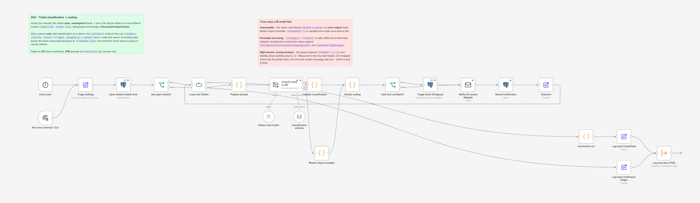

# A02 - Ticket Classification and Routing

**Category:** AI · **Difficulty:** Advanced · **Tested on:** n8n 2.37.10
**Patterns used:** P01 (error handler), P08 (observability: one `execution_log` row per run)

## Problem

Support tickets arrive from four channels into one pile, and the first ten minutes of every morning go to
reading them and deciding who they belong to. An LLM can do that reading - but "ask a model and write the answer
into the database" is how you end up with a `category` column containing `Billing?`, `refund`, `technical issue`
and an occasional apology paragraph, because a 3-billion-parameter model running on a laptop does not reliably
answer in the shape you asked for. The interesting part of this workflow is not the prompt; it is the contract
around it: a schema the output must parse into, an enum check on the values, a confidence floor, and one rule -
**a classification that cannot be validated never touches the ticket row**. It goes to a human instead, with the
reason attached.

## How it works

1. **Every hour** (Schedule, off until you publish the workflow) or **Run once (manual / CLI)** ->
   **Triage settings** (Set): `batch_limit 4`, `min_confidence 0.6`, `review_to triage@lab.local`, plus
   `started_at` for the log row.
2. **Open tickets (oldest first)** (Postgres, 3 retries): the oldest `status = 'open'` tickets with no assignee,
   joined to `customers` for the name and e-mail, `limit $1` from `batch_limit`. **Any open tickets?** (If) sends
   an empty queue straight to the log with status `info`.
3. **Loop over tickets** (batch size **1**) -> **Prepare prompt** (Code): flattens the ticket into the four lines
   the model sees (`Ticket / Channel / Subject / Message`, body truncated to 1200 characters) and keeps the ids
   the rest of the run needs. One item per LLM call is deliberate: it keeps the chain node's error output
   trustworthy (see Notes) and makes a failure cost one ticket, not the batch.
4. **Classify ticket (LLM)** (Basic LLM Chain) with two sub-nodes: **Ollama chat model** (`llama3.2:3b`,
   temperature 0, `format: json`) and **Classification schema** (Structured Output Parser), which appends the
   JSON schema to the prompt and parses the answer into
   `{category, priority, confidence, reason}`. The system message repeats the parser's `{"output": {...}}`
   envelope in words, because a 3B model only follows it about half the time otherwise (see Notes). The node
   retries once (`retryOnFail: 2`, 2 s apart) - a re-sample is the cheapest fix for a model that rambled - and
   then routes the item to its **error output**.
5. **Validate classification** (Code, success lane): the parser guarantees the *shape*, this node guarantees the
   *values* - `category` in `billing|technical|account|shipping|other`, `priority` in `low|normal|high|urgent`,
   `confidence` a number in `[0, 1]`, `reason` non-empty. Anything else becomes an entry in `problems[]` and the
   field becomes `null`; nothing throws.
   **Model output unusable** (Code, error lane): the same shape with `parsed: false` and the model/Ollama error
   message as the single problem.
6. **Decide routing** (Code) - one place computes `action` (`route` / `review`), the target mailbox, the e-mail
   subject, HTML and text, the notification severity, and whether the model agreed with the label the seed data
   carries. Queues: `billing@lab.local`, `support-tech@lab.local`, `accounts@lab.local`, `logistics@lab.local`,
   `support@lab.local`; the review desk is `triage@lab.local`.
7. **Valid and confident?** (If) - true: **Triage ticket (Postgres)** runs
   `update tickets set category, priority, status = 'triaged', assigned_to = <queue> where id = $1 and status =
   'open' returning ...` (3 retries; the `status = 'open'` guard makes a second run a no-op). False: straight to
   the e-mail, **no write at all**.
8. **Notify the queue (Mailpit)** (3 retries) -> **Record notification** (`notifications`, severity `info` for a
   routed ticket, `warning` for one that needs a human, *continue on error*) -> **Outcome** (Set: the flat
   per-ticket result) -> back into **Loop over tickets**.
9. When the loop is done: **Summarize run** (Code) counts routed / needs-review / unparseable / invalid / below
   confidence and, over the tickets that were classified, how often the model matched the category label already
   in the seed data. **Log input (classified)** -> **Log execution (P08)** writes exactly one `execution_log`
   row: `success` when everything routed, `warning` when at least one ticket went to a human.



## Setup

- Services: `core` **and** `ai` profiles - `docker compose --profile core --profile ai up -d` (n8n, Postgres,
  Mailpit, Ollama; ~8 GB RAM). The first boot pulls `llama3.2:3b` (~2 GB); check with
  `docker compose exec -T ollama ollama list` before running anything.
- Credentials: `Ollama - local`, `Postgres - demo`, `SMTP - Mailpit` (all created by `scripts/setup.sh`).
- Import: `bash scripts/import-workflows.sh workflows/A02-ticket-classifier`. P08 must be imported and published
  first (`depends_on: [P08]`), otherwise the last node fails with "Workflow is not active and cannot be executed".
- Activation: the workflow ships **unpublished** on purpose - an hourly schedule that runs four LLM calls will
  keep a laptop busy. Publish it (`--publish`, or the toggle in the UI) when you want the hourly triage.
- Tuning lives in **Triage settings** (how many tickets per run, how confident the model has to be) and in the
  **Ollama chat model** node (which model).

## Try it

```bash
docker compose exec -T ollama ollama list                       # llama3.2:3b must be there
docker compose exec -T postgres psql -U n8n -d demo < workflows/A02-ticket-classifier/test/new-tickets.sql
python scripts/dev/run-workflow.py A02                          # 21-76 s for four tickets on CPU
docker compose exec -T postgres psql -U n8n -d demo -c \
  "select ticket_no, category, priority, status, assigned_to from tickets where ticket_no like 'TCK-9%' order by ticket_no"
curl -s "localhost:8025/api/v1/messages?limit=4" | python -m json.tool | grep -E 'Subject|Address'
docker compose exec -T postgres psql -U n8n -d demo -c \
  "select target, severity, subject from notifications order by id desc limit 4"
docker compose exec -T postgres psql -U n8n -d demo -c \
  "select execution_id, status, error_message as notes from execution_log where workflow_id = 'ALA02TicketClass' order by id desc limit 1"
```

Expected: the four fixture tickets (`TCK-9001..9004`, see `test/README.md`) are classified one by one - 21 s for the
four tickets with a warm model, 76 s cold or while another workflow is using Ollama (`OLLAMA_NUM_PARALLEL: 1`,
so calls queue). A routed ticket becomes `status = triaged` with `assigned_to` set to
its queue mailbox and produces an e-mail to that queue plus an `info` row in `notifications`; anything the model
got wrong, wrote outside the enums, or was not confident enough about stays `open` and unassigned and produces a
`warning` e-mail to `triage@lab.local` with *Why a human: ...*. One `execution_log` row per run.

The run recorded while writing this README (`llama3.2:3b`, temperature 0; repeated once with identical
categories, priorities and confidences):

| ticket | model category / priority | confidence | action |
|---|---|---|---|
| TCK-9001 duplicate invoice charge | billing / urgent | 0.90 | routed to `billing@lab.local`, ticket `triaged` |
| TCK-9002 API 500 on /orders | technical / high | 0.80 | routed to `support-tech@lab.local`, ticket `triaged` |
| TCK-9003 Arabic, parcel not delivered | shipping / normal | 0.00 | `triage@lab.local`, ticket untouched |
| TCK-9004 "Re: Fwd: quick question" | other / low | 0.00 | `triage@lab.local`, ticket untouched |

`classified 4 ticket(s): 2 routed, 2 to the triage desk; 2 below min_confidence; category matched the seed label
on 4/4 (100%)` - the category was right four times out of four, and the model still reported `0.0` confidence
twice, which is the honest shape of this problem: the classification is usable, the self-assessment is not.
Run it again without reloading the fixture and it moves on to the seeded backlog (there are ~17 open,
unassigned tickets in the seed).

Without the fixture the workflow simply classifies the four oldest open tickets from the seed. To watch the
failure lane on purpose (no model needed), see the second half of `test/README.md`: point the chat model at
`no-such-model:1b` and every ticket lands on `triage@lab.local` with the ticket rows untouched.

## Notes & trade-offs

- **A 3B model is a triage assistant, not an oracle.** `llama3.2:3b` is what fits in the lab's 8 GB budget; it
  handles "charged twice for invoice INV-…" and "GET /orders returns 500" reliably, and gets visibly less sure of
  itself on short, vague tickets and on Arabic (the seed contains both): in the run above it put the Arabic
  parcel ticket in `shipping` correctly but justified it with "delivery address" and a confidence of `0.0`.
  Expect a wrong category now and then, and treat
  the `category` column as a suggestion that a human can override - the audit trail is the e-mail and the
  `notifications` row, not the column. A 7-8B model or a prompt with three worked examples per category is the
  first upgrade; a fine-tune on your own resolved tickets is the second.
- **The parser's `output` envelope is the failure nobody warns you about.** n8n's Structured Output Parser
  (v1.2, *from JSON example*) wraps your schema in `{"output": {...}}` and, if the model answers with the bare
  object, zod strips every unknown key and the node hands you `{}` - a *correct* classification silently becomes
  an empty one. Measured on these four tickets: **2/4** answers wrapped when only the parser's own format
  instructions ask for it; **4/4** after one sentence in the system message spells the envelope out. The
  workflow survived it either way (an empty object fails validation and goes to a human), but half the tickets
  went to the triage desk for no reason. If you swap the model, re-check the raw text in the *Ollama chat
  model* node's output before blaming the prompt.
- **Self-reported confidence is a weak signal.** The model returns the number it thinks looks right. In the run
  above it answered `0.0` on two tickets whose category it got *right* (including the Arabic one), and `0.9` on
  the two it found obvious; other prompts get `0.9` on a ticket that says "following up on the thing we
  discussed". So the floor mostly buys caution, not accuracy, and the enum check does the real work. A usable
  confidence signal needs token log-probabilities (not exposed by the LangChain nodes) or a second sample
  compared against the first (twice the cost). Set `min_confidence` to `0` if you would rather route everything
  the enums accept and let humans correct it.
- **The seed's `category` column doubles as a reference label** because the generator picks the category first
  and then the subject line from that category's templates. The summary reports agreement over the tickets that
  were classified, which is a useful sanity check on a prompt change - but it is a 4-to-20 ticket sample, not an
  evaluation. A real evaluation belongs in P06 with a fixed labelled set and a pass threshold.
- **Three failure modes, one destination.** Unparseable output (the chain node throws), parseable-but-invalid
  output (`{"category": "refund"}`) and the stripped-envelope `{}` above all end as `action = review`. That is
  deliberate: from the desk's point of view "the machine could not decide" is one situation. They stay
  distinguishable in the run summary (`unparsed` vs `invalid`) and in the e-mail, which prints the exact reason
  (`category null is not one of billing|technical|...`).
- **The error output is only trusted because the batch size is 1.** n8n's per-item error routing is dependable
  for a single item; with a batch, a failing item can be silently dropped while the node reports success (see
  `patterns/P05-sub-workflows/README.md`). One ticket per call costs a loop iteration and buys certainty. The
  same choice makes the run resumable in practice: a crash mid-batch leaves the already-triaged tickets triaged
  and the rest `open`.
- The output parser node can **auto-fix** (a second LLM call that repairs its own output against the schema). It
  is not wired here: it doubles the cost of every failure and hides the failure rate, which is exactly the number
  this workflow is meant to expose. Add it when the re-sample retry is not enough.
- `assigned_to` gets a **queue mailbox**, not a person; the seed uses agent e-mails there. Round-robin to a real
  agent needs a `queue_members` table and a cursor (Redis `INCR` modulo the member count) - out of scope here.
  There is also no SLA re-calculation: `sla_due_at` was set when the ticket arrived and the new priority does not
  move it. B04 is where the SLA timer belongs.
- No idempotency key: the `and status = 'open'` guard is what makes a re-run safe (the second update touches
  nothing), and a re-classified ticket would need its own decision anyway - "who wins, the model or the human who
  already changed the category?" - which is a policy question, not a workflow one. The guard has one honest hole:
  if somebody triages a ticket between the select and the update, the update changes no row while the e-mail
  still goes out. Reading the `returning` row and branching on it would close it, at the price of a node whose
  only job is an edge case that costs one duplicate e-mail.
- The prompt and the schema live in the workflow. In production both belong in version control next to a golden
  set, so that "we changed the prompt" is a reviewable diff with a measured before/after.
