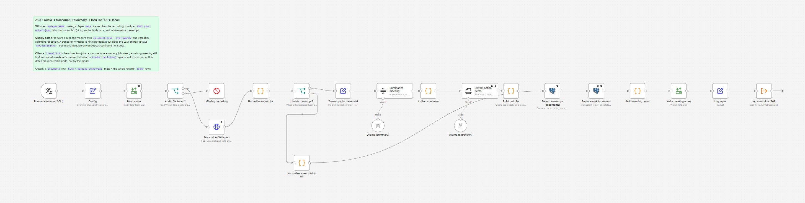

# A03 - Audio to Transcript, Summary and Task List

**Category:** AI · **Difficulty:** Advanced · **Tested on:** n8n 2.37.10
**Patterns used:** P01 (error handler), P08 (observability)

## Problem

The weekly ops call happens, three people commit to something, and by Thursday nobody remembers who owns what.
Somebody volunteers to "write the notes", does it twice, then stops. The recording exists - it is just 30 minutes
of audio nobody will ever open again. What is actually wanted is small and structured: a transcript you can
search, five lines a colleague can read in ten seconds, and a **task list with owners and dates** that can be
inserted into whatever tracks work. Sending meeting audio to a cloud transcription API is the usual answer, and
the usual reason legal says no. This runs the whole pipeline on the machine under the desk: Whisper for speech,
Ollama for language, Postgres for the result.

## How it works

1. **Run once (manual / CLI)** → **Config** - the recording (`/home/node/.n8n-files/seed/meeting-clip.wav`),
   the ASR language, the output directory, and the four quality-gate limits.
2. **Read audio** → **Audio file found?** → no → **Missing recording** (Stop and Error). Read/Write File is a
   glob: a path that matches nothing returns *zero items* and the run would finish green having done nothing.
3. yes → **Transcribe (Whisper)** - multipart `POST http://whisper:9000/asr?output=json` with the file in the
   `audio_file` field (`faster_whisper`, model `base`). The service answers `text/plain` even for
   `output=json`, so the HTTP node uses `responseFormat: text` and the JSON arrives as a string.
4. **Normalize transcript** (Code) - parses that string, keeps `text` and the per-segment
   `start/end/text/avg_logprob/no_speech_prob` (dropping the token arrays), and computes the word count and the
   mean confidence figures.
5. **Usable transcript?** (If) - the gate, four signals: at least `min_words` words, mean `no_speech_prob` at
   most `max_no_speech`, mean `avg_logprob` at least `min_avg_logprob`, and at most `max_repetition` of the
   segments repeating verbatim (a Whisper decoding loop). Whisper never says "I heard nothing" - over silence or
   noise it emits fluent, wrong sentences - so its own confidence numbers are the guard.
   - **no** → **No usable speech (skip AI)** (Code) - same output contract, status `low_confidence`, no LLM call.
6. **yes** → **Transcript for the model** (Set, text only) → **Summarize meeting** - Summarization Chain in
   **map-reduce** mode over **Ollama (summary)** (`llama3.2:3b`, temperature 0.2): chunk the transcript,
   summarise each chunk, combine into 3-6 bullet points. → **Collect summary** (Code) builds the extractor prompt
   from the summary *and* the raw transcript.
7. **Extract action items** - Information Extractor over **Ollama (extraction)** (temperature 0) against the JSON
   schema `{tasks: [{title, owner, due, priority}], decisions: [...]}`. It continues on error, so a model that
   fails to produce valid JSON costs the task list, not the run.
8. **Build task list** (Code) - trims and dedupes titles, normalises owners, and resolves due dates
   (`Friday`, `tomorrow`, `in 2 weeks`, `2026-09-11`) against the meeting date **in code**; anything unresolved is
   kept verbatim as `due_raw`.
9. **Record transcript (documents)** - one row, `kind = meeting-transcript`, `meta` = the whole record →
   **Replace task list (tasks)** - a single statement that deletes this source's previous rows and inserts the
   current list, so replays do not pile up → **Build meeting notes** → **Write meeting notes**
   (`data/out/meeting-<run_id>.md`).
10. **Log input** → **Log execution (P08)** - one `execution_log` row: `success`, or `warning` for a
   low-confidence transcript or a failed extraction. Node failures go to **P01**.



## Setup

- Services: `core` **and** `ai` profiles - `docker compose --profile core --profile ai up -d`
  (needs ~8 GB RAM; the first start downloads the Whisper `base` model, ~145 MB, and `llama3.2:3b`, ~2 GB).
- Credentials: `Postgres - demo`, `Ollama - local` (both created by `scripts/setup.sh` from `.env`).
  Whisper needs no credential - it is an unauthenticated service on the compose network.
- Import: `bash scripts/import-workflows.sh workflows/A03-audio-to-tasks`
- **P08 - Log execution must be imported and published first** (`bash scripts/import-workflows.sh patterns/P08-observability --publish`),
  otherwise the last node fails with "Workflow is not active and cannot be executed".
- No activation needed: A03 has a manual trigger and is run from the editor or the CLI.
- Before the first run, check both models are actually there:
  ```bash
  docker compose exec -T ollama ollama list                      # llama3.2:3b must be listed
  curl -s -o /dev/null -w '%{http_code}\n' localhost:9010/docs    # 200 once Whisper finished loading
  ```

## Try it

```bash
# 1. the raw ASR contract, straight against the service (this is what the HTTP node sends)
curl -s -X POST "localhost:9010/asr?encode=true&task=transcribe&language=en&output=json" \
     -F "audio_file=@seed/files/meeting-clip.wav" | python -m json.tool | head -30

# 2. the workflow
python scripts/dev/run-workflow.py A03
python scripts/dev/executions.py --last 3

# 3. what it produced
cat data/out/meeting-*.md
docker compose exec -T postgres psql -U n8n -d demo -c \
  "select id, kind, file_name, meta->>'status' as status, meta->'asr'->>'word_count' as words,
          meta->>'task_count' as tasks from documents where kind = 'meeting-transcript' order by id desc limit 3"
docker compose exec -T postgres psql -U n8n -d demo -c \
  "select id, source, title, owner, due_date from tasks where source like 'a03:%' order by id"
docker compose exec -T postgres psql -U n8n -d demo -c \
  "select workflow_name, status, duration_ms, error_message as notes from execution_log order by id desc limit 3"
```

Run it twice: the `tasks` rows are replaced, not duplicated (the `source` is `a03:<file name>`).

To point it at your own recording, drop the file into `data/` (mounted read-write at
`/home/node/.n8n-files/data/`) and change `audio_file` in **Config**. Any format ffmpeg can read works - the
service re-encodes before transcribing (`encode=true`).

`test/meeting-standup.txt` is a synthetic standup transcript with the kind of content the extractor is meant to
find. It is the fastest way to exercise the two LLM nodes without waiting for transcription:

```bash
docker compose exec -T ollama ollama run llama3.2:3b \
  "Extract the action items as JSON: $(cat workflows/A03-audio-to-tasks/test/meeting-standup.txt)"
```

`test/asr-response.json` is the real `/asr?output=json` body for `seed/files/meeting-clip.wav` - the shape
**Normalize transcript** parses. `test/expected.json` records what a run of this workflow produced here.

## Notes & trade-offs

- **The lab clip is synthesised speech, not a recording of people.** `seed/generate_seed.py` renders an invented
  four-person standup through a local offline TTS engine (Windows SAPI here; espeak-ng / piper / macOS `say`
  elsewhere), so it is real, transcribable English rather than a microphone capture. Two consequences worth
  knowing: every line is spoken with its own speaker's name in front of it, because Whisper does not diarise and
  that spoken label is the only thing that lets "I will fix the template" become "Samir owns it"; and a machine
  with no TTS engine falls back to a tone clip that will *not* transcribe - the generator prints a loud warning
  and this workflow then takes its `low_confidence` lane instead.
- **The extractor does not find every action item.** The clip contains four commitments; the shipped run pulls
  three and misses Nadia's "I will escalate the tax rates with finance today". That is `llama3.2:3b`, not the
  plumbing - a bigger model or a second extraction pass over the summary would close it. Treat the task list as a
  strong first draft a human confirms, which is the honest claim for a 3B model, and the reason the transcript,
  the summary and the tasks are all persisted rather than only the tasks.
- **A missing recording used to be silent.** Read/Write File is a glob, so a path that matches nothing returns
  zero items and every node after it is skipped - the execution finishes green and P08 never runs.
  `alwaysOutputData` on **Read audio** plus **Audio file found?** turns that into a Stop and Error
  (`A03: no file matched <path>`), which is what P01 is for. Worth copying into any file-driven workflow.
- **Accuracy on `base`.** `base` is the smallest model worth using: on clean single-speaker English expect
  roughly 10-15% word error, worse with accents, crosstalk or background noise, and it invents punctuation and
  names. It is fine for "what was this meeting about", not for minutes of record. `small` (~460 MB) or
  `medium` (~1.5 GB) are drop-in swaps via `WHISPER_MODEL` in `.env`, at 2-5x the CPU time. Nothing here does
  speaker diarisation, so "who said it" is only known when the speaker says a name; `whisperx` + a HF token is
  the upgrade path, and it is neither free nor local-only in spirit.
- **Runtime and timeouts.** `base` + `int8` on CPU runs at roughly 1x-3x realtime, so a 30 s clip is seconds and
  a one-hour recording is 20-60 minutes. The HTTP node is therefore set to a **600 s timeout with 2 tries,
  5 s apart** - a retry re-transcribes the whole file, so three tries would be an hour of CPU for a network
  blip. For recordings longer than a few minutes, move the transcription into a sub-workflow of its own and
  make the caller asynchronous (or raise the timeout deliberately); n8n's LangChain nodes have no timeout knob
  at all, so a wedged Ollama would hang the execution - `EXECUTIONS_TIMEOUT` is the only backstop.
- **The gate is honest, not clever.** `no_speech_prob` and `avg_logprob` are the model's own confidence and they
  do correlate with garbage, but they are not calibrated: a confidently wrong transcript passes. In production
  add `vad_filter=true` (it is already a Config field) so Whisper skips silent stretches instead of hallucinating
  through them. It is off here so the shipped run exercises the gate arithmetic on the whole clip, pauses
  included, and because the seeded clip is clean TTS with short gaps - on a real recording with dead air at the
  top and tail, turn it on.
- **A 3B model is the weak link, deliberately.** `llama3.2:3b` fits in 8 GB of RAM, which is the hardware
  baseline for this repo. It follows a JSON schema most of the time, not always - hence
  `onError: continueRegularOutput` on the extractor and a `warning` row instead of a failed run. On the seeded
  clip it produces a clean summary and three of the four commitments with the right owners and dates, missing
  Nadia's "I will escalate the tax rates with finance today" (see `test/expected.json`, `known_model_errors`).
  That is the accuracy ceiling: the output is a draft somebody skims, not a system of record. The fix is a bigger
  model (`OLLAMA_MODEL=llama3.1:8b`), not a longer prompt.
- **The extractor is prompt-sensitive.** The first version of the prompt asked for "owner and due date only when
  they were actually said" and the model returned **no due dates at all**. Spelling out "copy `due` exactly as it
  was spoken (today, tomorrow morning, by Friday...)" got all three. Small models need the example, not the rule.
- **Ollama serialises.** `OLLAMA_NUM_PARALLEL: 1` in the compose file, so when another workflow (A01, A02) is
  mid-inference A03 waits in the queue and the execution looks stuck. One run needs three slots: two for the
  map-reduce summary, one for the extraction.
- **Dates are resolved in code, never by the model.** Small models are unreliable at calendar arithmetic and a
  wrong due date is worse than none. The model returns what was said (`"Friday"`), `Build task list` maps it to a
  date relative to the meeting date, and gives up (keeping `due_raw`) rather than guessing.
- **Idempotency is per source file, not per run.** `Replace task list (tasks)` keys on `a03:<file name>`, so
  re-running the same recording replaces its tasks and re-running is safe. Two different recordings of the same
  meeting produce two sets. There is no unique index behind this - the delete+insert is one statement, which is
  enough for a single writer.
- **The whole record lives in `documents.meta`** (transcript, segments, summary, decisions, tasks). Convenient
  here, wrong at scale: a one-hour transcript is a few hundred KB of jsonb per row and the segments are the bulk
  of it. In production keep the audio and the transcript in object storage (MinIO, as D05 does) and put only the
  summary, the counts and the key in the row.
- **Not handled:** speaker labels, multi-language meetings (one `language` per run; `task=translate` exists but
  is not wired), attachments or slides mentioned in the call, and pushing the tasks anywhere but the `tasks`
  table - that last hop is one Postgres node away from being a Jira/Todoist/GitHub call, and deliberately stays
  local here.

## Live run

Verified on 2026-09-07, n8n 2.37.10, `faster_whisper` `base`/int8 on CPU, `llama3.2:3b`. Full record in
`test/expected.json`.

`python scripts/dev/run-workflow.py A03`, execution 1296, 79.0 s end to end, `status: success`:

```
transcript : 162 words, 16 segments, language en
             "Nadia. Morning everyone, quick stand up. Orders queue first. Karim, where are we?
              Karim. 12 orders are still stuck from the partner import. I will chase the corrected
              file today and rerun the import tomorrow morning. ..."
gate       : PASS on all four signals - 162 words (min 12), mean avg_logprob -0.120 (min -1.0),
             mean no_speech_prob 0.171 (max 0.6), verbatim-repeat share 0.00 (max 0.5)
documents  : #25 meeting-transcript / meeting-clip.wav / status ok / task_count 3
tasks      : id  title                                     owner  due_date
              8  Resolve stuck orders from partner import  Karim  2026-09-08   <- "tomorrow morning"
              9  Fix invoice PDFS support template         Samir  2026-09-11   <- "by Friday"
             10  Deploy uptime alerts                      Karim  2026-09-11   <- "before the end of the week"
P08        : A03 - Audio to Transcript, Summary and Task List | success | 78999 ms
```

The meeting is Monday 2026-09-07, so "by Friday" and "before the end of the week" both resolve to 2026-09-11.
Owners are attributed correctly because every line is spoken with its speaker's name in front of it - Whisper
does not diarise, so that label is doing the work. Three of the clip's four commitments are captured; the missed
one is in Notes & trade-offs.

Re-running replaces the task rows for the same recording rather than appending, so the workflow is safe to run
twice - an earlier run's ids 5-7 became 8-10 here, not 5-10.

The **Missing recording** guard was verified separately by pointing **Config** at a path that does not exist:
execution status `error`, message `A03: no file matched /home/node/.n8n-files/seed/does-not-exist.wav`.

The `low_confidence` lane is not hypothetical either: it is what every run produced before the seed clip carried
real speech, and it is what a machine with no local TTS engine still gets (see Notes & trade-offs).
