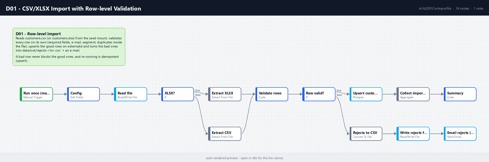

# D01 - CSV/XLSX Import with Row-level Validation

**Category:** Data & ETL · **Difficulty:** Intermediate · **Tested on:** n8n 2.37.10
**Patterns used:** P01 (error handler)

## Problem

A customer list arrives as a spreadsheet. Row 13 has a typo in the e-mail, row 28 has no name, row 52 repeats an
id. The naive import either fails as a whole on the first bad row (57 good rows lost) or inserts garbage. What the
person who sent the file needs is: the good rows in the database, the bad rows back in a file with *why* each one
was rejected, and the same result if the import runs twice.

## How it works

1. **Run once (manual / CLI)** → **Config** (Set) - `file`, `format` (`csv` | `xlsx`), `report_to`.
2. **Read file** (Read/Write Files from Disk) - from the read-only seed mount or `data/inbox/`.
3. **XLSX?** → **Extract XLSX** (first sheet, header row) or **Extract CSV** → one item per row.
4. **Validate rows** (Code, all rows at once) - trims, lower-cases e-mail/segment, checks required fields, e-mail
   syntax, allowed segments, and **duplicates inside the file**; every row gets `_row`, `_valid`, `_errors`.
5. **Row valid?** → yes → **Upsert customers** on `external_id` (3 retries) → **Collect imported** → **Summary**
   `{rows, imported, rejected, reject_rows, reject_errors}`.
6. → no → **Rejects to CSV** → **Write rejects file** (`data/out/rejects-<timestamp>.csv`, original columns plus
   `_row`, `_errors`) → **Email rejects (Mailpit)** with the CSV attached and the reasons listed inline.



## Setup

- Services: `core` profile (n8n, Postgres, Mailpit).
- Credentials: `Postgres - demo`, `SMTP - Mailpit`.
- Files: `seed/files/customers.csv` and `customers.xlsx` are mounted at `/home/node/.n8n-files/seed/`; drop your
  own files into `data/inbox/` (`/home/node/.n8n-files/data/inbox/` inside n8n). n8n can only read below
  `/home/node/.n8n-files` (`N8N_RESTRICT_FILE_ACCESS_TO`).
- Import: `bash scripts/import-workflows.sh workflows/D01-csv-import-validation`.

## Try it

```bash
python scripts/dev/run-workflow.py D01
python scripts/dev/executions.py --workflow ALD01CsvImportVa --last 1
ls data/out/ && cat data/out/rejects-*.csv
docker compose exec -T postgres psql -U n8n -d demo -c "select count(*) from customers where external_id like 'CSV-%'"   # 57
curl -s "localhost:8025/api/v1/messages?limit=1" | python -m json.tool | grep -E "Subject|Attachments"
python scripts/dev/run-workflow.py D01      # again: still 57 (upsert), a new rejects file, a new e-mail
```

XLSX branch: `test/xlsx-variant.json` is the same workflow pointed at `customers.xlsx`
(`docker compose cp ... n8n:/tmp/` + `n8n import:workflow`, then `python scripts/dev/run-workflow.py ALD01XlsxVariant`).
Both give `rows 60, imported 57, rejected 3 (rows 13, 28, 52)`.

## Notes & trade-offs

- Validation is in one Code node with the file loaded in memory - fine up to tens of thousands of rows. Beyond
  that, stream in batches (Loop Over Items, P04) and dedupe against the database instead of inside the file.
- Duplicates *within* the file are rejected (second occurrence); duplicates *against* the database are updates
  (upsert). That is a policy choice - swap the upsert for an insert with *continue on error* to reject them too.
- `segment` defaults to `smb` when empty but an unknown value is rejected; adjust the whitelist in the validator.
- The rejects e-mail is sent even for one bad row; batch several imports per day if that becomes noisy.
- The Summary node runs before the reject branch (n8n executes branches depth-first), so it reports the reject
  rows and reasons from the validator rather than reading the written file back.
