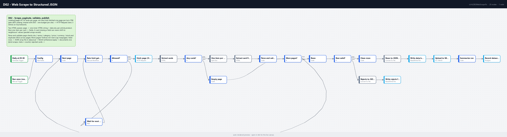

# D02 - Web Scrape to Structured JSON

**Category:** Data & ETL · **Difficulty:** Intermediate · **Tested on:** n8n 2.37.10
**Patterns used:** P01 (error handler), P04 (rate limiting)

## Problem

A supplier publishes its catalog only as HTML: 14 product cards per page, a "Next" link at the bottom, no API and
no export. The people who need the data copy it into a spreadsheet, page by page, and the numbers drift the moment
the site changes. The naive n8n version fetches all pages in one burst (and gets throttled), pulls each field with
a separate selector into parallel arrays (so one card without a price silently shifts every price after it onto
the wrong product), and writes whatever came out without checking it. This workflow walks the pages politely,
turns every card into one validated row, keeps the bad cards visible instead of dropping them, and publishes the
result as a JSON dataset with a record of what was scraped.

## How it works

1. **Daily at 05:30** (Schedule) or **Run once (manual / CLI)** -> **Config** (catalog URL, `max_pages` cap, gate
   key `d03-catalog` shared with D03, bucket, file names).
2. **Next page** (Code) - page 1 on the first turn, then `page + 1` carrying the rows collected so far. Each
   turn asks **Rate limit gate (P04)** (`d03-catalog`, 5 per 10 s); **Allowed?** no -> **Wait for next window**
   (`retry_after_ms`) -> ask again; yes -> **Fetch page (HTML)** (HTTP Request, text response, 10 s timeout,
   3 attempts, 1 s apart, on any failure).
3. **Extract cards** (HTML, pass 1) - one inner-HTML string and one `data-sku` per `article.product`, plus the
   `rel=next` href and the `data-page` / `data-pages` counters. **Any cards?** no -> **Empty page** (ends the
   loop with the rows so far).
4. **One item per card** (Split Out on `cards, sku`) -> **Extract card fields** (HTML, pass 2, per card:
   `.name`, `.category`, `.price`, `.price[data-currency]`, `.stock`). Because each card is parsed on its own, a
   missing field can never shift the neighbours' values.
5. **Parse and validate page** (Code) - one row per card: `sku` must match `SKU-nnnn`, `name` and `category`
   non-empty, `price` a positive number, `currency` three capital letters, `stock` parsed from `"N in stock"` /
   `"out of stock"`, and no SKU seen twice across pages. Every card is kept with `_valid` and `_errors`.
   `has_next` follows the `rel=next` link (fallback: `data-page < data-pages`), capped by `max_pages`.
6. **More pages?** yes -> back to **Next page**; no -> **Rows** (one item per card) -> **Row valid?**
7. Valid: **Clean rows** (drop `_valid`/`_errors`) -> **Rows to JSON file** (one JSON array) ->
   **Write data/out JSON** (`data/out/catalog-scrape.json`) -> **Upload to MinIO (artifacts)**
   (`scrapes/catalog-scrape-<yyyyLLdd>.json`) -> **Summarize run** -> **Record dataset (documents)**
   (`kind = scrape`, `meta` = pages, cards, valid, rejected, reject_errors, storage_key).
8. Invalid: **Rejects to JSON file** -> **Write rejects file** (`data/out/catalog-scrape-rejects.json`, rows with
   their `_errors`).

Row schema: `{sku, name, category, price, currency, stock, in_stock, page, card, source_url, scraped_at}`.



## Setup

- Services: `core` profile (n8n, Redis for the gate, MinIO, Postgres, mock-api).
- Credentials: `Redis - local` (used by P04), `S3 - MinIO`, `Postgres - demo`.
- Import: `bash scripts/import-workflows.sh --publish patterns/P04-rate-limiting workflows/D02-web-scrape-to-json`
  (the gate sub-workflow must be active). Activation starts the daily schedule; `scripts/setup.sh` does it
  because of `autopublish: true`.

## Try it

```bash
python scripts/dev/run-workflow.py D02                              # ~5 s for 3 pages
python scripts/dev/executions.py --workflow ALD02WebScrapeTo --last 1
python -c "import json; d=json.load(open('data/out/catalog-scrape.json')); print(len(d), d[0])"
docker compose exec -T minio mc alias set local http://localhost:9000 minioadmin minioadmin >/dev/null
docker compose exec -T minio mc ls -r local/artifacts/scrapes/
docker compose exec -T postgres psql -U n8n -d demo -c "select id, file_name, storage_key, meta->>'pages' pages, meta->>'cards' cards, meta->>'valid' valid, meta->>'rejected' rejected from documents where kind='scrape' order by id desc limit 1"
docker compose exec -T redis redis-cli --scan --pattern 'rl:d03-catalog:*'
```

The last node's output (`Record dataset (documents)`) reads:

```json
{ "kind": "scrape", "file_name": "catalog-scrape-20260907.json",
  "storage_key": "s3://artifacts/scrapes/catalog-scrape-20260907.json",
  "meta": { "source": "http://mock-api:8080/catalog", "pages": 3, "cards": 40, "valid": 40, "rejected": 0,
            "reject_errors": [], "local_file": "/home/node/.n8n-files/data/out/catalog-scrape.json" } }
```

`data/out/catalog-scrape.json` is a JSON array of 40 rows such as
`{"sku": "SKU-0001", "name": "Classic Desk Lamp", "category": "Office", "price": 413.25, "currency": "USD",
"stock": 10, "in_stock": true, "page": 1, "card": 1, "source_url": "http://mock-api:8080/catalog?page=1",
"scraped_at": "..."}`. The seed catalog is clean, so the reject branch does not run; to see validation and the
duplicate check at work, replay `test/fixture-variant.json` (see `test/README.md`: 5 cards -> 2 valid, 3 rejected).
Run D02 and D03 within ten seconds of each other and the shared `d03-catalog` gate throttles the later pages
(the execution waits for the next window instead of hitting the site).

## Notes & trade-offs

- **P02 is not on the fetch path.** The PRD-style choice would be to route each page through P02, but P02's HTTP
  node autodetects `text/html` as a file body and its Result node returns `data: null` for it, so it cannot carry a
  page. The HTTP node's own 3 attempts (1 s apart) absorb 5xx/network blips, the P04 gate prevents 429s, and anything left
  fails the execution so P01 alerts. Extending P02 with a `response_format` input is the right follow-up.
- **Two HTML passes instead of parallel arrays.** Pass 1 returns each card's *inner* HTML (the HTML node has no
  outer-HTML option), which is why `data-sku` is read on the same `article.product` elements in pass 1 and zipped
  into the Split Out. Selectors live in two nodes; when the site changes markup, change them there and re-run the
  fixture variant before trusting a run.
- **Rows are validated, not repaired.** A card with a missing price is rejected with its reason, not defaulted to
  0; the rejects file is only written when there are rejects, so a stale `catalog-scrape-rejects.json` from an
  older run is possible - read `documents.meta.rejected` for the truth of the latest run.
- **Pagination trusts the site's `rel=next`** with `data-pages` as a fallback and `max_pages` as a hard cap, so
  a site that always emits a "Next" link cannot loop forever.
- **Zero cards is an error.** If the first page matches no `article.product`, **Rows** throws and P01 records it;
  a scraper that silently publishes an empty dataset is the failure a schedule never surfaces. Same-day reruns
  overwrite the MinIO object and add a second `documents` row; the newest row is the current snapshot.
- Not handled: JavaScript-rendered pages (no headless browser in the stack), login walls, robots.txt / terms
  checks (do that before pointing it at a real site), and change detection between runs - D04 is the place for
  hash-based diffs; this workflow publishes a full snapshot each run.
