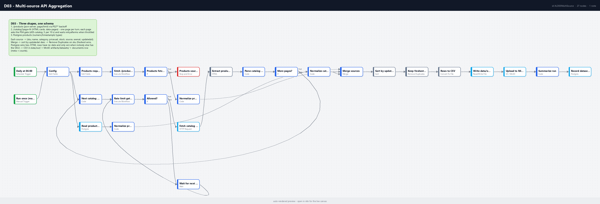

# D03 - Multi-source API Aggregation

**Category:** Data & ETL · **Difficulty:** Intermediate · **Tested on:** n8n 2.37.10
**Patterns used:** P01 (error handler), P02 (retry with backoff), P04 (rate limiting)

## Problem

The same product list lives in three places that disagree on shape: a JSON API (`price: 413.25`, `stock: 10`),
a paginated HTML catalog (`<span class="price" data-currency="USD">413.25</span>`, `10 in stock`), and a
Postgres table (`numeric`, `timestamptz`). Every report that needs "the catalog" re-implements the three parsers,
picks one source arbitrarily when they overlap, and blows through the HTML site's rate limit when it walks all the
pages at once. The fix is one workflow that owns the normalization, pages politely, and publishes one dataset
with a record of what it merged.

## How it works

1. **Daily at 06:00** (Schedule) or **Run once (manual / CLI)** -> **Config** (URLs, gate key `d03-catalog`,
   bucket, output path). Three branches fan out from Config:
2. **Source 1 - JSON**: **Products request** (Set: `GET /products?_page=1&_limit=100&_sort=sku`) ->
   **Fetch /products (P02)** (backoff on 5xx/429/network) -> **Products fetched?** (no -> **Products source
   failed**, Stop and Error) -> **Normalize products (JSON)** (Code).
3. **Source 2 - HTML pages**: **Next catalog page** (Code: page 1, then page+1 carrying the rows so far) ->
   **Rate limit gate (P04)** (`{key: d03-catalog, limit: 5, window_seconds: 10}`) -> **Allowed?** -> no ->
   **Wait for next window** (`retry_after_ms`) -> gate again; yes -> **Fetch catalog page (HTML)** (text) ->
   **Extract product cards** (HTML node: one array per selector + `data-page`/`data-pages`) -> **Parse catalog
   page** (Code: zip arrays into rows, `has_next = page < pages`) -> **More pages?** -> yes -> **Next catalog
   page**; no -> **Normalize catalog (HTML)** (Code: one item per card).
4. **Source 3 - Postgres**: **Read products table** (select, sorted by sku) -> **Normalize products (Postgres)**.
5. **Merge sources** (append, 3 inputs: Postgres, JSON, HTML) -> **Sort by updated_at desc** -> **Keep
   freshest per sku** (Remove Duplicates on `sku`: the first = freshest row wins; HTML rows carry no timestamp
   and only win for SKUs nobody else has).
6. **Rows to CSV** -> **Write data/out CSV** (`data/out/catalog-normalized.csv`) -> **Upload to MinIO
   (artifacts)** (`datasets/catalog-normalized-<yyyyLLdd>.csv`) -> **Summarize run** (Code: totals, per-source
   counts, duplicates removed) -> **Record dataset (documents)** (`kind = dataset`, `meta` = the summary).

Target schema for every source: `{sku, name, category, price_usd, stock, source, seen_at, updated_at}`.
`price_usd` is converted with a small rate table in the shared `normalize()` function (all seed rows are USD),
`stock` parses `"10 in stock"` / `"out of stock"` to an integer.



## Setup

- Services: `core` profile (n8n, Postgres, Redis, MinIO, mock-api).
- Credentials: `Postgres - demo`, `Redis - local` (used by P04), `S3 - MinIO`.
- Import: `bash scripts/import-workflows.sh patterns/P02-retry-backoff patterns/P04-rate-limiting workflows/D03-multi-source-aggregation --publish`
  (sub-workflows first, and they must be active). Activation starts the daily schedule.

## Try it

```bash
python scripts/dev/run-workflow.py D03
python scripts/dev/executions.py --workflow ALD03MultiSource --last 1
head -3 data/out/catalog-normalized.csv
docker compose exec -T minio mc alias set local http://localhost:9000 minioadmin minioadmin >/dev/null
docker compose exec -T minio mc ls -r local/artifacts/datasets/
docker compose exec -T postgres psql -U n8n -d demo -c "select id, kind, file_name, storage_key, meta->>'total' as total, meta->>'duplicates_removed' as dups from documents where kind='dataset' order by id desc limit 1"
docker compose exec -T redis redis-cli --scan --pattern 'rl:d03-catalog:*'
```

The last node's output (`Record dataset (documents)`) carries the summary in `meta`:

```json
{ "total": 40, "fetched": 120,
  "per_source":      { "postgres-products": 40, "mock-api-products": 40, "mock-api-catalog": 40 },
  "kept_per_source": { "postgres-products": 40 },
  "duplicates_removed": 80, "catalog_pages": 3,
  "file_name": "catalog-normalized-20260907.csv",
  "storage_key": "s3://artifacts/datasets/catalog-normalized-20260907.csv" }
```

All three seed sources carry the same 40 SKUs with the same `updated_at`, so Postgres (first Merge input) wins
every tie. Edit a row's `updated_at` in the mock API's `db.json` or in Postgres to watch another source win.
Run it twice within ten seconds and the second run's page 3 is throttled by the P04 gate (`rl:d03-catalog:*`
in Redis) and waits for the next window instead of hitting the site.

Sample inputs: `test/sample-products.json` (two rows of the JSON shape and their normalized form) and
`test/sample-catalog-page.json` (page 1 of the HTML catalog as captured with curl).

## Notes & trade-offs

- **Which row wins** is decided by `updated_at` and then by Merge input order (Postgres, JSON API, HTML). Make
  the order explicit for your data; "last writer wins" without a timestamp is a silent bug.
- The JSON source is fetched in one page (`_limit=100`, 40 rows). For bigger collections turn it into the same
  page loop as the HTML source (`_page` + 1 until an empty array) - the loop nodes are reusable as they are.
- The gate protects the HTML site from *this* workflow and from D02, which shares the `d03-catalog` key; the
  HTTP node's own 3 retries handle transient errors on a page. If the site sent `Retry-After`, route the page
  fetch through P02 as well.
- The `documents.meta` JSON is the audit trail: which sources, how many rows each, how many duplicates. Query
  it before trusting a dataset file.
- Not handled: schema drift detection (a renamed field silently becomes empty strings) - add a row-level
  validator like D01's when the sources are not under your control.
