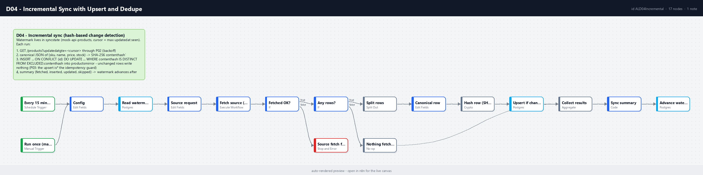

# D04 - Incremental Sync with Upsert and Dedupe

**Category:** Data & ETL · **Difficulty:** Intermediate · **Tested on:** n8n 2.37.10
**Patterns used:** P01 (error handler), P02 (retry with backoff), P03 (idempotency - upsert-as-guard variant)

## Problem

A product catalog lives in someone else's API and you need a local copy for reports. The naive sync ("pull
everything, delete, re-insert") locks the table, resets `synced_at` on every row so nobody can tell what actually
changed, and grows linearly with the catalog. The slightly better one ("pull rows where `updated_at` > last run")
still rewrites every row the source *touched*, even when nothing in it changed (sources bump timestamps on
re-saves, re-imports and migrations), and it double-writes when the previous run crashed between the writes and
the bookkeeping. What you want is: pull only what moved since the watermark, write only what really changed,
keep an audit of what happened, and make a re-run of the same window harmless.

## How it works

1. **Every 15 minutes** (Schedule) or **Run once (manual / CLI)** -> **Config** (source key `mock-api-products`,
   URL, page limit, epoch cursor).
2. **Read watermark** (Postgres `SELECT cursor ... FROM sync_state WHERE source = $1`, *always output*): no row
   yet -> empty item -> the epoch cursor, so the first run pulls the whole collection.
3. **Source request** (Set) -> **Fetch source (P02)** (`GET /products?updated_at_gte=<cursor>&_sort=updated_at&_order=asc`,
   backoff on 5xx/429/network) -> **Fetched OK?** -> no -> **Source fetch failed** (Stop and Error, P01 alerts).
4. **Any rows?** -> no -> **Nothing fetched** (still records `last_run_at`); yes -> **Split rows** (one item per row).
5. **Canonical row** (Set) - `id`, `sku` (upper-cased), `name` (trimmed), `price` (2 dp), `stock` (int),
   `updated_at`, and `canonical` = `JSON.stringify({sku, name, price, stock})` in fixed key order.
   `updated_at` is deliberately **not** part of it.
6. **Hash row (SHA-256)** (Crypto node) -> `content_hash`.
7. **Upsert if changed** (Postgres, one statement per row):
   `INSERT INTO products_mirror ... ON CONFLICT (id) DO UPDATE SET ... WHERE products_mirror.content_hash IS DISTINCT FROM EXCLUDED.content_hash RETURNING id, (xmax = 0) AS inserted`.
   New row -> inserted, different hash -> updated, same hash -> the statement returns nothing and writes nothing.
8. **Collect results** (Aggregate) -> **Sync summary** (Code):
   `{fetched, inserted, updated, skipped, changed_ids, previous_cursor, cursor, last_run_at}`, where `cursor` is the
   newest `updated_at` seen (never moves backwards within a run; an overlapping run can only widen the
   window, which the hash makes safe).
9. **Advance watermark** (Postgres upsert on `sync_state.source`) - runs only after every write succeeded.



## Setup

- Services: `core` profile (n8n, Postgres, mock-api).
- Credentials: `Postgres - demo` (created by `scripts/setup.sh`). P02 needs no credential.
- Import: `bash scripts/import-workflows.sh --publish patterns/P02-retry-backoff workflows/D04-incremental-sync`
  (P02 must be active because it is called as a sub-workflow; P01 should be active to receive errors).
- Activation starts the 15-minute schedule; `autopublish: true` makes `scripts/setup.sh` do it.

## Try it

```bash
python scripts/dev/run-workflow.py D04                      # run 1: full sync (sync_state has no row yet)
python scripts/dev/run-workflow.py D04                      # run 2: no-op
python scripts/dev/executions.py --workflow ALD04Incremental --last 2
docker compose exec -T postgres psql -U n8n -d demo \
  -c "select count(*), count(distinct content_hash), max(synced_at) from products_mirror" \
  -c "select * from sync_state where source = 'mock-api-products'" \
  -c "select id, sku, content_hash from products_mirror where id in (1, 2)"   # compare with test/sample-products.json
```

`Sync summary` output (open the execution in the UI, or `GET /api/v1/executions/<id>?includeData=true`):

| run | fetched | inserted | updated | skipped | cursor after |
|---|---|---|---|---|---|
| 1 - empty mirror | 40 | 40 | 0 | 0 | `2026-09-01T07:44:02Z` (newest `updated_at` in the seed) |
| 2 - nothing changed | 1 | 0 | 0 | 1 | unchanged; `max(synced_at)` in the mirror unchanged |

Run 2 fetches one row because the filter is `>=` (json-server has no `_gt`): the row sitting exactly on the
watermark comes back, its hash matches, nothing is written. That is the whole point of hashing - the watermark
decides what to *look at*, the hash decides what to *write*.

Then make the source move (json-server accepts `PATCH`; the change lives in the container only):

```bash
bash workflows/D04-incremental-sync/test/simulate-source-change.sh content   # stock of product 20 -> 7
python scripts/dev/run-workflow.py D04                                        # fetched 1, updated 1, skipped 0
bash workflows/D04-incremental-sync/test/simulate-source-change.sh touch     # only updated_at bumped
python scripts/dev/run-workflow.py D04                                        # fetched 1, updated 0, skipped 1
bash workflows/D04-incremental-sync/test/reset-watermark.sh                  # back to a clean first run
```

Failure path: `docker compose stop mock-api`, run once - P02 retries five times with backoff, the workflow stops
at `Source fetch failed`, P01 writes an `execution_log` row and e-mails `ops@lab.local` (Mailpit,
http://localhost:8025). `docker compose start mock-api` afterwards; the watermark did not move, so the next run
simply re-reads the same window.

## Notes & trade-offs

- **Target table.** The PRD line says "upsert + dedupe"; the seed reserves `products_mirror` (id, sku, name,
  price, stock, content_hash, synced_at) for exactly this, so the mirror is the target rather than the `products`
  table (which D03 reads as a source of its own). Point `Config.url` at `/orders` or `/customers` and swap the
  column list in **Canonical row** / **Upsert if changed** to sync another collection - the watermark row is
  keyed by `Config.source`, so several sources can share `sync_state`.
- **P03 without Redis.** The idempotency guard here is the `ON CONFLICT (id)` upsert plus the hash predicate
  (P03's "upsert on a natural key" row); calling the Redis sub-workflow per row would add 40 round trips for
  nothing. Re-running any window is safe: rows already at the same hash produce no write.
- **`>=` watermark.** json-server offers `_gte` but not `_gt`, so the row on the boundary is re-fetched each run
  and skipped by hash. With a real API use `>` (or `updated_at > cursor OR (updated_at = cursor AND id > last_id)`)
  and page with `_page` until an empty array - the `page_limit` of 500 covers the 40-row seed in one call.
- **Hash scope is a decision.** Only business columns are hashed (`sku, name, price, stock`); `category` and
  `currency` are not in the mirror and therefore not in the hash. Add a column to the mirror and it must go into
  both the canonical string and the SQL, or the diff is silently blind to it.
- **Rollbacks at the source are invisible.** If a source row goes back to an older value *without* a newer
  `updated_at` (restored backup, `reset-watermark.sh` without the reset), the watermark is past it and it stays
  stale in the mirror. Schedule a periodic full pass (epoch cursor) for that; the hash keeps the full pass cheap.
- **Timestamps compare as strings.** `Sync summary` keeps the newest `updated_at` with a plain string
  comparison, which is correct for uniform ISO-8601 `Z` values like the seed's. A source that mixes precisions or
  offsets (`...02.000Z`, `+00:00`) needs `new Date(x).toISOString()` before the comparison.
- **Deletes are not synced.** A row removed at the source stays in the mirror. Use a soft-delete flag in the
  source feed, or a periodic "ids present at source vs mirror" diff.
- One statement per row (40 here). For tens of thousands of rows, batch them: Aggregate -> a single
  `INSERT ... SELECT * FROM jsonb_to_recordset($1::jsonb)` with the same `ON CONFLICT ... WHERE` predicate.
