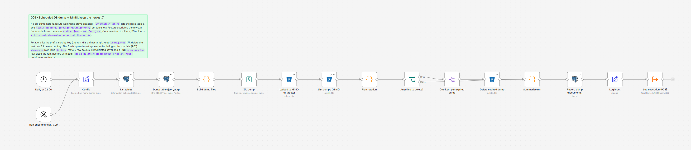

# D05 - Scheduled DB Dump to MinIO with Rotation

**Category:** Data & ETL · **Difficulty:** Advanced · **Tested on:** n8n 2.37.10
**Patterns used:** P01 (error handler), P08 (observability)

## Problem

The demo database is the only place where a week of orders, tickets and execution history lives, and nothing
copies it anywhere. The usual answers are worse than they look: a `pg_dump` in someone's crontab that nobody
watches (it stopped on the day the disk filled and the failure went to a mail alias that expired), a dump written
next to the database on the same volume (which is not a backup, it is a second copy of the same failure), or a
dump directory that grows until it takes the volume down. And when a dump *is* taken, the two questions that
matter usually go unanswered: did today's file actually land in object storage, and can anything be read back out
of it. This workflow takes a dump on a schedule, puts it in MinIO, keeps the newest seven, refuses to call the run
successful unless the fresh object is visible in the bucket listing, and records what it dumped - row counts per
table included - in a table you can query later.

## How it works

1. **Daily at 02:00** (Schedule) or **Run once (manual / CLI)** -> **Config**: `schema` = `public`, `bucket` =
   `artifacts`, `prefix` = `db-dumps/`, `keep` = `7`, and `run_id` = `{{ $now.toFormat('yyyyLLdd-HHmmss') }}`
   (a sortable local-time stamp that becomes the file name), plus `started_at` for the P08 row.
2. **List tables** (Postgres) - `information_schema.tables where table_schema = $1 and table_type = 'BASE TABLE'`,
   one item per table, each carrying `table_name`, its `quote_ident()` form, `current_database()` and
   `current_setting('server_version')`. 21 tables in the seeded database.
3. **Dump table (json_agg)** (Postgres, one statement per input item):
   `select $1::text as table_name, count(*)::int as row_count, coalesce(json_agg(row_to_json(t)), '[]'::json) as rows from <ident> t`.
   Postgres does the serialisation, so types stay faithful without any JavaScript casting: timestamps come out as
   ISO-8601 strings, `numeric` stays a JSON number (`48.00`), `jsonb` columns nest as objects, `null` stays `null`.
   The `FROM` clause interpolates the *quoted* identifier from step 2, so an odd table name cannot break the
   statement; `$1` is a bound parameter.
4. **Build dump files** (Code) - collapses the 21 items into **one** item whose *binary* properties are the files:
   `t_<table>` holds `<table>.json` (`{database, schema, table, dumped_at, run_id, row_count, columns, rows}`) and
   `manifest` holds `manifest.json` (format tag, server version, per-table `{table, file, row_count, bytes}`,
   `table_count`, `total_rows`, `bytes_uncompressed`, target key, restore hint). `binary_props` is the
   comma-separated list of those property names. No tables found -> it throws (P01 hears about it).
5. **Zip dump** (Compression) - zips every property in `binary_props` into `demo-<run_id>.zip`.
6. **Upload to MinIO (artifacts)** (S3) - `PUT artifacts/db-dumps/demo-<run_id>.zip`, 3 attempts 1 s apart.
7. **List dumps (MinIO)** (S3 `file:getAll`, `folderKey = db-dumps/`, *always output data*) - every object under
   the prefix, with `Key, LastModified, Size, ETag`.
8. **Plan rotation** (Code) - keeps only keys matching `^db-dumps/demo-\d{8}-\d{6}\.zip$` (so nothing else in the
   bucket is ever a rotation candidate), sorts them **descending by key** - the run id is a timestamp, so the key
   order *is* the chronological order - keeps the first `Config.keep`, and marks the rest `expired`. If the object
   uploaded a second ago is **not** in the listing, it throws: an upload that did not land must not be reported as
   a backup.
9. **Anything to delete?** (If `expired_count > 0`) -> true: **One item per expired dump** (Split Out on `expired`)
   -> **Delete expired dump** (one S3 `file:delete` per key) -> **Summarize run**. False: straight to
   **Summarize run**.
10. **Summarize run** (Code) - one item with `notes` and the `meta` object: run id, database and server version,
    bucket/key, zip size and uncompressed size, `table_count`, `total_rows`, a `{table: row_count}` map, `keep`,
    `found`, the `kept` keys and the `deleted` keys.
11. **Record dump (documents)** (Postgres insert) - `kind = 'db-dump'`, `file_name = demo-<run_id>.zip`,
    `storage_key = s3://artifacts/db-dumps/demo-<run_id>.zip`, `meta` = the object above as `jsonb`.
12. **Log input** -> **Log execution (P08)** - a `success` row in `execution_log` with the run's `notes`
    (P08 stores notes in `error_message`; the seeded table has no `notes` column).

Any node that fails ends the run in **P01 - Global Error Handler** (`settings.errorWorkflow`): an `error` row in
`execution_log` and one e-mail to `ops@lab.local` in Mailpit.

The archive is flat - 21 table files plus the manifest:

```
demo-20260907-170229.zip
├─ attendance.json        43 520 B   300 rows
├─ bookings.json           7 962 B    30 rows
├─ ... 18 more tables ...
├─ webhook_events.json    93 410 B   302 rows
└─ manifest.json           3 024 B   (a full one from a real run: test/sample-manifest.json)
```



## Setup

- Services: `core` profile (n8n, Postgres, MinIO). The `artifacts` bucket is created by `minio-init` at stack up.
- Credentials: `Postgres - demo` and `S3 - MinIO`, both created by `scripts/setup.sh`. P08 uses `Postgres - demo` too.
- Import: `bash scripts/import-workflows.sh --publish patterns/P08-observability workflows/D05-db-dump-to-minio`
  (P08 must be active because it is called as a sub-workflow; P01 should be active to receive errors).
- Activation starts the 02:00 schedule in the workflow timezone (`Africa/Tripoli`); `autopublish: true` makes
  `scripts/setup.sh` publish it for you.

## Try it

```bash
python scripts/dev/run-workflow.py D05                     # ~3 s: 21 tables, upload, rotation, documents + P08 row
python scripts/dev/executions.py --workflow ALD05DbDumpToMin --last 2
docker compose exec -T minio mc alias set local http://localhost:9000 minioadmin minioadmin >/dev/null
docker compose exec -T minio mc ls local/artifacts/db-dumps/
```

The first run on an empty prefix has nothing to rotate. To see rotation actually delete something, seed more than
`keep` fake old dumps (January keys, so they sort oldest) and run again:

```bash
bash workflows/D05-db-dump-to-minio/test/seed-old-dumps.sh        # 8 objects, or pass a count: ... 3
python scripts/dev/run-workflow.py D05
docker compose exec -T minio mc ls local/artifacts/db-dumps/      # exactly 7 objects left
```

Observed on the run pair above (`ls` output trimmed to the counts):

| run | tables | rows | zip | found in prefix | kept | deleted |
|---|---|---|---|---|---|---|
| 1 - empty prefix | 21 | 2792 | 77 630 B | 1 | 1 | 0 |
| 2 - after seeding 8 old dumps | 21 | 2962 | 81 988 B | 10 | 7 | 3 (`demo-20260101/02/03-020000.zip`) |

The row totals differ between two runs of the same database because `execution_log`, `uptime_checks` and
`documents` keep filling while you work - the dump is a snapshot, not a fixed number.

Then check the bookkeeping (or open the MinIO console at http://localhost:9001, `minioadmin` / `minioadmin`):

```bash
docker compose exec -T postgres psql -U n8n -d demo \
  -c "select id, file_name, storage_key, meta->>'table_count' tables, meta->>'total_rows' rows,
             meta->>'dump_bytes' zip_bytes, jsonb_array_length(meta->'kept') kept,
             jsonb_array_length(meta->'deleted') deleted
        from documents where kind = 'db-dump' order by id desc limit 3" \
  -c "select jsonb_pretty(meta -> 'tables') from documents where kind = 'db-dump' order by id desc limit 1" \
  -c "select execution_id, workflow_name, status, duration_ms, error_message as notes
        from execution_log where workflow_name like 'D05%' order by id desc limit 2"
```

`documents.meta` of the second run, abbreviated:

```json
{ "run_id": "20260907-170229", "database": "demo", "server_version": "17.11",
  "bucket": "artifacts", "key": "db-dumps/demo-20260907-170229.zip",
  "dump_bytes": 81988, "bytes_uncompressed": 703576, "table_count": 21, "total_rows": 2962,
  "tables": { "customers": 117, "orders": 200, "order_items": 443, "execution_log": 725, "tasks": 0, "...": 0 },
  "keep": 7, "found": 10,
  "kept": ["db-dumps/demo-20260907-170229.zip", "db-dumps/demo-20260907-115909.zip", "db-dumps/demo-20260108-020000.zip", "..."],
  "deleted": ["db-dumps/demo-20260103-020000.zip", "db-dumps/demo-20260102-020000.zip", "db-dumps/demo-20260101-020000.zip"] }
```

And the part that makes it a backup rather than a file: read one table back out of the newest zip.
`test/restore-table.py` downloads it, unzips `<table>.json`, loads the rows into a scratch table
`<table>_restore_check` with `json_populate_recordset(null::<table>, ...)`, compares the count with the manifest
and drops the scratch table again. The live tables are never touched.

```bash
python workflows/D05-db-dump-to-minio/test/restore-table.py customers
python workflows/D05-db-dump-to-minio/test/restore-table.py orders --key db-dumps/demo-20260907-170229.zip
```

```
dump: s3://artifacts/db-dumps/demo-20260907-170229.zip
manifest: run_id=20260907-170229 database=demo server=17.11 tables=21 total_rows=2962
orders: 200 rows, columns ['id', 'order_number', 'customer_id', 'status', 'total', 'currency', 'ordered_at', 'shipped_at']
restored into orders_restore_check: 200 rows (manifest says 200)
sample restored row: {"id":1,"order_number":"ORD-2026-0001","customer_id":39,"status":"paid","total":48.00,...}
ROUND-TRIP OK
```

A real restore is the same statement without the scratch table:

```sql
insert into orders select * from json_populate_recordset(null::orders, '<the "rows" array from orders.json>');
select setval(pg_get_serial_sequence('orders', 'id'), max(id)) from orders;   -- identity columns need this
```

Without the stack up you can still read `test/sample-manifest.json` (a full manifest from a real run: 21 tables,
2792 rows) and `test/sample-products.json` (the first 3 rows of `products.json`, to see how Postgres serialised
`numeric` and `timestamptz`).

## Notes & trade-offs

- **This is a logical JSON dump, not `pg_dump`.** Execute Command is disabled in this lab (hard rule 4), and the
  Postgres node cannot stream `COPY`, so the dump is what SQL can produce on its own: rows only. It contains **no
  DDL** - no schema, sequences, indexes, constraints, views, functions, extensions or ownership. Restoring means
  `seed/schema.sql` (or your own migration) first, then the `json_populate_recordset` insert per table, then
  `setval` on every identity/serial sequence. For a real database, run `pg_dump -Fc` from a sidecar container on a
  cron and let n8n handle only the upload/rotation/notification half of this workflow - the rotation, the
  "did it land" check and the `documents` bookkeeping port over unchanged.
- **Everything is in memory, twice.** `json_agg` materialises a whole table as one JSON value inside Postgres, and
  the Code node then holds every table plus the zip. The seed (2 962 rows, 704 KB uncompressed, 82 KB zipped)
  finishes in ~3 s; a table with millions of rows would blow up both sides. The honest fix is not "increase the
  memory limit" but chunking (`order by id limit N offset M` per table, one binary property per chunk) or, again,
  a real `pg_dump` with multipart upload.
- **`file:getAll` names the prefix `folderKey`, not `prefix`.** The S3 node v1 silently ignores an unknown option,
  so the "wrong" spelling returns the *entire* bucket - which the rotation regex then filters down to our own keys
  anyway, but the listing would have carried every unrelated object first. The builder now emits `folderKey`
  (see `.claude/skills/n8n-workflow-json/reference/nodes.md`). The same node also drops **zero-byte objects and
  `.../` folder markers** from its output: a dump that somehow uploaded as 0 bytes would be invisible in step 7
  and step 8 would throw "uploaded dump ... is not in the listing" instead of quietly keeping an empty backup.
  That is the behaviour you want, but it means the seeded fixtures must have content - `seed-old-dumps.sh` writes
  a 99-byte line into each one for exactly that reason.
- **Rotation counts files, it does not read dates.** Sorting is by key, which only equals chronological order
  because `run_id` is `yyyyLLdd-HHmmss`. That holds for the fixed workflow timezone here (`Africa/Tripoli`, no
  DST); in a DST timezone one hour a year sorts out of order. Sorting on `LastModified` would fix that but breaks
  the moment someone copies objects around (a copy is "modified" now). A retention *policy* (keep 7 daily, 4
  weekly, 12 monthly) needs the date parsed out of the key and a bucket-per-tier layout, or MinIO's own lifecycle
  rules - which is where this belongs in production.
- **The delete guard is deliberate.** Only `db-dumps/demo-<8 digits>-<6 digits>.zip` is eligible for deletion; a
  dump uploaded by hand under another name is never rotated (and never counted against `keep`). Rotation with a
  wildcard delete is how people lose the objects that happened to share a prefix.
- **Verification is existence + size, not a restore.** The run proves the object is listed and records its size,
  but it does not download the zip, open it, or diff row counts back. `test/restore-table.py` does that on
  demand; a production setup would schedule it (weekly restore into a scratch database) and log a `warning`
  through P08 when the counts disagree. A backup you have never restored is a hypothesis.
- **No encryption, no immutability, no off-host copy.** The bucket has no versioning or object lock and n8n holds
  credentials that can delete; anything that owns n8n owns the backups. Real backups need write-once credentials
  (or object lock with a retention period), encryption at rest, and a second location. All three are MinIO/infra
  configuration, not workflow logic, which is why they are out of scope here.
- **Partial failures leave a usable state.** Each Postgres and S3 node retries 3 times, 1 s apart. If a delete
  fails after the upload succeeded, the run ends in P01 with the new dump already stored; the next run finds one
  object too many and expires it then. If the upload fails, nothing is deleted at all - rotation only ever runs
  *after* a successful upload, never before.
- **The dump dumps its own bookkeeping.** `documents` and `execution_log` are base tables in `public`, so every
  dump contains the previous runs' rows (`execution_log` is already the biggest file in the seed). Excluding
  tables would be one `and table_name <> all($2)` in step 2; keeping them is the more useful default here because
  the audit trail is part of what you would want back.
