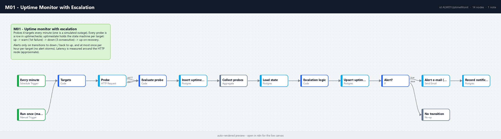

# M01 - Uptime Monitor with Escalation

**Category:** Monitoring · **Difficulty:** Intermediate · **Tested on:** n8n 2.37.10
**Patterns used:** P01 (error handler), P08 (observability: every probe is a structured row)

## Problem

A one-node "ping and e-mail if it fails" monitor pages you sixty times during a one-hour outage and once for
every network hiccup. A monitor people trust has to remember what it saw last time: a single failure is a
warning, three in a row is an incident, recovery is one message, and nothing repeats more than once an hour.

## How it works

1. **Every minute** (Schedule) or **Run once (manual / CLI)**.
2. **Targets** (Code) - `mock-api`, `n8n`, `minio` and a deliberate **simulated-outage** (`/health/down`, always 503).
3. **Probe** (HTTP, 5 s timeout, never throws; connection errors go to the error output) → **Evaluate probe**
   (Code, per item: `ok`, status code, approximate latency).
4. **Insert uptime_checks** - one row per probe, every run (continue on error).
5. **Collect probes** → **Load state** (`uptime_state`) → **Escalation logic** (Code):
   ok → `up`, failures reset · 1-2 failures → `warn` · 3 consecutive → `down`; alert on `→ down` and on
   `down → up`, and only if the last alert for that target is older than one hour.
6. **Upsert uptime_state** → **Alert?** → **Alert e-mail (Mailpit)** + **Record notification**, else **No transition**.



## Setup

- Services: `core` profile. Credentials: `Postgres - demo`, `SMTP - Mailpit`.
- Import: `bash scripts/import-workflows.sh workflows/M01-uptime-monitor --publish` (starts the minute schedule).
- Seed: `uptime_state` starts with three `up` rows; the fourth target is created on first run.

## Try it

```bash
python scripts/dev/run-workflow.py M01 && python scripts/dev/run-workflow.py M01 && python scripts/dev/run-workflow.py M01
docker compose exec -T postgres psql -U n8n -d demo -c "select target, state, failures, since, last_alert_at from uptime_state order by target"
docker compose exec -T postgres psql -U n8n -d demo -c "select target, ok, status_code, latency_ms, checked_at from uptime_checks order by id desc limit 8"
curl -s "localhost:8025/api/v1/messages?limit=2" | python -m json.tool | grep Subject     # "[Automation Lab] DOWN: simulated-outage (warn -> down)"
```

After the third run `simulated-outage` is `down` with one alert; further runs (or the schedule) stay silent for an
hour. Real outage: `docker compose stop mock-api`, wait three minutes, `docker compose start mock-api` - one
DOWN e-mail, one recovery e-mail.

## Notes & trade-offs

- Latency is measured around the HTTP node from a timestamp set in **Targets**, so it includes n8n scheduling
  overhead; good enough for trend graphs, not for SLA arithmetic.
- Thresholds (`DOWN_AFTER = 3`, one-hour cooldown) are constants in the Code node; move them to a Set node or a
  table when targets need different rules.
- One e-mail per target per transition. For a fleet, group transitions per run into a single message.
- Add Telegram next to the e-mail node for the optional external variant (credential `Telegram - bot`).
