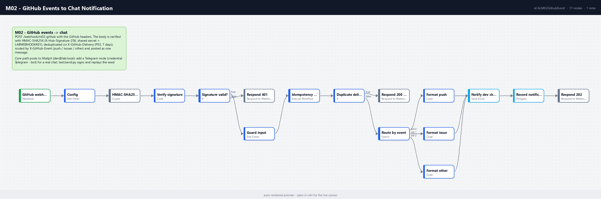

# M02 - GitHub Events to Chat Notification

**Category:** Monitoring · **Difficulty:** Beginner · **Tested on:** n8n 2.37.10
**Patterns used:** P01 (error handler), P03 (idempotency on the delivery id), P06 (signed replay fixtures)

## Problem

"Post GitHub events to chat" is the first webhook most people wire up, and the first one that gets abused: an
unauthenticated endpoint accepts anything, GitHub redelivers on timeouts so the channel gets the same push
twice, and every event type ends up formatted the same unreadable way. A correct receiver verifies the HMAC
signature over the raw body, deduplicates on the delivery id, and routes by event type.

## How it works

1. **GitHub webhook** - `POST /webhook/m02-github`, raw body kept for signing.
2. **Config** (shared secret, notification address) → **HMAC-SHA256 of raw body** (Crypto node, binary) →
   **Verify signature** (Code) - compares with `X-Hub-Signature-256`, extracts `X-GitHub-Event` and
   `X-GitHub-Delivery`. Invalid → **Respond 401**.
3. **Guard input** → **Idempotency guard (P03)** on the delivery id (7-day TTL) → duplicate → **Respond 200 (duplicate)**.
4. **Route by event** (Switch): `push` / `issues` / anything else → **Format push / issue / other** (Code:
   branch, commit list, force-push flag; issue action, number, title, labels).
5. **Notify dev channel (Mailpit)** → **Record notification** → **Respond 202**.



## Setup

- Services: `core` profile. Credentials: `SMTP - Mailpit`, `Postgres - demo`, `Redis - local` (via P03).
- Import: `bash scripts/import-workflows.sh patterns/P03-idempotency workflows/M02-github-events-to-chat --publish`.
- Secret: the Config node holds the same dummy value as `LAB_WEBHOOK_KEY` in `.env.example`. Workflows cannot
  read `$env` in this lab (`N8N_BLOCK_ENV_ACCESS_IN_NODE=true`); in production keep the secret in a credential
  and reference it from the Crypto node (see `docs/security.md`; the P07 secrets pattern is not shipped yet).
- Real GitHub (optional): point a repository webhook at a public URL of this endpoint, content type JSON, the
  same secret. Real chat (optional): add a Telegram node (`Telegram - bot`) after the formatters.

## Try it

```bash
cd workflows/M02-github-events-to-chat/test
python send.py push   --delivery d-push-1        # 202 {"ok":true,"event":"push"}
python send.py push   --delivery d-push-1        # 200 {"ok":true,"duplicate":true}   (P03)
python send.py issues --delivery d-issue-1       # 202 {"ok":true,"event":"issues"}
python send.py push   --bad-signature            # 401 {"ok":false,"error":"invalid signature"}
curl -s "localhost:8025/api/v1/messages?limit=2" | python -m json.tool | grep Subject
# "[github] push to lab-org/demo-repo@main: 2 commit(s) by nour-haddad", "[github] issue opened: #42 ..."
```

## Notes & trade-offs

- The signature is computed over the **raw** request body (Webhook option *Raw Body*); re-serialising the parsed
  JSON would change whitespace and never match.
- The comparison in the Code node is length-guarded and loops over every character; `crypto.timingSafeEqual`
  is not available to Code nodes in this stack (built-in `require` is disabled).
- Delivery ids are deduplicated for 7 days; GitHub redeliveries from the UI reuse the id and are answered 200
  without a second message - that is the intended behaviour.
- One Code formatter per event keeps the Switch readable; add outputs for `pull_request`, `release`, `workflow_run`.
