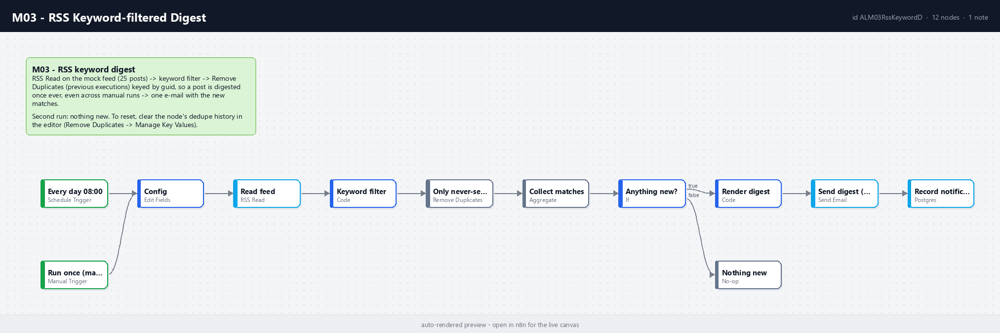

# M03 - RSS Keyword-filtered Digest

**Category:** Monitoring · **Difficulty:** Beginner · **Tested on:** n8n 2.37.10
**Patterns used:** P01 (error handler)

## Problem

Following a handful of blogs for a few topics means either reading everything or missing things. The digest
should be one e-mail a day with only the posts that mention the topics - and it must never send the same post
twice, even when the feed keeps old entries for weeks or someone runs the workflow by hand.

## How it works

1. **Every day 08:00** (Schedule) or **Run once (manual / CLI)** → **Config** (feed URL, comma-separated
   keywords, recipient).
2. **Read feed** (RSS Read, 3 retries) - the mock feed at `http://mock-api:8080/feed.xml` (25 synthetic posts).
3. **Keyword filter** (Code) - case-insensitive match on title + description; records which keywords hit.
4. **Only never-sent posts** (Remove Duplicates v2, *remove items seen in previous executions*, keyed by `guid`,
   history 5000) - the memory that makes the digest idempotent across runs.
5. **Collect matches** → **Anything new?** → **Render digest** (Code, HTML list with links and matched keywords)
   → **Send digest (Mailpit)** → **Record notification**; otherwise **Nothing new**.



## Setup

- Services: `core` profile (n8n, mock-api, Mailpit, Postgres).
- Credentials: `SMTP - Mailpit`, `Postgres - demo`.
- Import: `bash scripts/import-workflows.sh workflows/M03-rss-keyword-digest --publish`.

## Try it

```bash
python scripts/dev/run-workflow.py M03            # first run: digest with the matching posts
python scripts/dev/run-workflow.py M03            # second run: "Nothing new"
python scripts/dev/executions.py --workflow ALM03RssKeywordD --last 2
curl -s "localhost:8025/api/v1/messages?limit=1" | python -m json.tool | grep Subject
curl -s localhost:8080/feed.xml | head -30       # the feed itself; test/feed-sample.xml is a saved copy
```

To replay, open the workflow in the editor, select **Only never-sent posts** → *Manage key values* → clear, or
change the keywords in **Config** (a post already sent stays sent).

## Notes & trade-offs

- The default keywords are broad on purpose against a 25-post synthetic feed (every post is about automation),
  so the first digest is long; with a real feed tighten the list in **Config**.
- Deduplication history lives in n8n's database per node (`Remove Duplicates` v2) - it survives restarts but not
  a re-import under a new node id. For an audit trail persist sent guids in Postgres instead.
- Matching is substring-based (`ocr` matches "procrastination"); use word boundaries in the Code node for precision.
- One feed per workflow keeps it readable; for many feeds emit `{feed, keywords}` items from **Config** and let
  **Read feed** run per item.
