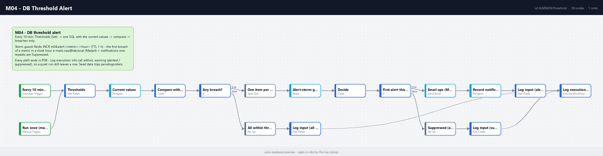

# M04 - DB Threshold Alert

**Category:** Monitoring · **Difficulty:** Beginner · **Tested on:** n8n 2.37.10
**Patterns used:** P01 (error handler), P08 (observability: every run logs, alerts are storm-guarded)

## Problem

The numbers that tell you the business is stuck are already in the database: orders that stay `pending` for
days, urgent tickets nobody picked up, tickets past their SLA. Somebody "keeps an eye on it" by running a query
when they remember. A workflow can run the query every ten minutes - but a naive one then e-mails every ten
minutes for as long as the number stays high, and the second week nobody reads the alerts any more. The check is
easy; the discipline is alerting once and still leaving a trace of every run.

## How it works

1. **Every 10 minutes** (Schedule) or **Run once (manual / CLI)** -> **Thresholds** (Set): `pending_orders_max
   10`, `pending_age_hours_max 48`, `open_tickets_urgent_max 3`, `sla_breached_max 0`, `alert_to ops@lab.local`,
   plus `started_at` (for the log) and `window_key` (the current hour, `yyyyLLddHH`).
2. **Current values** (Postgres, one row): pending orders and the age in hours of the oldest one (`orders`),
   open urgent tickets and open tickets past `sla_due_at` (`tickets` in `open / triaged / in_progress`). The SQL
   is in `test/thresholds-check.sql`.
3. **Compare with thresholds** (Code) - every metric with `value`, `threshold`, `severity` (`warning` for the
   order metrics, `error` for the ticket ones) and `breached = value > threshold`; one item out with the list
   of breaches and a one-line summary.
4. **Any breach?** (If) - no: **All within thresholds** -> **Log input (all within)** -> **Log execution (P08)**
   with status `info` and notes `all within thresholds: pending_orders 3/10, ...`. The quiet run leaves a row.
5. Yes: **One item per breach** (Split Out) -> **Alert-storm guard** (Redis `INCR m04:alert:<metric>:<hour>`,
   TTL 1 h): the counter says how many runs this hour saw the breach.
6. **Decide** (Code) - metrics with counter `1` are alerted now, the others are suppressed; builds the subject,
   an HTML table and a text version, and the note for the log.
7. **First alert this hour?** (If) - yes: **Email ops (Mailpit)** (3 retries) -> **Record notification**
   (`notifications`, channel `email`, severity = worst of the alerted metrics, *continue on error*) -> **Log input
   (alerted)**. No: **Suppressed (already alerted this hour)** -> **Log input (suppressed)**.
8. Both end in **Log execution (P08)** with status `warning` and notes `alerted: sla_breached 48 > 0, ...` or
   `breach persists, alert suppressed this hour: ...`.



## Setup

- Services: `core` profile (n8n, Postgres, Redis, Mailpit).
- Credentials: `Postgres - demo`, `Redis - local`, `SMTP - Mailpit`.
- Import: `bash scripts/import-workflows.sh workflows/M04-db-threshold-alert --publish` (P08 must be imported and
  published first: `depends_on: [P08]`). Publishing arms the 10-minute schedule.
- Limits live in the **Thresholds** node, not in the SQL; change them there.

## Try it

```bash
docker compose exec -T postgres psql -U n8n -d demo < workflows/M04-db-threshold-alert/test/thresholds-check.sql
python scripts/dev/run-workflow.py M04
curl -s "localhost:8025/api/v1/messages?limit=1" | python -m json.tool | grep Subject
docker compose exec -T postgres psql -U n8n -d demo -c "select channel, severity, subject, sent_at from notifications order by id desc limit 1"
python scripts/dev/run-workflow.py M04                      # within the same hour: suppressed
docker compose exec -T postgres psql -U n8n -d demo -c "select execution_id, status, error_message as notes from execution_log where workflow_id = 'ALM04DbThreshold' order by id desc limit 2"
docker compose exec -T redis redis-cli keys "m04:alert:*"
```

Expected with the seed (dated around 2026-09-01, so pending orders are weeks old): one e-mail to
`ops@lab.local` titled `[Automation Lab] ERROR: 3 metrics over threshold (pending_orders 32 > 10,
pending_age_hours 2944 > 48, sla_breached 48 > 0)` with a four-column table; `open_tickets_urgent` (1) stays
within its limit. The second run sends nothing, `notifications` gets no new row, and `execution_log` shows two
`warning` rows: `alerted: ...` then `breach persists, alert suppressed this hour: ...`. Redis holds three keys
`m04:alert:<metric>:<hour>` with value `2`. Raise the limits in **Thresholds** to see the `info` path.

## Notes & trade-offs

- **One e-mail per metric per clock hour**, by keying the Redis counter on the hour (`m04:alert:<metric>:<hour>`)
  instead of refreshing a TTL on every `INCR` as P01 does. P01's refresh means "silent while it keeps failing";
  for a threshold that stays breached for days a fresh reminder every hour is the better default. The cost is
  the edge case of a breach starting at 10:55: alerted at 10:55 and again at 11:05. Keys expire after an hour,
  so Redis stays clean.
- The limits are constants in a Set node. In production they belong in a table (`thresholds(metric, max,
  severity, owner)`) so that the query and the comparison stay generic and the owner gets the e-mail; the Code
  node already treats the metric list as data, so that is a small change.
- All four metrics are fetched in **one** query (four scalar sub-selects) so that a run costs one round trip and
  the values are consistent with each other. Add a metric = add a sub-select and one line in the `defs` list.
- Alerting on `value > threshold` only. There is no recovery notice ("pending orders back to 4") and no
  flap protection beyond the hourly window; M01 (uptime) shows the state-machine version with `warn -> down ->
  recovered` transitions, which is what you want for metrics that oscillate.
- The `info` row on quiet runs is deliberate: a dashboard query over `execution_log` for M04 rows per hour tells
  you the schedule is alive; an alert-only workflow that goes silent looks exactly like a healthy one.
- Telegram is a documented optional branch next to the e-mail (credential `Telegram - bot`), not part of the core
  path.
