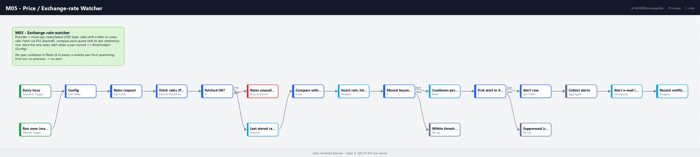

# M05 - Price / Exchange-rate Watcher

**Category:** Monitoring · **Difficulty:** Intermediate · **Tested on:** n8n 2.37.10
**Patterns used:** P01 (error handler), P02 (retry with backoff on the provider call)

## Problem

Finance wants to know when the dollar moves against the currencies they invoice in, not a daily rate table they
never open. The naive version polls a rate API and mails every result; the useful version keeps a history so
"moved" means something, alerts only when a pair crosses a threshold since the last stored point, and does not
send the same "EUR up 2.1%" every hour while the pair stays volatile.

## How it works

1. **Every hour** (Schedule) or **Run once (manual / CLI)** → **Config** (watched quotes, `threshold_pct`,
   report address) → **Rates request** (provider URL, attempts, backoff base).
2. **Fetch rates (P02)** calls `GET http://mock-api:8080/rates/latest` with exponential backoff → **Fetched OK?**;
   a terminal failure raises **Rates unavailable** so P01 reports it with the attempt count.
3. **Last stored rate per quote** (Postgres, `DISTINCT ON (quote)` over `rate_history`, always outputs) →
   **Compare with history** (Code): per watched quote, current rate, previous rate, `change_pct`, `direction`,
   `alert` when `|change| >= threshold_pct`. A quote with no history is stored but never alerts.
4. **Insert rate_history** stores every fetched rate → **Moved beyond threshold?** → **Cooldown per pair (INCR)**
   (Redis key `m05:alert:<quote>`, 6 h TTL) → **First alert in 6 h?** keeps only the first hit per pair.
5. **Alert row** → **Collect alerts** (one item) → **Alert e-mail (Mailpit)** with a Pair / Previous / Now / Change
   table → **Record notification** (`notifications` table). Quiet pairs end in **Within threshold** or
   **Suppressed (cooldown)**.



## Setup

- Services: `core` profile (n8n, Postgres, Redis, Mailpit, mock-api). Credentials: `Postgres - demo`,
  `Redis - local`, `SMTP - Mailpit`; P02 uses none (the provider is unauthenticated).
- Import: `bash scripts/import-workflows.sh patterns/P02-retry-backoff workflows/M05-exchange-rate-watcher --publish`.
- Provider: the mock-api drifts every rate by up to ±3 % per minute, so consecutive runs a minute apart trip the
  0.5 % threshold on most pairs. For a real provider change `url` in **Rates request** (any JSON shaped
  `{rates: {EUR: 0.92, ...}, date}` works) and add its key as a header in the same node.
- The seed holds ten days of USD→EUR/GBP/LYD history; the other four watched quotes start empty.

## Try it

```bash
python scripts/dev/run-workflow.py M05                      # first run: EUR/GBP/LYD compared with the seed, others stored only
curl -s "localhost:8025/api/v1/messages?limit=1" | python -m json.tool | grep Subject
docker compose exec -T postgres psql -U n8n -d demo < workflows/M05-exchange-rate-watcher/test/history-check.sql
python scripts/dev/run-workflow.py M05                      # same pairs again within 6 h: suppressed (cooldown)
docker compose exec -T redis redis-cli --scan --pattern "m05:alert:*"
docker compose exec -T postgres psql -U n8n -d demo -c "select channel, severity, subject, sent_at from notifications order by id desc limit 1"
```

Expected: the first run sends one e-mail to `finance@lab.local` titled `[Automation Lab] FX alert: USD/EUR 1.87%,
USD/GBP -2.4%, ...` (exact pairs and figures depend on the minute), `rate_history` grows by seven rows, and Redis
holds one `m05:alert:<quote>` key per alerted pair. The second run stores seven more rows and sends nothing for
pairs still in cooldown. `test/rates-sample.json` is the provider response shape the Compare node expects; use it
to dry-run the Code node in the editor.

## Notes & trade-offs

- "Moved" compares against the **last stored** point, not the previous fetch, so a slow drift of 0.2 % per hour
  never alerts. For trend alerts compare against the rate N hours ago (`fetched_at < now() - interval '24 hours'`).
- The cooldown is per pair, not per run; a second pair crossing the threshold ten minutes later still alerts.
  The Redis TTL is only set on the first `INCR` (a key that already exists keeps its expiry).
- History inserts use `continueRegularOutput`; a failed insert still alerts (the rate was observed) and is
  reported through P01 on the next run rather than dropping the notification.
- Real providers rate-limit free tiers (typically 1 000 requests/month); an hourly schedule fits, a minute one
  does not - see P04 for batching several bases into one request.
