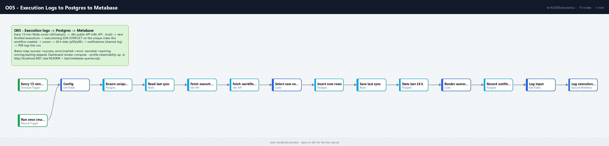

# O05 - Execution Logs to Postgres to Metabase

**Category:** DevOps · **Difficulty:** Intermediate · **Tested on:** n8n 2.37.10
**Patterns used:** P01 (error handler), P08 (observability: this is the backfill half of the pattern)

## Problem

n8n keeps its execution history in its own database and prunes it after 7 days (`EXECUTIONS_DATA_MAX_AGE=168`
in the compose file). The executions page answers "did this workflow run" one workflow at a time; it cannot
answer "how many runs failed last week across everything", "is D01 getting slower", or "which schedules stopped
firing" - and after a week it cannot answer anything. Workflows that adopt P08 log themselves, but the ones
that do not (and the sub-workflow runs, and the crashes n8n only knows about) leave no durable trace.

## How it works

1. **Every 15 minutes** (Schedule) or **Run once (manual / CLI)** -> **Config** (Set): `started_at` for the P08
   log call, `cursor_key = o05:last_sync`.
2. **Ensure unique index** (Postgres, *Execute Once*) - `create unique index if not exists
   execution_log_execution_id_uidx on execution_log (execution_id) where execution_id is not null`
   (`test/schema-addon.sql`). Idempotent DDL; it makes "one row per execution" a database guarantee.
3. **Read last sync** (Redis GET `o05:last_sync`) - ISO timestamp cursor, `null` on the first run (= 1970).
4. **Fetch executions** (n8n node, credential `n8n API - local`, `GET /executions`, newest 250, *Include
   Execution Details* off) - id, workflowId, mode, status, startedAt, stoppedAt. **Fetch workflow names**
   (n8n node, `GET /workflows`, *Execute Once*) - the public API's execution list carries no workflow name, so
   the id -> name map comes from a second call.
5. **Select new executions** (Code) - keeps executions that are *final* (status `success`, `error`, `crashed`,
   `canceled`; `running`/`waiting`/`new` are skipped) and started after the cursor; maps n8n status to the P08
   vocabulary (`success` -> `success`, `error`/`crashed` -> `error`, `canceled` -> `warning`), computes
   `duration_ms = stoppedAt - startedAt`, and picks the next cursor: the newest `startedAt` seen, pulled back to
   just before the oldest still-running execution so it is picked up once it finishes.
6. **Insert new rows** (Postgres, one bulk statement) - `insert ... select from jsonb_to_recordset($1) on conflict
   (execution_id) do update set started_at/finished_at/duration_ms = coalesce(existing, new)`: new executions are
   inserted, rows that P08 or P01 already wrote only get their missing timing filled in (status and notes are
   never overridden), complete rows are untouched. Returns `{inserted, enriched, candidates}`.
7. **Save last sync** (Redis SET) -> **Stats last 24 h** (Postgres, *Execute Once*) - runs per workflow and
   status with `percentile_cont(0.5 / 0.95)` of `duration_ms`.
8. **Render summary** (Code) - a plain-text report -> **Record notification** (Postgres insert into
   `notifications`, channel `log`, target `metabase`, severity `info`, *continue on error*).
9. **Log input** (Set) -> **Log execution (P08)** - this run's own row: `success`, notes
   `synced N new executions (...)`. On the next run O05 finds its previous execution already logged and only
   fills the timing.



## Setup

- Services: `core` profile (n8n, Postgres, Redis). Metabase is the optional `observability` profile:
  `docker compose --profile core --profile observability up -d` (one extra container, ~1 GB RAM, port 3001).
- Credentials: `Postgres - demo`, `Redis - local`, `n8n API - local` (the public API key `scripts/setup.sh`
  creates; base URL `http://localhost:5678/api/v1` as seen from inside the n8n container).
- Import: `bash scripts/import-workflows.sh workflows/O05-execution-logs-metabase --publish` (P08 must be
  imported and published first: `depends_on: [P08]`).
- Metabase, first run (about five minutes):
  1. Open <http://localhost:3001>, create the admin user (any `@lab.local` address, local only).
  2. *Add your data*: PostgreSQL, display name `demo`, host `postgres`, port `5432`, database `demo`, user
     `n8n`, password = `POSTGRES_PASSWORD` from your `.env`. Metabase runs on the compose network, so `postgres`
     resolves; `localhost` would not.
  3. *New -> SQL query*: paste the questions from `test/metabase-queries.sql` (runs per workflow/status 24 h,
     p50/p95 per workflow, failures and warnings 7 d, alert volume per day, runs per hour), save each, and pin
     them to a dashboard named "Automation Lab - runs". Set the dashboard auto-refresh to 15 minutes to match
     the sync.

## Try it

```bash
python scripts/dev/run-workflow.py O05                    # first run: backfills every execution n8n still has
python scripts/dev/run-workflow.py O05                    # second run: inserted 0 (idempotent)
docker compose exec -T postgres psql -U n8n -d demo -c "select body from notifications where channel = 'log' order by id desc limit 1"
docker compose exec -T postgres psql -U n8n -d demo -c "select status, count(*) from execution_log group by 1 order by 1"
docker compose exec -T redis redis-cli get o05:last_sync
python scripts/dev/executions.py --workflow ALO05ExecutionLo --last 2
```

Expected: the first summary says `inserted N, enriched M` (N = finished executions n8n still holds that nobody
logged, M = P01/P08 rows that were missing `duration_ms`). The second run has only a couple of candidates (the
executions since the previous cursor) and inserts exactly one row: the `P08 - Log execution` sub-run spawned by
the first run. The first run's own execution is already in the table (P08 wrote it, with notes) and is skipped.
Nothing is ever inserted twice. A real second run looked like this:

```
O05 sync 2026-09-06T22:59:50.823Z: fetched 250 executions, 2 after cursor (2026-09-06T22:59:28.226Z), inserted 1, enriched 0; next cursor 2026-09-06T22:59:41.232Z

Last 24 h per workflow / status (runs, p50 ms, p95 ms):
  D01 - CSV/XLSX Import with Row-level Validation  success     3    3068    3290
  O05 - Execution Logs to Postgres to Metabase     success     1    2155    2155
  P01 - Global Error Handler                       success    13     181     393
  P02 - HTTP with backoff                          success    75     181    1037
  T03 - Polling an API Without Webhooks            success    65     351     808
  ...
261 runs in 24 h, 23 errors. Dashboard: Metabase http://localhost:3001 (profile observability).
```

and `execution_log` for O05 itself shows `notes = synced 1 new executions (2 candidates), 261 runs / 23 errors in 24 h`.

Then `docker compose --profile observability up -d` and build the dashboard (Setup). The row for
`O05 - Execution Logs to Postgres to Metabase` in `execution_log` comes from P08 at the end of each run; the
next run enriches it with n8n's own timing.

## Notes & trade-offs

- **What the public API does not return**: the workflow *name* (hence the second call), node-level data unless
  `includeData=true` (we never ask: 250 executions with data would be megabytes), and anything already pruned.
  Executions n8n never persisted (`EXECUTIONS_DATA_SAVE_ON_SUCCESS=none` in a lean production setup) are
  invisible to it; that is exactly why P08 logs from inside the workflow and O05 is only the backfill.
- **Pruning**: `EXECUTIONS_DATA_PRUNE=true`, `EXECUTIONS_DATA_MAX_AGE=168` (hours) in `docker-compose.yml`.
  `execution_log` is in the `demo` database and survives pruning; the dashboard therefore shows more history than
  n8n itself does.
- **Page size**: the newest 250 executions per run. At 15-minute intervals that is 1000 executions per hour of
  headroom; a busier instance turns on *Return All* (the node paginates with the API cursor) or shortens the
  interval. Missing a page is not silent: the cursor only moves past executions that were actually seen.
- **The cursor is a hint, the index is the guarantee.** Long-running executions hold the cursor back, so a few
  executions are re-examined on every run and rejected by `ON CONFLICT`. Cheap, and it means a Redis wipe just
  costs one full re-scan.
- **Status mapping** is lossy on purpose: `crashed` (n8n restarted mid-run) becomes `error`, `canceled` becomes
  `warning`. Keep the vocabulary small so the dashboard stays readable; the n8n `mode` (`trigger`, `manual`,
  `integrated`, `cli`) is available in the Code node if you want to filter sub-workflow runs out.
- Metabase is one container and a first-run wizard; Grafana + Prometheus (`N8N_METRICS=true`) would give live
  process metrics but need two containers and a scrape config. The lab picks the option that shows the table.
- The summary goes to the `notifications` table (channel `log`) rather than e-mail: an every-15-minutes e-mail
  is the alert fatigue P08 warns about. T02's daily digest is the place for a human-facing summary.
