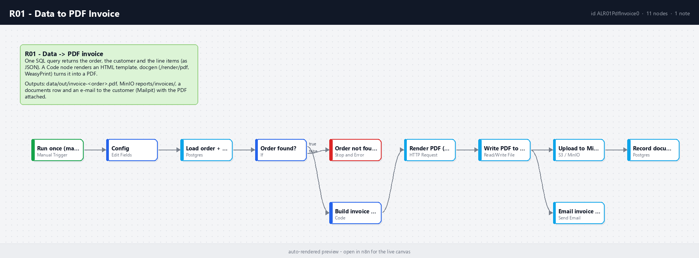

# R01 - Data to PDF Invoice

**Category:** Documents · **Difficulty:** Intermediate · **Tested on:** n8n 2.37.10
**Patterns used:** P01 (error handler)

## Problem

Orders live in Postgres; the customer wants a PDF. The usual answer is a paid "PDF API" with a key and a per-page
price, or a Word template someone edits by hand. Here the whole chain is local: one SQL query, an HTML template,
a self-hosted renderer (WeasyPrint inside the `docgen` container), object storage (MinIO) and an outgoing e-mail
(Mailpit) - and a `documents` row so the invoice can be found again.

## How it works

1. **Run once (manual / CLI)** → **Config** (`order_number`, default `ORD-2026-0001`).
2. **Load order + items** (Postgres) - one parameterised query joins order, customer and aggregates the line
   items as JSON (`json_agg`), so the workflow handles exactly one item.
3. **Order found?** → no → **Order not found** (Stop and Error → P01).
4. **Build invoice HTML** (Code) - invoice number derived from the order, 30-day due date, totals, embedded CSS.
5. **Render PDF (docgen)** - `POST http://docgen:8090/render/pdf` `{html, filename}` → binary PDF (3 retries).
6. **Write PDF to data/out** - `data/out/invoice-<order>.pdf` on the host.
7. **Upload to MinIO (reports)** - key `invoices/invoice-<order>.pdf` → **Record document** (`documents` row with
   `storage_key` and totals in `meta`).
8. **Email invoice (Mailpit)** - to the customer's `@lab.local` address with the PDF attached (runs in parallel with 7).



## Setup

- Services: `core` + `docs` profiles (`docker compose --profile core --profile docs up -d`).
- Credentials: `Postgres - demo`, `S3 - MinIO`, `SMTP - Mailpit`.
- Import: `bash scripts/import-workflows.sh workflows/R01-pdf-invoice`.

## Try it

```bash
python scripts/dev/run-workflow.py R01
ls -la data/out/invoice-ORD-2026-0001.pdf
docker compose exec -T postgres psql -U n8n -d demo -c "select id, kind, file_name, storage_key, meta from documents where kind='invoice'"
docker compose exec -T minio mc ls local/reports/invoices/          # after: mc alias set local http://localhost:9000 minioadmin minioadmin
curl -s "localhost:8025/api/v1/messages?limit=1" | python -m json.tool | grep -E "Subject|Attachments"
```

Open http://localhost:9001 (MinIO console) → `reports/invoices/`, and http://localhost:8025 for the e-mail.
To invoice another order, change `order_number` in **Config** (e.g. `ORD-2026-0004`) or run
`test/orders.sql` to pick paid orders.

## Notes & trade-offs

- HTML + CSS as the template language: designers can edit it, WeasyPrint supports `@page`, page breaks and
  embedded fonts (DejaVu and Amiri are installed in docgen). Arabic invoices work the same way with `dir="rtl"`.
- The invoice number is derived (`INV-` + order number) rather than sequenced in a table; a real system needs a
  gap-free sequence and an `invoices` table - keep `documents` as the audit trail.
- VAT is 0 % in the template; it is a one-line change in the Code node.
- The e-mail and the MinIO upload branch from the same node so both get the binary; the `documents` row is written
  only after the upload succeeded.
