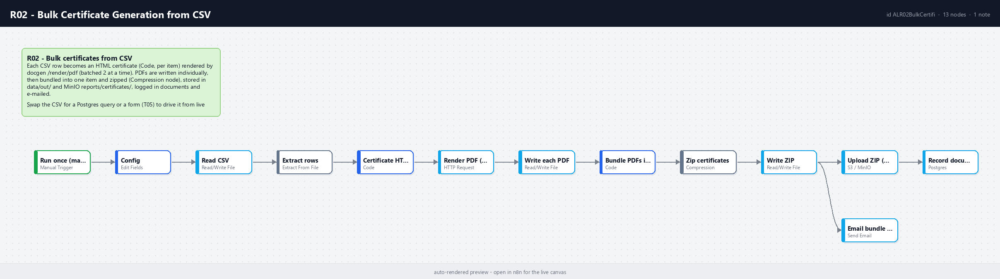

# R02 - Bulk Certificate Generation from CSV

**Category:** Documents · **Difficulty:** Intermediate · **Tested on:** n8n 2.37.10
**Patterns used:** P01 (error handler)

## Problem

Twelve people finished a course and each needs a certificate with their name, the course, the hours and the date.
Doing it by hand is twelve copies of the same mistake waiting to happen; doing it with a mail-merge means one
PDF with twelve pages that still has to be split and sent. What is wanted: one CSV in, one PDF per person out,
plus a single ZIP for the training team.

## How it works

1. **Run once (manual / CLI)** → **Config** (`file` = `seed/files/certificates.csv`, `report_to`).
2. **Read CSV** → **Extract rows** - one item per attendee.
3. **Certificate HTML (per row)** (Code, run once per item) - A4 landscape template with a double border,
   certificate id `CERT-<date>-<nnn>`, file name from the attendee and course.
4. **Render PDF (docgen)** - `POST /render/pdf`, batched two at a time, 3 retries.
5. **Write each PDF** - `data/out/certificate-<name>-<course>.pdf`.
6. **Bundle PDFs into one item** (Code) - moves every item's binary into one item (`file0..fileN`).
7. **Zip certificates** (Compression) → **Write ZIP** (`data/out/certificates-<timestamp>.zip`).
8. **Upload ZIP (MinIO)** `reports/certificates/` → **Record document**; **Email bundle (Mailpit)** with the ZIP attached.



## Setup

- Services: `core` + `docs` profiles.
- Credentials: `S3 - MinIO`, `Postgres - demo`, `SMTP - Mailpit`.
- Import: `bash scripts/import-workflows.sh workflows/R02-bulk-certificates`.

## Try it

```bash
python scripts/dev/run-workflow.py R02
ls data/out/certificate-*.pdf | wc -l          # 12
ls data/out/certificates-*.zip
docker compose exec -T postgres psql -U n8n -d demo -c "select file_name, meta->>'count' from documents where kind='certificates-zip'"
curl -s "localhost:8025/api/v1/messages?limit=1" | python -m json.tool | grep -E "Subject|Attachments"
```

Use your own list: copy `test/certificates-sample.csv` to `data/inbox/` and set **Config → file** to
`/home/node/.n8n-files/data/inbox/certificates-sample.csv` (columns `full_name,email,course,hours,completed_on,instructor`).

## Notes & trade-offs

- Rendering is batched (2 concurrent, 200 ms apart) so a 500-row file does not open 500 connections to docgen;
  raise the batch size on a bigger box.
- The ZIP is built from an in-memory bundle of all PDFs; for thousands of certificates stream them to MinIO one
  by one and zip on the storage side instead.
- `Write each PDF` targets `data/out/` directly because the Read/Write Files node does not create folders.
- WeasyPrint 62 does not understand the CSS `inset` shorthand - the template uses explicit offsets (found the hard
  way: the frame covered half the page).
