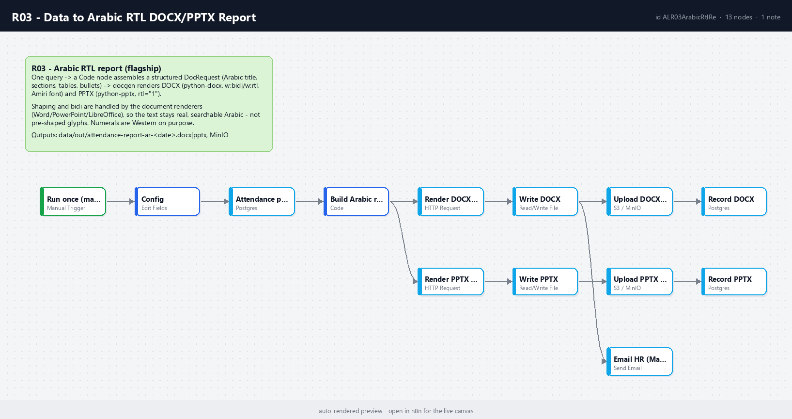

# R03 - Data to Arabic RTL DOCX/PPTX Report

**Category:** Documents · **Difficulty:** Advanced · **Tested on:** n8n 2.37.10
**Patterns used:** P01 (error handler)

## Problem

HR wants the weekly attendance report in Arabic, as a Word document they can edit and a slide deck they can
present. Most automation stacks fail here in one of three ways: letters come out disconnected (no shaping),
sentences read backwards (no bidi), or numbers are flipped inside mixed text. The fix is not to pre-shape the
text into glyphs (that breaks search, copy and editing) - it is to produce real Unicode Arabic and let Word and
PowerPoint do the shaping, while telling them explicitly that paragraphs and tables are right-to-left.

## How it works

1. **Run once (manual / CLI)** → **Config** (`report_to: hr@lab.local`).
2. **Attendance per employee** (Postgres) - one row per employee with `full_name_ar`, `department_ar` and
   present/late/absent/leave counts over the seeded period.
3. **Build Arabic report (DocRequest)** (Code) - assembles docgen's structured document: Arabic title and subtitle,
   an executive summary (attendance rate, best and weakest department), a per-department table, the per-employee
   table, and recommendations (five most absent/late employees). Numerals stay Western (`0-9`) on purpose.
4. **Render DOCX (docgen)** and **Render PPTX (docgen)** in parallel - `POST /render/docx` and `/render/pptx`
   with `lang: "ar", rtl: true`. docgen writes `w:bidi` / `w:rtl` on every paragraph and run, sets the Amiri
   font, right-aligns tables (DOCX) and sets `rtl="1"` on text frames (PPTX).
5. **Write DOCX** / **Write PPTX** → `data/out/attendance-report-ar-<date>.docx|pptx`.
6. **Upload DOCX/PPTX (MinIO)** → `reports/attendance/` → **Record DOCX/PPTX** rows in `documents`.
7. **Email HR (Mailpit)** - Arabic e-mail body (`dir="rtl"`) with the DOCX attached.



## Setup

- Services: `core` + `docs` profiles. The `docgen` image ships the Amiri font (SIL OFL) and python-docx / python-pptx.
- Credentials: `Postgres - demo`, `S3 - MinIO`, `SMTP - Mailpit`.
- Import: `bash scripts/import-workflows.sh workflows/R03-arabic-rtl-report`.

## Try it

```bash
python scripts/dev/run-workflow.py R03
ls data/out/attendance-report-ar-*
docker compose exec -T docgen python -c "import docx,glob; d=docx.Document(sorted(glob.glob('/data/out/attendance-report-ar-*.docx'))[-1]); print(d.paragraphs[0].text); print('bidi marks:', d.element.body.xml.count('w:bidi'))"
docker compose exec -T postgres psql -U n8n -d demo -c "select kind, file_name, meta->'totals' from documents where kind like 'report-%'"
```

Expected: title `تقرير الحضور والانصراف`, two tables (departments, 25 employees), hundreds of `w:bidi` marks, a
6-slide PPTX, two `documents` rows, one e-mail. Open the DOCX in Word/LibreOffice: text is selectable Arabic.
Chain with **R04**: the rows R04 extracts from a locked PDF can feed the same `DocRequest` builder.

## Notes & trade-offs

- Shaping/bidi is delegated to the consuming application; that is the correct division of labour for DOCX/PPTX.
  For PDF output the same content goes through `/render/pdf` (WeasyPrint + HarfBuzz shape it).
- Western numerals are a deliberate choice for tables and sorting; switch to Arabic-Indic digits in the Code node
  (`String(n).replace(/\d/g, d => '٠١٢٣٤٥٦٧٨٩'[d])`) if the audience expects them.
- `test/docrequest-sample.json` is the exact payload sent to docgen; POST it with curl to iterate on layout
  without running the workflow.
- The report period is whatever the seed contains (min/max `work_date`); a production version takes the week as a
  parameter and runs from a Schedule Trigger (T02 shows the pattern).
