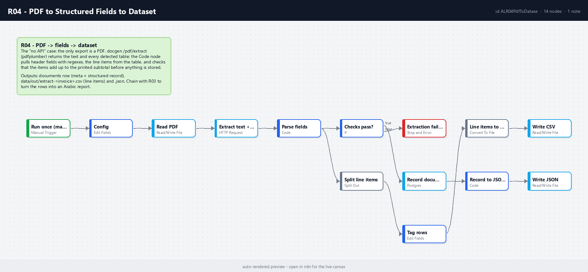

# R04 - PDF to Structured Fields to Dataset

**Category:** Documents · **Difficulty:** Advanced · **Tested on:** n8n 2.37.10
**Patterns used:** P01 (error handler)

## Problem

The supplier has no API and no export button - only the PDF invoice they e-mail. Someone retypes the line items
into a spreadsheet every month. The "no API access" case is the most common integration job there is, and the
PDF is text-based (not a scan), so the data is in there; it just needs to be pulled out reliably and **checked**
before it lands in a dataset.

## How it works

1. **Run once (manual / CLI)** → **Config** (`file` = `seed/files/invoice-locked.pdf`).
2. **Read PDF** → **Extract text + tables (docgen)** - multipart `POST /pdf/extract` (pdfplumber) returns the
   page text and every detected table as `{header, rows}`.
3. **Parse fields** (Code) - header fields by anchored regexes (`Invoice number:`, `Issue date:`, `Due date:`,
   `Subtotal`, `VAT`, `^Total`), e-mail addresses, and the line items from the table whose header contains a
   description and an amount column. Then the checks: invoice number present, items present, **items sum equals
   the printed subtotal**, `qty × unit_price == amount` per line.
4. **Checks pass?** → no → **Extraction failed checks** (Stop and Error with the failed checks → P01).
5. → yes → **Record document** (`documents` row, `kind = invoice-extract`, full record in `meta`) →
   **Record to JSON file** → **Write JSON** (`data/out/extract-<invoice>.json`).
6. In parallel: **Split line items** → **Tag rows** (invoice number, date, currency on every row) →
   **Line items to CSV** → **Write CSV** (`data/out/extract-<invoice>.csv`) - the dataset.



## Setup

- Services: `core` + `docs` profiles.
- Credentials: `Postgres - demo`.
- Import: `bash scripts/import-workflows.sh workflows/R04-pdf-to-dataset`.

## Try it

```bash
python scripts/dev/run-workflow.py R04
cat data/out/extract-INV-2026-0142.csv
python -m json.tool data/out/extract-INV-2026-0142.json | head -30
docker compose exec -T postgres psql -U n8n -d demo -c "select id, file_name, meta->'header'->>'total' as total, meta->'checks' from documents where kind='invoice-extract'"
curl -s -X POST localhost:8090/pdf/extract -F "file=@seed/files/invoice-locked.pdf" | python -m json.tool | head -40   # raw docgen output
```

Expected: 6 line items, `subtotal 2715.00`, `vat 380.10`, `total 3095.10`, all four checks `true`.
`test/expected.json` holds the full parsed record.

## Notes & trade-offs

- Regex parsing is per layout: a different supplier needs a different set of anchors. Keep one Code node per
  layout (or a Switch on the sender) rather than one universal parser. For scanned PDFs the same flow starts with
  OCR (`/ocr`, see A04 and B03).
- The arithmetic checks are the point: extraction that is *probably* right is worse than none. A failed check
  stops the workflow and P01 alerts a human with the failed check names.
- `Subtotal` vs `Total` is the classic trap - the total regex is anchored to the line start.
- The dataset is a CSV here; swap **Write CSV** for a Postgres insert into an `invoice_lines` table once the
  schema is agreed. Chain with **R03** to publish the extracted rows as an Arabic report.
