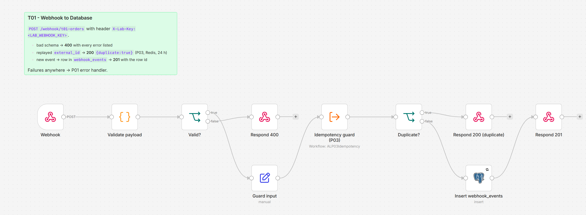

# T01 - Webhook to Database

**Category:** Triggers · **Difficulty:** Beginner · **Tested on:** n8n 2.37.10
**Patterns used:** P01 (error handler), P03 (idempotency), P07 (shared key via the header-auth credential)

## Problem

A web shop posts every new order to an HTTP endpoint. The endpoint has to say clearly what it did: **201** when it
stored the order, **400** with the list of problems when the payload is wrong (so the sender can fix it instead of
retrying forever), **200** when it already has this order (senders retry), and **403** when the shared key is
missing. Most "webhook to database" examples only cover the happy path and return 200 for everything.

## How it works

1. **Webhook** - `POST /webhook/t01-orders`, header auth (`X-Lab-Key`), response deferred to a Respond node.
2. **Validate payload** (Code) - checks `external_id`, `order_number`, `customer.email`, `items[]` (sku, qty),
   `total`, `ordered_at`; collects every error instead of stopping at the first.
3. **Valid?** → no → **Respond 400** `{ok:false, errors:[...]}`.
4. **Guard input** → **Idempotency guard (P03)** - `INCR idem:t01-orders:<external_id>` (24 h TTL).
5. **Duplicate?** → yes → **Respond 200** `{ok:true, duplicate:true, seen:n}`; nothing is written.
6. **Insert webhook_events** (Postgres, 3 retries) - `external_id` (UNIQUE), `source`, `event_type`, `payload` (jsonb), `received_at`.
7. **Respond 201** `{ok:true, id, external_id}`.

Any node failure goes to **P01** (`settings.errorWorkflow`), which logs and e-mails.



## Setup

- Services: `core` profile (n8n, Postgres, Redis).
- Credentials: `Webhook - header auth` (header `X-Lab-Key`, value `LAB_WEBHOOK_KEY` from `.env`), `Postgres - demo`,
  and `Redis - local` (used by P03). All created by `bash scripts/setup.sh`.
- Import: `bash scripts/import-workflows.sh patterns/P03-idempotency workflows/T01-webhook-to-database --publish`
  (P03 first; both must be **active** - webhooks only listen on published workflows).

## Try it

```bash
KEY=lab-demo-key   # LAB_WEBHOOK_KEY in .env
curl -s -X POST localhost:5678/webhook/t01-orders -H 'Content-Type: application/json' -H "X-Lab-Key: $KEY" -d @test/payload.json
# {"ok":true,"id":1,"external_id":"evt-order-20260901-0001"}            -> 201
curl -s -X POST localhost:5678/webhook/t01-orders -H 'Content-Type: application/json' -H "X-Lab-Key: $KEY" -d @test/payload.json
# {"ok":true,"duplicate":true,"external_id":"evt-order-20260901-0001","seen":2}   -> 200
curl -s -X POST localhost:5678/webhook/t01-orders -H 'Content-Type: application/json' -H "X-Lab-Key: $KEY" -d @test/invalid.json
# {"ok":false,"errors":["external_id: non-empty string required", ...]}  -> 400
curl -s -X POST localhost:5678/webhook/t01-orders -H 'Content-Type: application/json' -d @test/payload.json
# Authorization data is wrong!                                           -> 403
docker compose exec -T postgres psql -U n8n -d demo -c "select id, external_id, event_type, payload->>'order_number' from webhook_events"
python scripts/dev/executions.py --last 5
```

To replay as a new order change `external_id` in the payload, or reset the guard:
`docker compose exec -T redis redis-cli del idem:t01-orders:evt-order-20260901-0001` (the DB unique index still
rejects a second insert - that failure is what P01 is for).

## Notes & trade-offs

- Validation lives in one Code node so the 400 body lists everything wrong at once; for a large schema use a JSON
  Schema library in the Code node or a dedicated validation sub-workflow.
- Header auth is a shared secret; for a public endpoint verify an HMAC signature of the raw body instead (see
  `docs/security.md` and P07). The Webhook node's `rawBody` option keeps the bytes needed for that.
- Idempotency is two-layered on purpose: P03 answers replays fast without touching Postgres, the `UNIQUE`
  constraint on `external_id` is the guarantee when Redis has forgotten the key.
- `responseMode: responseNode` means every path must end in a Respond node; a path without one makes the sender
  wait for the timeout. The error workflow does not respond either - a failure returns n8n's generic 500.
