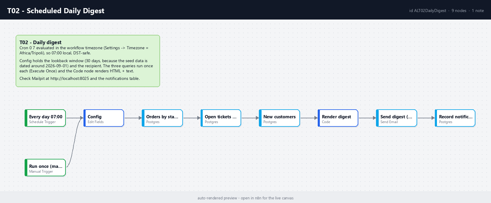

# T02 - Scheduled Daily Digest

**Category:** Triggers · **Difficulty:** Beginner · **Tested on:** n8n 2.37.10
**Patterns used:** P01 (error handler)

## Problem

Every morning someone opens three dashboards to answer the same questions: how many orders came in, what is
stuck in support, did we sign anyone new. The answer should arrive by itself at 07:00 *local time* - not at 07:00
UTC, not an hour off after the clocks change - and it should still arrive (saying "nothing to report") on a quiet
day, so that silence means "broken", never "quiet".

## How it works

1. **Every day 07:00** (Schedule, cron `0 7 * * *`) - evaluated in the **workflow timezone** (`Africa/Tripoli`,
   set in workflow settings, not in the node), or **Run once (manual / CLI)** for testing.
2. **Config** (Set) - `lookback_days: 30`, `report_to: ops@lab.local`. One place to change both.
3. **Orders by status**, **Open tickets by priority**, **New customers** (Postgres, parameterised `$1`, *Execute
   Once*, *Always Output Data*) - three small summaries; an empty result still produces an item.
4. **Render digest** (Code) - one HTML table per summary plus a plain-text version, totals line, "nothing to
   report" flag.
5. **Send digest (Mailpit)** - HTML e-mail, 3 retries.
6. **Record notification** (Postgres insert into `notifications`, continue on error).



## Setup

- Services: `core` profile (n8n, Postgres, Mailpit).
- Credentials: `Postgres - demo`, `SMTP - Mailpit`.
- Import: `bash scripts/import-workflows.sh workflows/T02-daily-digest --publish` (publishing arms the schedule).
- Timezone: workflow **Settings → Timezone** is `Africa/Tripoli` (exported in `settings.timezone`); change it
  there, not in the cron string. `GENERIC_TIMEZONE` in `.env` is only the instance default for new workflows.

## Try it

```bash
docker compose exec -T postgres psql -U n8n -d demo < workflows/T02-daily-digest/test/queries.sql   # what to expect
python scripts/dev/run-workflow.py T02
python scripts/dev/executions.py --workflow ALT02DailyDigest --last 1
curl -s "localhost:8025/api/v1/messages?limit=1" | python -m json.tool | grep Subject      # open http://localhost:8025
docker compose exec -T postgres psql -U n8n -d demo -c "select channel, target, subject, sent_at from notifications order by id desc limit 1"
```

Expected subject: `[Automation Lab] Daily digest 2026-09-07`, body with the three tables (paid/shipped revenue
in the totals line). Set `lookback_days` to `1` in Config and run again to see the "nothing to report" variant
(the seed data is dated around 2026-09-01).

## Notes & trade-offs

- **Lookback is a parameter, not "yesterday"**, because a demo database has a fixed date range; in production set
  it to 1 and keep the window aligned with the cron (a 07:00 run with `now() - 1 day` covers 07:00→07:00).
- Cron in n8n is timezone-aware through the workflow setting; DST is handled by the tz database (07:00 stays 07:00).
  A run that is *missed* while n8n is down is not replayed - if that matters, keep a "last digest sent" row and
  let the next run detect the gap.
- Each query is marked *Execute Once* so the second and third queries do not run once per row of the first.
- Rendering lives in one Code node for readability; a templating sub-workflow (P05) would let several reports
  share the layout.
