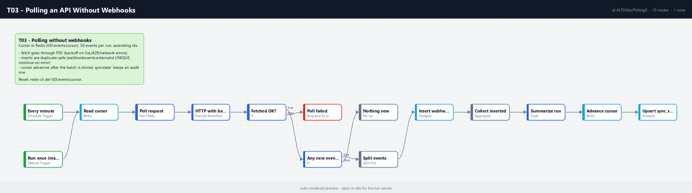

# T03 - Polling an API Without Webhooks

**Category:** Triggers · **Difficulty:** Intermediate · **Tested on:** n8n 2.37.10
**Patterns used:** P01 (error handler), P02 (retry with backoff)

## Problem

The source system has no webhooks, only a REST list endpoint. Polling it naively ("fetch the last 100 events every
minute") re-reads the same rows on every run, misses rows when more than 100 arrive in a minute, and turns a
five-minute API outage into a hundred red executions. The fix is a **cursor** the workflow owns, a bounded page
size, backoff on failure, and inserts that survive being replayed.

## How it works

1. **Every minute** (Schedule) or **Run once (manual / CLI)** - both start the same chain.
2. **Read cursor** (Redis GET `t03:events:cursor`, always outputs; missing key = start from 0).
3. **Poll request** (Set) - `GET http://mock-api:8080/events?id_gte=<cursor+1>&_sort=id&_order=asc&_limit=50`.
4. **HTTP with backoff (P02)** - retries 5xx/429/network errors with exponential backoff, never throws.
5. **Fetched OK?** → no → **Poll failed** (Stop and Error, so P01 logs and alerts once).
6. **Any new events?** → no → **Nothing new** (clean, quiet run).
7. **Split events** → **Insert webhook_events** (`external_id = mock-event-<id>`, UNIQUE; *continue on error*
   so a replayed page rejects rows individually).
8. **Collect inserted** → **Summarize run** (Code: new cursor = max id fetched, counts) → **Advance cursor**
   (Redis SET) → **Upsert sync_state** (`source, cursor, last_run_at, rows_seen`).

The cursor advances only after the batch is stored, so a crash mid-run re-reads that page next time and the
unique key discards the duplicates.



## Setup

- Services: `core` profile (n8n, Postgres, Redis, mock-api).
- Credentials: `Redis - local`, `Postgres - demo`.
- Import: `bash scripts/import-workflows.sh patterns/P02-retry-backoff workflows/T03-api-polling --publish`
  (P02 first). Activation starts the one-minute schedule; the mock feed has 300 events, so it drains in 6 runs and
  then reports "Nothing new".

## Try it

```bash
python scripts/dev/run-workflow.py T03            # first run: events 1-50
python scripts/dev/run-workflow.py T03            # second run: events 51-100
docker compose exec -T redis redis-cli get t03:events:cursor                     # 100
docker compose exec -T postgres psql -U n8n -d demo -c "select count(*), min(external_id), max(external_id) from webhook_events where source='mock-api-poll'"
docker compose exec -T postgres psql -U n8n -d demo -c "select * from sync_state where source='mock-api-events'"
python scripts/dev/executions.py --workflow ALT03ApiPolling0 --last 3
```

Replay safety: `bash test/reset-cursor.sh` sets the cursor back to 0 and runs again - the inserts are rejected by
the unique index one by one and the execution still succeeds. Failure path: stop the mock API
(`docker compose stop mock-api`), run once, watch P02 retry five times and P01 send the alert; `docker compose
start mock-api`.

## Notes & trade-offs

- Page size 50 bounds the work per run; a burst larger than 50/minute is caught up over the following minutes,
  never lost. Increase `_limit` or the schedule frequency to trade latency for load.
- The feed is sorted by an increasing integer id. For feeds sorted by `updated_at` use the timestamp as the cursor
  and query `>=` (not `>`) to tolerate equal timestamps - the unique key absorbs the overlap.
- Redis holds the cursor for speed; `sync_state` mirrors it so a Redis flush can be recovered with one UPDATE.
- The Schedule Trigger and the Manual Trigger both feed the same first node; the manual one exists because
  `n8n execute` (CLI) needs it.
