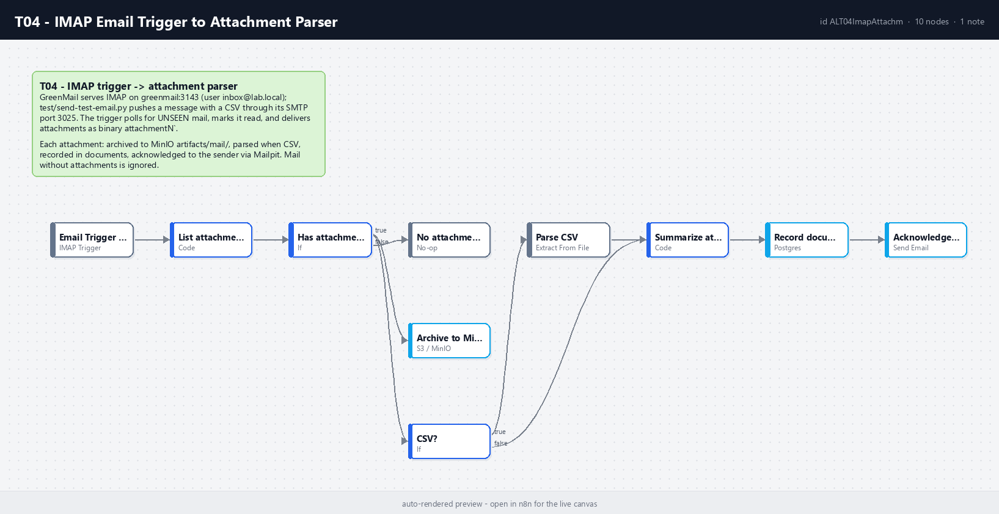

# T04 - IMAP Email Trigger to Attachment Parser

**Category:** Triggers · **Difficulty:** Intermediate · **Tested on:** n8n 2.37.10
**Patterns used:** P01 (error handler)

## Problem

A supplier sends the weekly export as a CSV attachment. Someone downloads it, renames it, uploads it somewhere
and replies "got it". The mailbox is the integration, so the mailbox should be the trigger: every unread message
with an attachment is picked up, the attachment archived where it can be found, tabular files parsed, and the
sender told exactly what was received - with no cloud mailbox and no OAuth app registration.

## How it works

1. **Email Trigger (IMAP - GreenMail)** - polls `INBOX` for `UNSEEN` mail on `greenmail:3143`, marks messages
   read, resolves attachments as binary `attachment_0..n`.
2. **List attachments** (Code) - one item per attachment (binary moved to `data`), sender address extracted;
   messages without attachments become one "ignore" item.
3. **Has attachment?** → no → **No attachment - ignore**.
4. → yes → **Archive to MinIO (artifacts)** (`artifacts/mail/<file>`, 3 retries) and **CSV?** → **Parse CSV**.
5. **Summarize attachment** (Code, once) - adds the parsed row count → **Record document** (`documents`, kind
   `email-attachment`, meta with sender, subject, message id, mime, rows) → **Acknowledge sender (Mailpit)**.



## Setup

- Services: `core` profile - GreenMail (`IMAP - GreenMail` credential: login `inbox`, password `inbox`, host
  `greenmail`, port 3143, no TLS), MinIO, Postgres, Mailpit.
- Import: `bash scripts/import-workflows.sh workflows/T04-imap-attachment-parser --publish`. The IMAP trigger
  connects on activation; if GreenMail is down, activation fails with "Connection ended unexpectedly".

## Try it

```bash
python workflows/T04-imap-attachment-parser/test/send-test-email.py        # SMTP -> GreenMail :3025, CSV attached
sleep 20
python scripts/dev/executions.py --workflow ALT04ImapAttachm --last 1      # success, mode trigger
docker compose exec -T postgres psql -U n8n -d demo -c "select file_name, meta from documents where kind='email-attachment'"
docker compose exec -T minio mc ls local/artifacts/mail/                    # after: mc alias set local http://localhost:9000 minioadmin minioadmin
curl -s "localhost:8025/api/v1/messages?limit=1" | python -m json.tool | grep Subject    # "Re: Weekly export ... - received"
```

`send-test-email.py <file>` attaches any file; non-CSV attachments are archived and receipted without parsing.

## Notes & trade-offs

- GreenMail's IMAP login is the **login name** (`inbox`), not the address: with `greenmail.auth.disabled` a
  login of `inbox@lab.local` makes GreenMail try to auto-create a second user with the same address and drop the
  connection. `.env.example` and the bootstrap use `inbox` for that reason.
- The trigger marks mail as read (`postProcessAction: read`); with `nothing` plus `trackLastMessageId` the same
  message would be reprocessed after a restart. For at-least-once with dedupe, add P03 keyed on `message_id`.
- Attachments arrive in memory; very large files belong on the S3 branch only, with parsing done in a batch job.
- The acknowledgement goes to the parsed sender address through Mailpit, so a real reply never leaves the lab.
