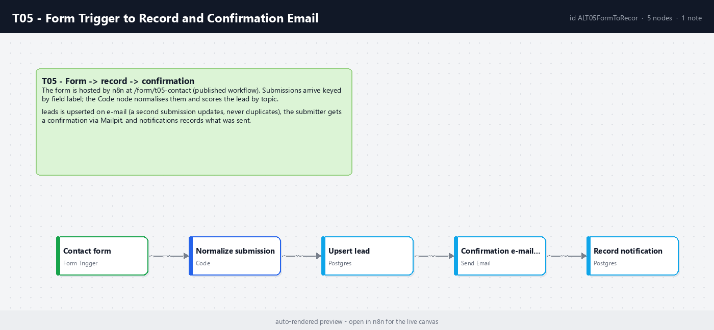

# T05 - Form Trigger to Record and Confirmation Email

**Category:** Triggers · **Difficulty:** Beginner · **Tested on:** n8n 2.37.10
**Patterns used:** P01 (error handler), P06 (testing: the form is a replayable HTTP contract)

## Problem

"Contact us" forms usually mean a form builder subscription, a Zap, a spreadsheet and a mailbox nobody checks.
n8n can host the form itself: no external service, submissions land in the database as leads, the submitter gets
a confirmation at once, and a second submission from the same address updates the lead instead of creating a
duplicate.

## How it works

1. **Contact form** (n8n Form Trigger v2.2) - hosted at `/form/t05-contact`: Name, Email, Company, Topic
   (dropdown), Message. Responds "Form submitted" immediately.
2. **Normalize submission** (Code) - trims, lower-cases the e-mail, derives the company domain, scores the lead
   by topic (Demo request 60, Partnership 50, Support 20, Other 10), packs topic + message into `enriched`.
3. **Upsert lead** (Postgres, on `email`, 3 retries) - `leads.source = form`, `status = new`.
4. **Confirmation e-mail (Mailpit)** to the submitter.
5. **Record notification** (`notifications` row).



## Setup

- Services: `core` profile (n8n, Postgres, Mailpit).
- Credentials: `Postgres - demo`, `SMTP - Mailpit`.
- Import: `bash scripts/import-workflows.sh workflows/T05-form-to-record --publish` - the form only exists while
  the workflow is published.

## Try it

Open http://localhost:5678/form/t05-contact in a browser and submit, or from the shell (fields are posted in
form order as `field-0` … `field-4`):

```bash
curl -s -X POST localhost:5678/form/t05-contact -F "field-0=Lina Haddad" -F "field-1=lina.haddad@lab.local" \
  -F "field-2=Sample Bakery" -F "field-3=Demo request" -F "field-4=Please show me the invoice workflow." | grep -o "Form Submitted"
docker compose exec -T postgres psql -U n8n -d demo -c "select email, name, company, score, status, enriched->>'topic' from leads where source='form'"
curl -s "localhost:8025/api/v1/messages?limit=1" | python -m json.tool | grep Subject
python scripts/dev/executions.py --workflow ALT05FormToRecor --last 1
```

`test/submission.sh` wraps the curl; submit twice to see the upsert (one row, updated).

## Notes & trade-offs

- The form path lives in the node's **options → path** (v2.2+); the top-level `path` is ignored by newer
  versions, which is why an unconfigured form answers only on its random webhook id.
- The form trigger has no spam protection; put it behind a reverse proxy with rate limiting (P04) before exposing it.
- Scoring by topic is a placeholder for a real qualification step; B01 shows enrichment and a follow-up sequence.
- Uploads: add a *File* field and the file arrives as binary - route it through T06's logic (hash, archive).
