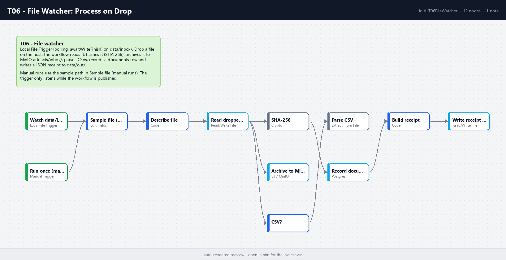

# T06 - File Watcher: Process on Drop

**Category:** Triggers · **Difficulty:** Beginner · **Tested on:** n8n 2.37.10
**Patterns used:** P01 (error handler)

## Problem

The legacy system cannot call an API, but it can write a file to a folder. That folder *is* the integration:
anything dropped there should be picked up within seconds, fingerprinted, archived somewhere durable, parsed if
it is tabular, and receipted so the sender can prove delivery - without anyone polling a share by hand.

## How it works

1. **Watch data/inbox** (Local File Trigger, folder mode, `add` events, polling, `awaitWriteFinish` so half-written
   files are not read) - host path `data/inbox/`, container path `/home/node/.n8n-files/data/inbox`.
   **Run once (manual / CLI)** → **Sample file (manual runs)** provides a path for CLI runs.
2. **Describe file** (Code) - name, extension, event, timestamp.
3. **Read dropped file** → three branches off the binary:
   - **Archive to MinIO (artifacts)** - `artifacts/inbox/<name>` (3 retries);
   - **CSV?** → **Parse CSV** (rows become items; count goes into the receipt);
   - **SHA-256** (Crypto, binary) → **Record document** (`documents`, kind `inbox-file`, meta with hash and event)
     → **Build receipt** (Code, JSON with hash, size, mime, CSV row count, archive key) →
     **Write receipt to data/out/processed** (`data/out/processed-<name>.receipt.json`).



## Setup

- Services: `core` profile (n8n, Postgres, MinIO). `data/` is bind-mounted read-write into n8n.
- Credentials: `S3 - MinIO`, `Postgres - demo`.
- Import: `bash scripts/import-workflows.sh workflows/T06-file-watcher --publish` (the watcher only runs while
  the workflow is published; `ignoreInitial` skips files already present).

## Try it

```bash
cp workflows/T06-file-watcher/test/sample-drop.csv data/inbox/
sleep 10
python scripts/dev/executions.py --workflow ALT06FileWatcher --last 1          # success, mode trigger
cat data/out/processed-sample-drop.csv.receipt.json
docker compose exec -T postgres psql -U n8n -d demo -c "select file_name, meta from documents where kind='inbox-file'"
docker compose exec -T minio mc ls local/artifacts/inbox/                       # after: mc alias set local http://localhost:9000 minioadmin minioadmin
```

Drop a non-CSV file (`echo hi > data/inbox/note.txt`) to see the CSV branch skipped and the receipt still written.

## Notes & trade-offs

- Polling (`usePolling`) is deliberate: inotify events do not cross the Docker Desktop bind mount on Windows/macOS.
  The cost is a few hundred milliseconds of latency.
- Files are not moved out of `data/inbox/` (n8n has no move operation); the receipt in `data/out/` and the
  `documents` row are the processed markers. A cron that deletes receipted files is the production complement.
- Re-importing an active trigger workflow without deactivating it first left the old trigger running (three
  executions per drop); `scripts/import-workflows.sh` now deactivates before import for exactly this reason.
- Crypto and S3 nodes emit items without the binary; that is why all three consumers branch from the Read node.
